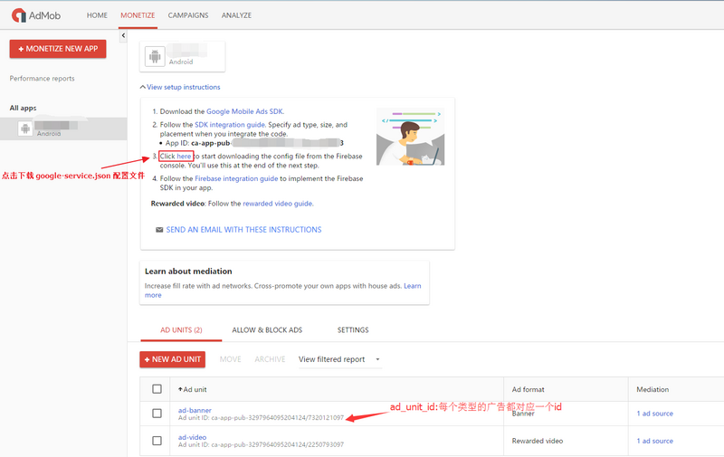
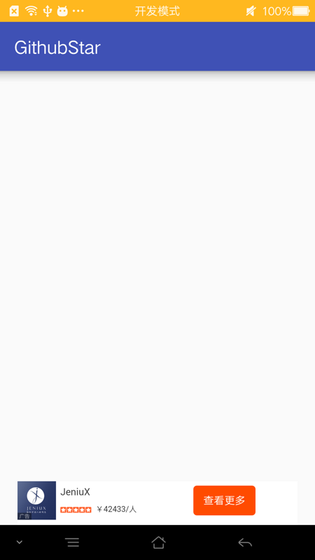

- [创建Admod app的顺序](#创建admod-app的顺序)
- [Android Google AdMob 广告接入示例](#android-google-admob-广告接入示例)
  - [什么是 AdMob ?](#什么是-admob-)
  - [AdMob 广告的类型 ？](#admob-广告的类型-)
  - [以 Banner 广告为例，接入AdMob](#以-banner-广告为例接入admob)
    - [2-1.账号](#2-1账号)
    - [2-2. 在 AdMob 上创建新的项目](#2-2-在-admob-上创建新的项目)
    - [2-3. Android Studio 项目配置](#2-3-android-studio-项目配置)
    - [2-4. Eclipse 项目配置](#2-4-eclipse-项目配置)
    - [2-5. xml 布局编写](#2-5-xml-布局编写)
    - [2-6. Activity 加载 Banner 广告](#2-6-activity-加载-banner-广告)
    - [2-7. Google AdMob Demo 地址](#2-7-google-admob-demo-地址)


# 创建Admod app的顺序
* 在admod后台创建app，生成appid

* 创建广告单元，生成广告id

* firebase创建app。如：iOS

* 绑定identiferid

* 下载 GoogleService-Info.plist和info.plist一个文件
* 在info.plist配置appid

```
<key>GADApplicationIdentifier</key>
<string>ca-app-pub-9899963092044978~8886647952</string>
```


# Android Google AdMob 广告接入示例

首先请大家放心，虽然 Google搜索等服务被qiang了，但是 广告服务国内还是可以用的，真是普天同庆啊~~~噗！

其实这篇文章也只是记录我接入 AdMob 的过程，更具体的其实 Google 官方给的更详细（配图和视频还有GitHub 的demo 示例等），所以不想看官方（毕竟大部分英文）的可以看我写的，如果已经看了官方或者有了解了可以重点看我 加粗 的地方，方便你快速找到你想要的信息。

Google 官方引导：firebase.google.com/docs/admob/…

## 什么是 AdMob ?
AdMob by Google 是一种移动广告平台，借助该平台您可从您的应用中获得可观的收入。将 AdMob 与 Firebase Analytics 相结合，您不仅可得到更多的应用使用量数据，而且可以提升分析能力。无需更改现有 AdMob 配置，Firebase 便可与 AdMob 集成在一起。

## AdMob 广告的类型 ？
总共分四种。
分别为：Banner（横幅广告） 、Interstitial（插页广告）、Rewarded Video（应用内购买广告）、Native（原生广告）。

Banner（横幅广告）：最常见的，就是平时看到的屏幕的底部或者顶部有一个横条的广告条。

Interstitial（插页广告）：类似启动页广告，整个屏幕显示一副广告。

Rewarded Video（应用内购买广告）：这个玩国外游戏经常会看到，你看完一个广告视频，游戏会奖励你一些道具或者其他的什么（这个奖励是一个整数，在AdMob中可以设置数量，用户看完视频会得到这个数量的奖励，比如奖励3瓶药水，3条生命等。）。

Native（原生广告）：这个是体验最好的广告形式，和原生app无缝对接，也许你已经见过一个列表的某个item内容展示的是广告，就是这种形式。

## 以 Banner 广告为例，接入AdMob

### 2-1.账号

你需要 Google 账号，然后注册AdMob，如果有 Google 账号是可以直接登录的。
有了账号以后你才能继续！

NOTICE：如果 AdMob 登录页面打不开（其他页面是可以打开的），请务必禁止 AdBlock 等屏蔽广告的插件，或者手动添加白名单！！！

### 2-2. 在 AdMob 上创建新的项目

推荐你把 Google 官方的示例写一遍，不费事的。

在 AdMob 上创建新的项目，apps.admob.com/，中间提示你填写包名、项目名等，如实填写就可以。

最后完成时你的界面应该是这样的：




注意你的 APP id ,ad unit id,,并 下载 google-service.json配置文件。

### 2-3. Android Studio 项目配置

配置 Gradle

1.项目级 build.gradle

```
    dependencies {
        classpath 'com.android.tools.build:gradle:x.x.x'
        classpath 'com.google.gms:google-services:3.0.0'
    }
```

2.应用级 build.gradle

```
    dependencies {
            compile fileTree(dir: 'libs', include: ['*.jar'])
            compile 'com.android.support:appcompat-v7:xx.x.x'
            compile 'com.google.firebase:firebase-ads:10.2.1'
        }
```

//apply plugin 语句位于底部

```
apply plugin: 'com.google.gms.google-services'
3.google-service.json
```

直接粘贴在应用级的根目录下，例如：YourProject/app/google-service.json

### 2-4. Eclipse 项目配置


### 2-5. xml 布局编写

主页面布局：activity_main.xml

<RelativeLayout xmlns:android="http://schemas.android.com/apk/res/android"
    xmlns:tools="http://schemas.android.com/tools" android:layout_width="match_parent"
    xmlns:ads="http://schemas.android.com/apk/res-auto"
    android:layout_height="match_parent" android:paddingLeft="@dimen/activity_horizontal_margin"
    android:paddingRight="@dimen/activity_horizontal_margin"
    android:paddingTop="@dimen/activity_vertical_margin"
    android:paddingBottom="@dimen/activity_vertical_margin"
    tools:context=".MainActivity">

    <TextView android:text="@string/hello_world" android:layout_width="wrap_content"
        android:layout_height="wrap_content" />

    <com.google.android.gms.ads.AdView
        android:id="@+id/adView"
        android:layout_width="wrap_content"
        android:layout_height="wrap_content"
        android:layout_centerHorizontal="true"
        android:layout_alignParentBottom="true"
        ads:adSize="BANNER"
        ads:adUnitId="@string/banner_ad_unit_id">
    </com.google.android.gms.ads.AdView>

</RelativeLayout>

### 2-6. Activity 加载 Banner 广告

MainActivity.java 部分代码：
```
package ...

import ...
import ...
import com.google.android.gms.ads.AdRequest;
import com.google.android.gms.ads.AdView;

public class MainActivity extends ActionBarActivity {

    ...

    protected void onCreate(Bundle savedInstanceState) {
        super.onCreate(savedInstanceState);
        setContentView(R.layout.activity_main);

        //加载广告
        AdView mAdView = (AdView) findViewById(R.id.adView);
        AdRequest adRequest = new AdRequest.Builder().build();
        mAdView.loadAd(adRequest);
    }

    ...

}
```
做完主要不要忘记权限：

```
    <uses-permission android:name="android.permission.INTERNET"/>
    <uses-permission android:name="android.permission.ACCESS_NETWORK_STATE"/>
```
### 2-7. Google AdMob Demo 地址

官方demo地址： github.com/googleads/g…

3. 效果图
在页面底部展示 Banner 广告条:



4. 注意事项
<: NOTICE :>

当你注册完 AdMob 账户，创建完项目，得到对应的 id ，准备进行测试时，你可能得到一些错误：failed to load ad 3，或者， There was a problem getting an ad response. ErrorCode: 0等。

请注意，你创建的项目需要等待一段时间才能测试使用，所以尽管你的代码和配置都是正确的，但还是收到错误。等待一段时间就好了，我大概过了2个多小时才正常。

<: NOTICE :> 关于 Rewarded Video（应用内购买广告）

你在测试时很大几率得到错误提示----failed to load ad 3，并且方法的失败回调响应了。

这只是系统没有什么广告返回给你而已，也就是应用内视频广告并不总是会有的。

错误信息可以在官网得到解释：

public static final int ERROR_CODE_NO_FILL  --> Constant Value: 3

The ad request was successful, but no ad was returned due to lack of ad inventory.
广告请求已成功，但由于缺少广告资源，没有返回任何广告。
更多错误信息可以查看官网：developers.google.com/android/ref…

5. 总结
Google 的广告听说比较用心，实际效果不知如何，本文描述不全的或者日后有改动的都以官网为准。

官网：www.google.cn/admob/

enjoy!

Google