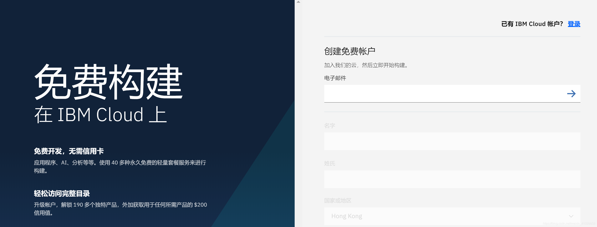
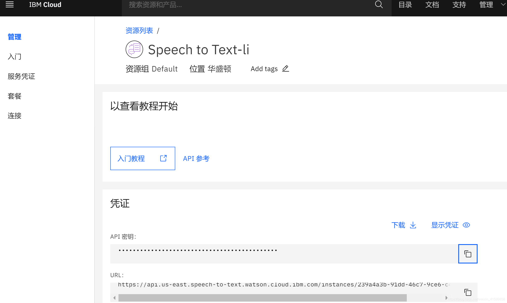

- [音频文字转换](#音频文字转换)
  - [1.音频模块简介](#1音频模块简介)
  - [2.模块安装](#2模块安装)
  - [3.文字转音频](#3文字转音频)
  - [3.3.语音播放](#33语音播放)
  - [3.4.文字发音](#34文字发音)
  - [4.音频转文字](#4音频转文字)
    - [4.1.注册IBM应用](#41注册ibm应用)
    - [4.2.获取凭证](#42获取凭证)
    - [4.3.转换实现](#43转换实现)
  - [5.音频格式转换](#5音频格式转换)

# 音频文字转换

Python 是一门通用性很强的语言，本文主要讲述其中的音频模块 gtts（Google文本到语音）的使用。

## 1.音频模块简介

* 文本转语音：
1. gtts：谷歌模块
2. aip：百度合成

* 格式转换：

pydub和ffmpeg：实现mp3转wav格式

* 发音：

1. pyttsx3：系统内置语音引擎实现发音，不生成mp3
2. win32com：Windows操作系统内置的语音引擎实现文字发音

* 音频转文字：
1. SpeechRecognition：IBM speech to text
2. 谷歌gTTS模块：gtts文档
3. 百度语音合成api接口：api文档


## 2.模块安装

```
pip install gTTS       # 谷歌文字转语音
pip install baidu-aip  # 语音合成
pip install playsound  # 语音播放
pip install pyttsx3    # 语音引擎实现发音
pip install SpeechRecognition  # 音频转文字
```

## 3.文字转音频

3.1.gtts模块使用

```python
from gtts import gTTS
def text2voice():
    """文字转语音 - 谷歌 gtts模块"""
    tts = gTTS(text="oh 宝贝! come on, baby!", lang="en")
    tts.save("test.mp3")
```

3.2.百度合成

进入[语音合成网站](https://ai.baidu.com/tech/speech/tts)，登录创建应用

```python
from aip import AipSpeech


APP_ID = '你的 App ID'
API_KEY = '你的 Api Key'
SECRET_KEY = '你的 Secret Key'
client = AipSpeech(APP_ID, API_KEY, SECRET_KEY)


# 合成音频
def text_mixin_vocie():
    result = client.synthesis('你好吗？', 'zh', 1, {'vol': 5, })
    # 识别正确返回语音二进制 错误则返回dict 
    if not isinstance(result, dict):
        with open('auido.mp3', 'wb') as f:
            f.write(result)

# 读取文件
def get_file_content(filePath):
    cmd_str = "ffmpeg -y  -i %s  -acodec pcm_s16le -f s16le -ac 1 -ar 16000 %s.pcm"%(filePath, filePath)
    os.system(cmd_str)  # 调用系统命令ffmpeg,传入音频文件名即可
    with open(filePath + ".pcm", 'rb') as fp:
        return fp.read()

# 识别本地文件
res = client.asr(get_file_content('audio.m4a'), 'pcm', 16000, {
    'dev_pid': 1536,  # 1536表示能识别中文和英文，它的容错率比较高
})
print(res)
print(res['result'])
```
## 3.3.语音播放

```python
from playsound import playsound


def play_voice():
    playsound("store/test.mp3")  # 音频文件路径

```

## 3.4.文字发音

win32com 模块

```python
import win32com.client as win
def word_pronunciation():
    speak = win.Dispatch("SAPI.SpVoice")
    speak.Speak("come on, baby!")
    speak.Speak("宝贝儿，你好!")
```
pyttsx3 模块
pyttsx3 模块可能会安装失败，可去官网下载指定版本

```python
import pyttsx3


def word_pronunciation_v2():
    engine = pyttsx3.init()
    engine.setProperty("voice", "HKEY_LOCAL_MACHINE\SOFTWARE\Microsoft\Speech\Voices\Tokens\TTS_MS_ZH - CN_HUIHUI_11.0")
    engine.say('开始语音合成中...')
    engine.say("你好吗？宝儿姐...")
    engine.say('全世界都在说中国话...')
    engine.runAndWait()
```
## 4.音频转文字

### 4.1.注册IBM应用

首先去[Speech to text](https://cloud.ibm.com/registration)官网注册.
IBM-注册

### 4.2.获取凭证

到管理页面，获取凭证
IBM-api密钥

### 4.3.转换实现

入门教程: [Speech to Text](https://cloud.ibm.com/docs/speech-to-text?topic=speech-to-text-gettingStarted#getting-started-tutorial)

[python接口使用参考](https://cloud.ibm.com/apidocs/speech-to-text/speech-to-text?code=python)


音频转换文字方式：

* python 脚本运行命令转录音频（参考文档中的 curl 命令）
requests调用api接口（https://gateway-wdc.watsonplatform.net/speech-to-text/api/v1/recognize）
* speech_recognition模块

```python
import speech_recognition as sr
import requests
 
harvard = sr.AudioFile('audio.wav')  # 文件路径
r = sr.Recognizer()
with harvard as source:
    audio = r.record(source)
print(type(audio))

IBM_USERNAME = '******'
IBM_PASSWORD= '******'
text = r.recognize_ibm(audio, username = IBM_USERNAME, password = IBM_PASSWORD, language='zh-CN')
# 或者
text = r.recognize_google(audio, language = 'zh-CN')

print(text)
```


## 5.音频格式转换

5.1.[ffmpeg的使用](http://blog.gregzaal.com/how-to-install-ffmpeg-on-windows/)

5.1.1.安装ffmpeg

参考：ffmpeg使用参考
```
pip install ffmpeg
```

5.1.2.引入exe路径：

将 ffmpeg 添加到环境变量
在代码中引入 ffmpeg 路径
5.1.3.实现转换

```python
def trans_voice_type():
    """音频格式转换"""
    source_path = "xxx"
    save_path = 'xxx'
    source_file = os.listdir(source_path)

    for source in source_file:
        old_path = os.path.join(source_path, source)
        new_name = os.path.join(save_path, source[:-4])  # 截取音频名字,删除后缀
        
        print('正在转换音频:{}'.format(new_name))
        os.popen("C:\\python\\python36\\Tools\\ffmpeg\\bin\\ffmpeg.exe -i " + old_path + " " + new_name + ".wav")
    print('所有音频转换完毕!')
```
5.2.pydub的使用

5.2.1.安装pydub
```
pip install pydub
```
5.2.2.实现转换

```python
from pydub import AudioSegment


def convert_video(file_path):
    outfile = os.path.splitext(os.path.realpath(file_path))[0] + '.wav'
    AudioSegment.converter = "C:\\python\\python36\\Tools\\ffmpeg\\bin\\ffmpeg.exe"
    AudioSegment.from_file(file_path).export(outfile, format='wav')
```
