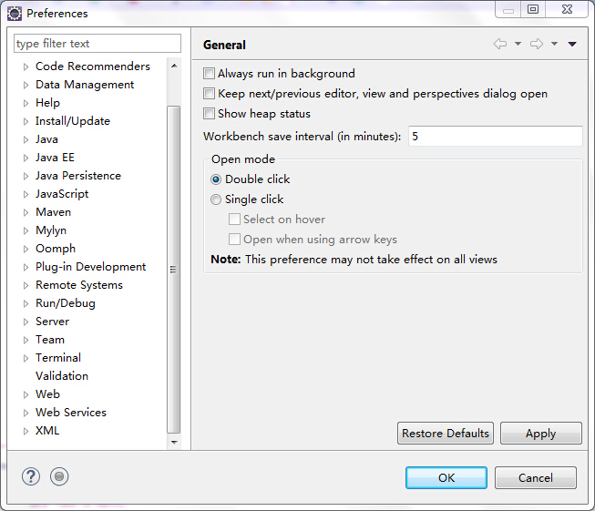
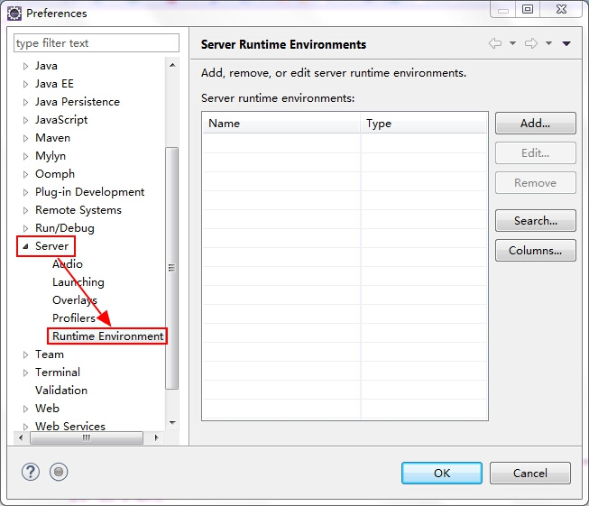
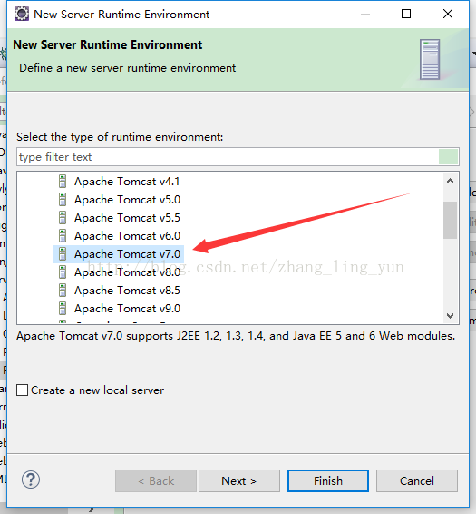
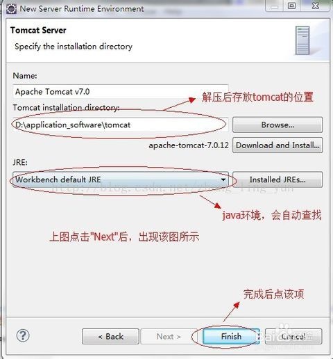
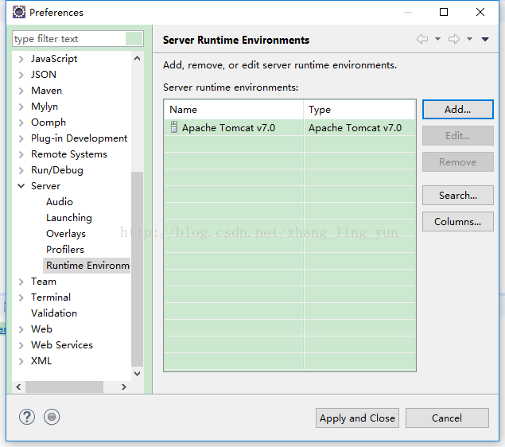
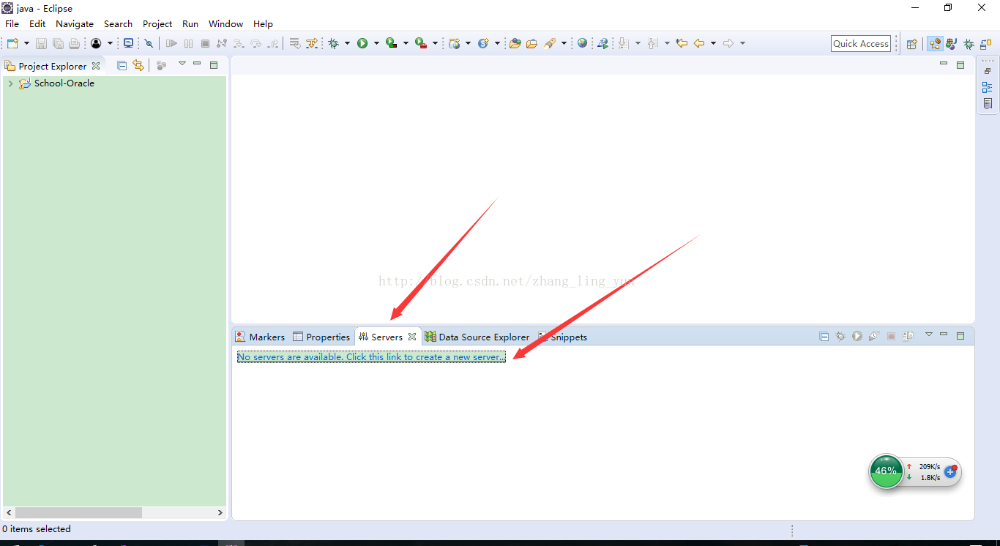
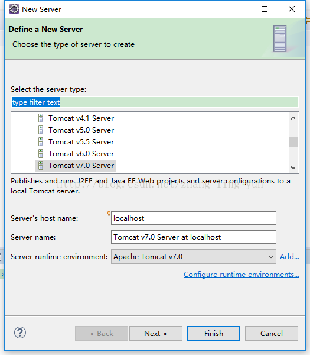

- [Eclipse下载](#eclipse下载)
- [project Explorer不显示work set](#project-explorer不显示work-set)
- [Tomcat配置](#tomcat配置)
- [如何干净的删除包](#如何干净的删除包)
- [运行前保存所有文件](#运行前保存所有文件)
- [自动补全配置](#自动补全配置)
  - [设置提示快捷键](#设置提示快捷键)
  - [java自动补全](#java自动补全)
  - [xml文件自动补全](#xml文件自动补全)
  - [xml节点自动提示](#xml节点自动提示)
    - [xml的<!DOCTYPE>部分设置](#xml的doctype部分设置)
- [快捷键](#快捷键)
  - [快速补充‘=’左边的变量](#快速补充左边的变量)
  - [代码行上移](#代码行上移)
  - [代码行下移](#代码行下移)
  - [删除当前行](#删除当前行)
  - [显示类名全路径](#显示类名全路径)


# Eclipse下载

https://www.eclipse.org/downloads/packages/

java ee:可以创建项目web工程。

# project Explorer不显示work set

通过project Explorer界面的右上角找到Select Working Set，选中想要显示的workset即可

# Tomcat配置
1. 打开Eclipse，单击“Window”菜单，选择下方的“Preferences”。 

2. 单击“Server”选项，选择下方的“Runtime Environments”。 

3. 点击“Add”添加Tomcat。

4. 点击“Next”，选中自己安装的Tomcat路径。

5. 点击“Finish”完成。 

6. 完成之后将出现以下界面(如果没有出现可以点击Window->Show View->Servers进行显示)

7. 双击控制台蓝色的链接

8. 点击"Finish"之后,这样我们的Tomcat服务器就已经配置好了。

# 如何干净的删除包

选中Referenced Libraries右击选择build path 选中无效的package然后remove。

# 运行前保存所有文件

    Windows-> preferences->run/debug>launching->save required dirty editors before launching

  备选方案：Always  Never  Prompt

# 自动补全配置

该功能极力推荐，减少不必要的记忆，现在不局限于某个对象后输入“.”才提示，而是输入任意字符就能提示

## 设置提示快捷键

preferences->General->Keys找到Content Assist
首先Remove Binding(移除绑定),然后再Binding（按下Alt+/）
When中选Editing Text就可以，OK
现在在写代码的时候按下Alt+/就会有自动提示了。


## java自动补全
preferences/windows->Java->Editor->Content Assist
再右下角Auto activation triggers for Java里面改为

.abcdefghijklmnopqrstuvwxyzABCDEFGHIJKLMNOPQRSTUVWXYZ0123456789

这样每次输入上面字母都会自动提示了


## xml文件自动补全

Windows->preferance->XML->XML Files->Editor->Content Assist
面板最上端 Auto Activation 将Prompt when these characters are inserted后面的文本框中的“<=:”替换成“<=:abcdefghijklmnopqrstuvwxyzABCDEFGHIJKLMNOPQRSTUVWXYZ ”（注意后面还有一个空格）

## xml节点自动提示

### xml的<!DOCTYPE>部分设置

"-//mybatis.org//DTD Config 3.0//EN"： key是一个本地key
"http://mybatis.org/dtd/mybatis-3-config.dtd"：是mybatis的节点网络配置

```xml
<!DOCTYPE configuration
PUBLIC "-//mybatis.org//DTD Config 3.0//EN"
"http://mybatis.org/dtd/mybatis-3-config.dtd">
```

断网情况下需要配置本地的key才能进行自动提示。

配置方法如下：
Windows->preferance->XML->XML Catalog->add

设置location和key，类型public


# 快捷键

## 快速补充‘=’左边的变量

keys->Quick Assist - Assist to local variable;

## 代码行上移

keys-> move lines up

## 代码行下移

keys -> move lines down

## 删除当前行

keys -> Delete line

## 显示类名全路径

keys -> copy Qualified Name

选中文件拷贝的是全路径。选中Java文件内部的类名拷贝的是包名。

