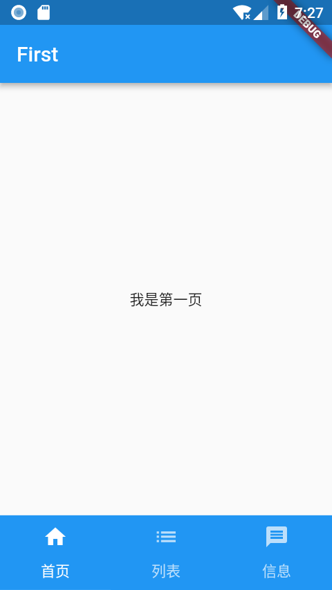
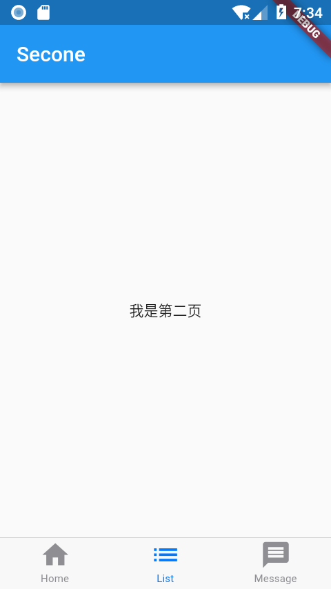

- [零、概述](#零概述)
- [TabBar + TabBarView](#tabbar--tabbarview)
- [BottomNavigationBar + BottomNavigationBarItem](#bottomnavigationbar--bottomnavigationbaritem)
- [CupertinoTabBar](#cupertinotabbar)

长话短说，现在主流的App都是底部导航按钮 + Fragment 的方式，Android 原生开发有很多种方式来实现，Flutter 也是。

## 零、概述

* TabBar + TabBarView
  *  相当于 Android 原生TabLayout + ViewPage
  *  有自带 Material Design 动画
  * 代码实现简单
  * 支持左右滑动
* BottomNavigationBar + BottomNavigationBarItem
    * 相当于Android 原生控件 BottomNavigationBar
    * 有自带 Material Design 动画
    * 代码实现简单
    * 不支持左右滑动
* BottomAppBar
    * 完全可以自定义
    * 代码量复杂
    * 没有自带动画
* CupertinoTabBar
    * IOS 风格


## TabBar + TabBarView

TabBar + TabBarView 的方式非常简单，相当于 Android 原生中的
TabLayout + ViewPage 方式，并且也支持左右滑动。
如下图所示：


TabBar + TabBarView
具体实现代码如下：
```dart
  @override
  Widget build(BuildContext context) {
    return new Scaffold(
      body: new TabBarView(controller: controller, children: <Widget>[
        new FirstPage(),
        new SecondPage(),
        new ThirdPage()
      ]),
      bottomNavigationBar: new Material(
        color: Colors.blue,
        child: new TabBar(
          controller: controller,
          tabs: <Tab>[
            new Tab(text: "首页", icon: new Icon(Icons.home)),
            new Tab(text: "列表", icon: new Icon(Icons.list)),
            new Tab(text: "信息", icon: new Icon(Icons.message)),
          ],
          indicatorWeight: 0.1,
        ),
      ),
    );
  }
```
TabBar 默认是有高度的，但是我找了很久也没找到 api 去处理，最后使用了一个投机取巧的方法：把 indicatorWeight 的值设置为0.1，也就是把指示器的高度设置为0.1。


## BottomNavigationBar + BottomNavigationBarItem

这种方式也代码量非常少，相当于Android原生谷歌推出的 Material Design 风格的控件 BottomNavigationBar，并且点击的动画和效果也是一样。
如下图所示：


```dart
BottomNavigationBar + BottomNavigationBarItem
具体实现代码如下：

  @override
  Widget build(BuildContext context) {
    return new Scaffold(
      body: _children[_currentIndex],
//      CupertinoTabBar 是IOS分格
      bottomNavigationBar: BottomNavigationBar(
        currentIndex: _currentIndex,
        onTap: onTabTapped,
        items: [
          BottomNavigationBarItem(
              title: new Text("Home"), icon: new Icon(Icons.home)),
          BottomNavigationBarItem(
              title: new Text("List"), icon: new Icon(Icons.list)),
          BottomNavigationBarItem(
              title: new Text("Message"), icon: new Icon(Icons.message)),
        ],
      ),
    );
  }
```
有人会问：Flutter 不是支持 Android 和 IOS 么，我想用 IOS 风格的底部导航栏怎么办？
很简单，根据注释所写的那样：只要把 BottomNavigationBar 改成 CupertinoTabBar 就可以了。
如下图所示：


## CupertinoTabBar

点击 Material Design 动画效果没有了，图标上面也出现了一根横线，并且图标也会更扁平化。
三、BottomAppBar 自定义

以上两种方式都是使用系统封装好的，如果我想完全自定义，不遵循 MD 风格或者 IOS 风格，那就必须使用
BottomAppBar。
若下图所示：


BottomAppBar

代码如下所示：

```dart
  Row tabs() {
    return Row(
      mainAxisSize: MainAxisSize.max,
      mainAxisAlignment: MainAxisAlignment.spaceAround,
      children: <Widget>[
        new Container(
          child: IconButton(
            icon: Icon(Icons.near_me),
            color: _tabColor,
            onPressed: () {
              setState(() {
                _tabColor = Colors.orangeAccent;
                _index = 0;
              });
            },
          ),
        ),
        IconButton(
          icon: Icon(Icons.edit_location),
          color: Colors.white,
          onPressed: () {
            setState(() {
              _tabColor = Colors.white;
              _index = 1;
            });
          },
        ),
      ],
    );
  }
```
中间那个很酷炫的 + 号是 FloatingActionButton ，它们两可以组合使用，也可以单独使用，在官网上的解释如下：

A container that is typically used with Scaffold.bottomNavigationBar, and can have a notch along the top that makes room for an overlapping FloatingActionButton.
Typically used with a Scaffold and a FloatingActionButton.
完

