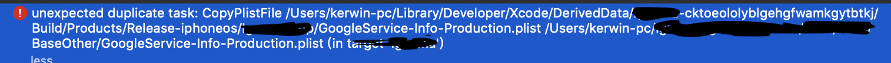
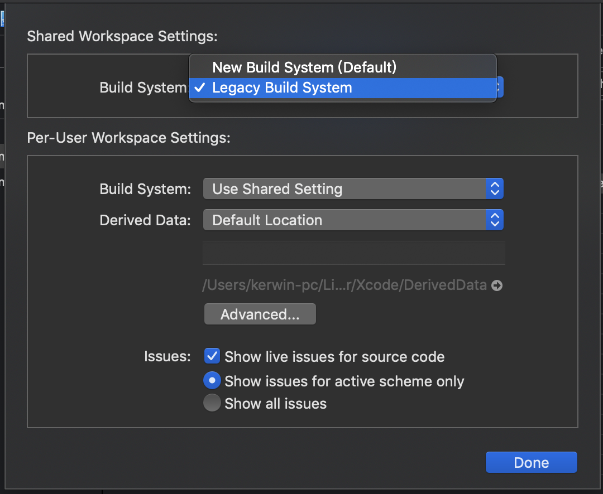

- [[!] The 'Pods-Runner' target has transitive dependencies that include static frameworks](#-the-pods-runner-target-has-transitive-dependencies-that-include-static-frameworks)

# [!] The 'Pods-Runner' target has transitive dependencies that include static frameworks

删除 `ios/Flutter/Flutter.framework `运行 `pod install`


#  Undefined symbols for architecture arm64:

```shell
      Undefined symbols for architecture arm64:
      "_OBJC_CLASS_$_GULSecureCoding", referenced from:
          objc-class-ref in FirebaseMessaging(FIRMessagingPubSub.o)
      "_GULLoggerRegisterVersion", referenced from:
          ___FIRLoggerInitializeASL_block_invoke in FirebaseCore(FIRLogger.o)
      "_GULLoggerInitializeASL", referenced from:
          ___FIRLoggerInitializeASL_block_invoke in FirebaseCore(FIRLogger.o)
```

删除 ‘ios/Runner.xcworkspace/xcshareddata/WorkspaceSettings.xcsettings’
或者 删除 ‘ios/Runner.xcworkspace/**/WorkspaceSettings.xcsettings’
即找到WorkspaceSettings.xcsettings删除即可

其他原因一般是路径问题flutter版本问题


# unexpected duplicate task: CopyPlistFile


出现这种问题主要是因为出现了重复。两种解决方式：

一、File -> workspace settings，选择Legacy Build System。旧的build方式即可


二、如果不想改为旧的build方式的话，那就需要删除重复的文件路径。在Build Phases 里面进行搜索，并删除重复的。主要是copy bundle resource 里面出现了相同名称的文件。我是因为我这边构建了两个targets，而两个targets的copy bundle resource出现了相同的文件，两边删除一边即可，不过要根据项目情况而进行删除。

