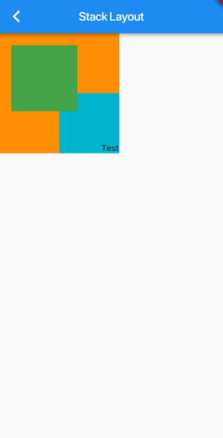

官方文档

https://flutter.dev/docs/get-started/flutter-for/ios-devs#plugins

# 使用库

## 库和可见性

使用import和library智联可以创建一个模块化的可共享的代码库。库不仅提供API，而且还是是隐私单元：以下划线（_）开头的标识符仅在库内可见。每个Dart应用程序都是一个库，即使它不适用library指令。可以使用包（packages）来分发库。

## 使用库

使用import来指定如何让一个库中的命名空间在另一个库中使用。

例如Dart Web应用，通常使用`dart:html`库，可以像这样导入：

```dart
// 注意不要忘记分号';'
import 'dart:html';
```

import唯一需要的参数是指定库的URI。对于内置库，URI具有特殊的`dart:`（scheme）方案。对于其他库，可以使用文件系统路径或`package:`（scheme）方案。该package:方案是由包管理器（如pub工具）提供的库。

```dart
使用package管理
import 'package:test/test.dart';
```


- URI代表统一资源标识符。URL（统一资源定位符）是一种常见的URI。

#### 指定库前缀

如果导入的两个具有冲突标识符的库，则可以为一个或两个库指定前缀。

```dart
// lib1和lib2中都含有Element类
import 'package:lib1/lib1.dart';
import 'package:lib2/lib2.dart' as lib2;

// Uses Element from lib1.
Element element1 = Element();

// Uses Element from lib2.
lib2.Element element2 = lib2.Element();
```


#### 仅导入库的一部分

如果只想使用库的一部分，则可以选择行的导入库：

```dart
// 只导入foo
import 'package:lib1/lib1.dart' show foo;

// 导入除foo外的所有内容
import 'package:lib2/lib2.dart' hide foo;
```


#### 懒加载一个库

延迟加载（懒加载）允许应用程序在需要库时按需加载库。使用懒加载的场景：

1. 减少应用程序初始启动时间。
2. 例如执行A/B测试-尝试（testing—trying）算法的替代实现。
3. 加载很少使用的功能，例如可选的屏幕和对话框。

- 只有dart2js支持延迟加载。Flutter，Dart VM和dartdevc都不支持延迟加载。

要懒加载一个库，必须使用`defferred as`来导入它。

```dart
// 懒加载一个库
import 'package:greetings/hello.dart' deferred as hello;
```

当使用这个库时，使用这个库的标识符来调用`loadLibrary()`方法。

```dart
Future greet() async {
  await hello.loadLibrary();
  hello.printGreeting();
}
```

上面代码中，await关键字暂停执行，直到加载库。该库只加载一次，所以可以多次调用loadLibrary()而不会出现问题，async和await关键字支持异步编程，这里先不用关注它，会在介绍。

需要注意以下内容：

- 延迟库的常量不是导入文件中的常量。在加载延迟库之前，这些常量不存在。
- 不能在导入文件中使用延迟库中的类型。相反，可以考虑将接口类型移动到由延迟库和导入文件导入的库。
- Dart隐式插入loadLibrary()到您使用的deferred as namespace定义的命名空间。loadLibrary()函数返回Future。


https://lingjye.com/2019/07/15/dart_04/

# 时间控制

## 创建

```dart
var now =new DateTime.now();
print(now);
var d =new DateTime(2019, 1, 10, 9, 30);
print(d);
```

## 创建时间UTC

```dart
var d = new DateTime.utc(2019, 10, 10, 9, 30);
```


## 解析时间 ISO 8601

```dart
var d1 = DateTime.parse('2018-10-10 09:30:30Z');
print(d1);
var d2 = DateTime.parse('2018-10-10 09:30:30+0800');
print(d2);
```

## 时间增减量

```dart
var d1 = DateTime.now();
print(d1);
print(d1.add(new Duration(minutes: 5)));//加五分钟
print(d1.add(new Duration(minutes: -5)));//减五分钟
```

##  时间比较

```dart
  var d1 = new DateTime(2018, 10, 1);
  var d2 = new DateTime(2018, 10, 10);
  print(d1.isAfter(d2));//是否在d2之后
  print(d1.isBefore(d2));//是否在d2之前
  var d3 = DateTime.now();
  var d4 = d3.add(new Duration(milliseconds: 30));
  print(d3.isAtSameMomentAs(d4));//是否相同
```


##  时间差

```dart
var d1 = new DateTime(2018, 10, 1);
var d2 = new DateTime(2018, 10, 10);
var difference = d1.difference(d2);
print([difference.inDays, difference.inHours]);//d1与d2相差的天数与小时
```

## 时间戳

```dart
  var now = new DateTime.now();
  print(now.millisecondsSinceEpoch);//单位毫秒，13位时间戳
  print(now.microsecondsSinceEpoch);//单位微秒,16位时间戳
```

## 时间格式化

自己封装下吧

```dart
//padLeft(int width,String padding)：如果字符串长度小于width，在左边填充padding
var date = new DateTime.now();
  String timestamp = "${date.year.toString()}-${date.month.toString().padLeft(2,'0')}-${date.day.toString().padLeft(2,'0')} ${date.hour.toString().padLeft(2, '0')}:${date.minute.toString().padLeft(2, '0')}";
  print(timestamp);
```

## 时间选择器

### 选择日期

```dart
//设置默认显示的日期为当前
  DateTime initialDate = DateTime.now();
  
  void showDefaultYearPicker(BuildContext context) async {
    final DateTime dateTime = await showDatePicker(
      context: context,
      //定义控件打开时默认选择日期
      initialDate: initialDate,
      //定义控件最早可以选择的日期
      firstDate: DateTime(2018, 1),
      //定义控件最晚可以选择的日期
      lastDate: DateTime(2022, 1),
      builder: (BuildContext context, Widget child) {
        return Theme(
          data: CommonColors.themData,
          child: child,
        );
      },
    );
    if (dateTime != null && dateTime != initialDate) {}
  }
————————————————
版权声明：本文为CSDN博主「早起的年轻人」的原创文章，遵循 CC 4.0 BY-SA 版权协议，转载请附上原文出处链接及本声明。
原文链接：https://blog.csdn.net/zl18603543572/article/details/94614825
```

### 选择时分秒

```dart
//设置显示显示的时间为当前
  TimeOfDay initialTime = TimeOfDay.now();
  void showDefaultDatePicker(BuildContext context) async {
    final TimeOfDay timeOfDay = await showTimePicker(
      context: context,
      initialTime: initialTime,
      builder: (BuildContext context, Widget child) {
        return Theme(
          data: CommonColors.themData,
          child: child,
        );
      },
    );
    if (timeOfDay != null && timeOfDay != initialTime) {
      setState(() {
        initialTime = timeOfDay;
      });
    }
  }
————————————————
版权声明：本文为CSDN博主「早起的年轻人」的原创文章，遵循 CC 4.0 BY-SA 版权协议，转载请附上原文出处链接及本声明。
原文链接：https://blog.csdn.net/zl18603543572/article/details/94614825
```


# 国际化

## 依赖库

```dart
flutter_localizations:
    sdk: flutter 
intl:
intl_translation:

//ios用到的一个第三方本地库，具体参考demo
language_locale:
  path: ./language_locale
```

1. 创建一个lib/local/String.dart文件

```dart
import 'dart:async';

import 'package:flutter/widgets.dart';
import 'package:intl/intl.dart';

import 'messages_all.dart';

class Strings {
  static Future<Strings> load(Locale locale) {
    String langCode = locale.languageCode;
    if (langCode == 'zh') {
      if (locale.scriptCode == 'Hans') langCode += '_Hans';
      if (locale.scriptCode == 'Hant') langCode += '_Hant';
      if (langCode == 'zh') langCode += '_Hans';
    }

    final String localeName = Intl.canonicalizedLocale(langCode);
    // ignore: strong_mode_uses_dynamic_as_bottom
    return initializeMessages(localeName).then((_) {
      Intl.defaultLocale = localeName;
      return new Strings();
    });
  }

  static Strings of(BuildContext context) {
    return Localizations.of<Strings>(context, Strings);
  }

  static final Strings instance = new Strings();

  // TODO 追加すべき文言
  String get title => Intl.message('Flutter Demo Home Page', name: "title");
  String get message => Intl.message('You have pushed the button this many times:', name: "message");

}

```

注意整个配置过程只有这个文件是需要修改的，其他文件都是自动生成和更新的不需要修改。

2. 运行下面命令生成local/intl_messages.arb文件

3. ```shell
   flutter pub pub run intl_translation:extract_to_arb --output-dir=lib/local lib/local/Strings.dart
   ```

3. 分别创建一下文件

   local/intl_zh_Hans.arb(中文简体）

   ```json
   {
     "title": "点击按钮",
     "message": "显示按钮点击次数"
   }
   ```

   local/intl_zh_Hant.arb（中文繁体）

   ```json
   {
     "title": "フラッターデモホームページ",
     "message": "ボタンを押した回数がここに表示されます"
   }
   ```

   local/intl_ko.arb(韩国语）

   ```json
   {
     "title": "저장 완료\n이미지를 표시하는 데 몇 분",
     "message": "계속하려면 설정 앱에서 사용 설정하세요"
   }
   ```

   local/intl_ja.arb(日本语）

   ```json
   {
     "title": "フラッターデモホームページ",
     "message": "ボタンを押した回数がここに表示されます"
   }
   ```

4. 运行下面命令创建相应的Dart文件

5. ```shell
   flutter pub pub run intl_translation:generate_from_arb --output-dir=lib/local --no-use-deferred-loading lib/local/Strings.dart lib/local/intl_messages.arb lib/local/intl_*.arb
   ```

   运行输出信息，如果有错误请根据错误信息修改，注意json的最后一个元素是没有,的

   ```
   No @@locale or _locale field found in intl_messages, assuming 'messages' based on the file name.
   No @@locale or _locale field found in intl_ja, assuming 'ja' based on the file name.
   No @@locale or _locale field found in intl_ko, assuming 'ko' based on the file name.
   No @@locale or _locale field found in intl_messages, assuming 'messages' based on the file name.
   No @@locale or _locale field found in intl_zh_Hans, assuming 'zh_Hans' based on the file name.
   No @@locale or _locale field found in intl_zh_Hant, assuming 'zh_Hant' based on the file name.
   ```

   运行结束后你会看到工程里多了以下文件：

   local/messages_all.dart
   local/messages_ja.dart
   local/messages_ko.dart
   local/messages_messages.dart
   local/messages_zh_Hans.dart
   local/messages_zh_Hant.dart

5. 使用前配置main.dart

   ```dart
   ........
   import 'dart:async';
   import 'package:flutter_localizations/flutter_localizations.dart';
   import 'local/Strings.dart';
   
   import 'package:language_locale/language_locale.dart';
   ........
     
   main() async {
     // Fetch Locale for iOS.
     var iosLocale;
     if (Platform.isIOS) {
       Map<dynamic, dynamic> results = await LanguageLocale.locale;
       String lanCode = results["lanCode"] as String ?? "";
       String countryCode = results["countryCode"] as String ?? "";
       String scriptCode = results["scriptCode"] as String ?? "";
       if (lanCode == 'zh') {
         iosLocale = Locale.fromSubtags(
             languageCode: lanCode, scriptCode: scriptCode, countryCode: countryCode);
       } else {
         iosLocale = Locale(lanCode, countryCode);
       }
     }
   
     runApp(MyApp(iosLocale));
   }
   
   class _MyLocalizationsDelegate extends LocalizationsDelegate<Strings> {
     const _MyLocalizationsDelegate();
   
     @override
     bool isSupported(Locale locale) {
       String code = locale.languageCode;
       String scriptCode = locale.scriptCode;
   
       if (code.contains('zh')) {
         if (scriptCode != null) {
           if (scriptCode.contains('Hant')) {
             code = 'zh_Hant';
           }
   
           if (scriptCode.contains('Hans')) {
             code = 'zh_Hans';
           }
         } else {
           code = 'zh_Hans';
         }
       }
   
       return ['en', 'ja', 'ko', 'zh_Hant', 'zh_Hans'].contains(code);
     }
   
     @override
     Future<Strings> load(Locale locale) => Strings.load(locale);
   
     @override
     bool shouldReload(_MyLocalizationsDelegate old) => false;
   }
   .............
   class MyApp extends StatelessWidget {
     // This widget is the root of your application.
     @override
     Widget build(BuildContext context) {
       return MaterialApp(
         title: 'Flutter Demo',
         //适配iOS的本地化
         localeResolutionCallback: (Locale locale, Iterable<Locale> supportedLocales) {
             Locale candidateLocale = Platform.isIOS ? iosLocale : locale;
             Locale defaultLocale = supportedLocales.first;
   
             for (Locale lc in supportedLocales) {
               if (lc.languageCode == candidateLocale.languageCode) {
                 return candidateLocale;
               }
             }
   
             return defaultLocale;
           },
         localizationsDelegates: [
           const _MyLocalizationsDelegate(),
           GlobalMaterialLocalizations.delegate,
           GlobalWidgetsLocalizations.delegate,
         ],
         supportedLocales: [
           const Locale('en', 'US'),
           const Locale('ja', 'JP'),
           const Locale('ko', 'KP'),
           const Locale.fromSubtags(languageCode: 'zh', scriptCode: 'Hans'),
           const Locale.fromSubtags(languageCode: 'zh', scriptCode: 'Hant'),
           const Locale.fromSubtags(languageCode: 'zh', scriptCode: 'Hans', countryCode: 'CN'),
           const Locale.fromSubtags(languageCode: 'zh', scriptCode: 'Hant', countryCode: 'TW'),
         ],
         home: .....,
       );
     }
   }
   .............
   ```

   

参考：https://qiita.com/jiro-aqua/items/fd9896682ca09018fdd3

# Flutter项目的依赖库

## 本地依赖库

```dart
camera:
    path: ./camera
```

## Git远程依赖库

```dart
flutter_twitter_login:
    git: git://github.com/eudangeld/flutter_twitter_login.git
```

## Flutter pub依赖库

```
uni_links: ^0.2.0
```


# 本地数据库操作


## sqlite

官方框架

## floor

一个类似Spring的框架，目前还不稳定（个人更喜欢）


## moor

相对floor比较流行和稳定，可以开发app和dart应用。moor的设计理念就是所有的东西都对象话，数据库的概念仍然可见，所有的元素如表，字段，主键，数据库，都是对象。select，insert，update

### moor_flutter

moor针对flutter的版本

#### 引入moor_flutter

```dart
dependencies:
  moor_flutter: ^2.0.0
    

import 'package:moor_flutter/moor_flutter.dart';
```


# 动画

## 旋转动画组件RotationTransitio

```dart
 AnimationController controller;

controller =
        AnimationController(duration: const Duration(seconds: 2), vsync: this);//动画时间  
//旋转
  Widget buildRotationTransition() {
    return Center(
      child: RotationTransition(
        //设置动画的旋转中心
        alignment: Alignment.center,
        //动画控制器
        turns: controller,
        //将要执行动画的子view
        child: Container(
          width: 100,
          height: 100,
          color: Colors.grey,
        ),
      ),
    );
  }
}
```


## 帧动画

https://segmentfault.com/a/1190000018074981

具体到Flutter，动画处理主要分为三个部分：

- 动画控制器（AnimationController），控制整个动画运行，包括开始结束和动画时长等。
- 动画抽象（Animation），描述了动画运动的速率，例如组件是加速还是匀速，或者其它变化。
- 变动范围（Tween），定义了动画组件属性值的变化范围，例如从坐标(0, 0)移动到(20, 0)


## 处理流程

上述三大组件，控制了整个动画的运行。用文字描述，其流程主要包括：

1. 初始化动画控制器，设定动画的时长，初始值等（如上例：2秒时长）
2. 初始化变动范围（如上例：Offset从[0, 0]到[20, 0]）
3. 初始化动画抽象，定义它的运动速率（如上例：匀速变动）
4. 将动画描述的值，赋值到动画组件的对应属性上
5. 开始执行动画（调用动画控制器的开始方法）
6. 动画执行结束

### AnimationController定义

AnimationController是一个特殊的Animation对象。创建一个AnimationController时，需要传递一个vsync参数。设置此参数的目的，是希望屏幕每**一帧画面变化时能够被通知到**。也就是说，屏幕刷新的每一帧，AnimationController都会生成一个新的值（同样也意味着，如果在屏幕外那么就不被触发）。这样动画组件就能够完成一个连续平滑的动画动作。

AnimationControler通常是在一个StatefulWidget中被声明，并且附带一个叫做SingleTickerProviderStateMixin的Mixin（原因就在上面说的，要设置vsync参数）。

```dart
import 'package:flutter/material.dart';

class AnimationDemo extends StatefulWidget
{
  @override
  State<StatefulWidget> createState() {
    return _State();
  }
}

class _State extends State<AnimationDemo> with SingleTickerProviderStateMixin
{
  AnimationController controller;

  @override
  void initState() {
    super.initState();
    controller = AnimationController(duration: Duration(milliseconds: 2000), vsync: this);
    //动画开始、结束、向前移动或向后移动时会调用StatusListener
    controller.addStatusListener((status) {
      if (status == AnimationStatus.completed) {
        //动画从 controller.forward() 正向执行 结束时会回调此方法
        print("status is completed");
      } else if (status == AnimationStatus.dismissed) {
        //动画从 controller.reverse() 反向执行 结束时会回调此方法
        print("status is dismissed");
      } else if (status == AnimationStatus.forward) {
        print("status is forward");
        //执行 controller.forward() 会回调此状态
      } else if (status == AnimationStatus.reverse) {
        //执行 controller.reverse() 会回调此状态
        print("status is reverse");
      }
    }
  }

  @override
  void dispose() {
    controller.dispose();  // 离开时需要销毁controller
    super.dispose();
  }
  
  .......
}
```

当Animation和Tween的设置完成后，简单调用controller.forward()即可开始动画。

### Tween定义

Tween就是要改变的属性值的变动范围。它可以是任意的属性类如Offset或者Color，最常见的是double。

```dart
...
    AnimationController controller;
    Tween<double> slideTween = Tween(begin: 0.0, end: 20.0);
...
```

### Animation定义

Animation对象本身可以看做是动画中所有变化值的一个集合。它包含了变化区间内的所有可取值，并返回给动画组件当前的变动值。

Animation在使用中要设置的，是他的变动速率，如Curves.linear(线性变化)。

```dart
...
    AnimationController controller;
    Tween<double> slideTween = Tween(begin: 0.0, end: 20.0);
    Animation<double> animation;
    
    @override
    void initState() {
        super.initState();
        
        ...
        animation = slideTween.animate(CurvedAnimation(parent: controller, curve: Curves.linear));
    }
...
```

### 动画组件的设置

```dart

class _State extends State<AnimationDemo> with SingleTickerProviderStateMixin {
  ....

  @override
  Widget build(BuildContext context) {
    return Scaffold(
        appBar: AppBar(
          title: Text("Animation Demo"),
        ),
        body: Stack(
          children: <Widget>[
            SizedBox(
              width: 200,
              height: 200,
              child: Container(
                alignment: Alignment.centerLeft,
                padding: EdgeInsets.only(left: animation.value),
                child: Container(
                  color: Colors.blue,
                  width: 80,
                  height: 80,
                ),
              ),
            ),
            Positioned(
              width: 200,
              height: 200,
              child: Container(
                alignment: Alignment.centerLeft,
                padding: EdgeInsets.only(top: animation.value,left: animation.value),
                child: Container(
                  color: Colors.blue,
                  width: 80,
                  height: 80,
                ),
              ),
            )
          ],
        ));
  }
}
```

### 动画启动

```dart
...
    @override
    void initState() {
        ...
       animation.addListener(() {
     			  print(animation.value);//打印当前动画的值
      			setState(() {});
    		});
       controller.repeat();//动画重复执行
//     controller.forward();//动画只执行一次
    }
```

### 总结

controller有点像iOS的NSTimer，addListener是每一帧变化都会回调。在回调里通过setState更新UI，否则无法更新。所以只要一个动画抽象值与一个组件的某个外观属性值联系起来，那么就能在动画中展现出连续平滑的外观变化。

### 串行动画

串行动画（Sequential Animation）顾名思义，多个动画像肉串一样一个接一个的发生。但这只是从现象上观察出的结果，实际的运行方式和并行动画差别不大。串行动画的关键之处在于，它为每个动画的发生设定了一个计时器，只有到特定时间点时，特定的动画效果才会发生。

例如设计一个3秒钟的动画：

- 移动动画从0秒开始，持续1秒
- 旋转动画从1秒开始，持续1.5秒
- 缩放动画从2秒开始，持续0.7秒

那么，最后的动画效果便是：

1. 0~1秒，动画元素在移动
2. 1~2秒，动画元素在旋转
3. 2~2.5秒，动画既在旋转又在缩放
4. 2.5~2.7秒，动画在缩放
5. 2.7~3秒，动画静止不动

```dart
class ParallelDemoState extends State<ParallelDemo> with SingleTickerProviderStateMixin {
    ...
    Tween<double> slideTween = Tween(begin: 0.0, end: 200.0);
    Tween<double> borderTween = Tween(begin: 0.0, end: 40.0);  // 添加边角半径变动范围
    Animation<double> slideAnimation;
    Animation<double> borderAnimation; // 添加边角半径动画定义
    
    @override
    void initState() {
        ...
        controller = AnimationController(duration: Duration(milliseconds: 2000), vsync: this);
        slideAnimation = slideTween.animate(CurvedAnimation(parent: controller, curve: Curves.linear));
        borderAnimation = borderTween.animate(CurvedAnimation(parent: controller, curve: Curves.linear)); // 定义边角半径动画
    }
    
    ...
        
    @override
    Widget build(BuildContext context) {
        return Container(
            width: 200,
            alignment: Alignment.centerLeft,
            child: Container(
                margin: EdgeInsets.only(left: slideAnimation.value),
                decoration: BoxDecoration(
                    borderRadius: BorderRadius.circular(borderAnimation.value), // 边角半径的属性上添加动画
                    color: Colors.blue,
                ),
                width: 80,
                height: 80,
            ),
        );
    }
}
```


### 并行动画

在串行动画例子的基础上，我们加上计时器Interval的处理。Interval有三个参数，前两个参数指示了动画的开始和结束时间。这两个参数都是以动画控制器的Duration时长的比例来计算的。例如：

- Slide动画分别为0.0和0.5，表示动画从0秒（2000ms *0.0）这个时间点开始，至1秒（2000ms* 0.5)这个时间点结束
- Border动画分别为0.5和1.0，表示动画从1秒（2000ms *0.5）这个时间点开始，至2秒（2000ms* 1.0）这个时间点结束

```dart
class SequentialDemoState extends State<ParallelDemo> with SingleTickerProviderStateMixin {
    ...
    
    @override
    void initState() {
        ...
        controller = AnimationController(duration: Duration(milliseconds: 2000), vsync: this);
        // slideAnimation = slideTween.animate(CurvedAnimation(parent: controller, curve: Curves.linear));
        // borderAnimation = borderTween.animate(CurvedAnimation(parent: controller, curve: Curves.linear)); // 定义边角半径动画
        
        // 换一种写法，加入Interval
        slideAnimation = slideTween.animate(CurveTween(curve: Interval(0.0, 0.5, curve: Curves.linear)).animate(controller));
        borderAnimation = borderTween.animate(CurveTween(curve: Interval(0.5, 1.0, curve: Curves.linear)).animate(controller));
    }
    
    ...
        
    @override
    Widget build(BuildContext context) {
        return Container(
            width: 200,
            alignment: Alignment.centerLeft,
            child: Container(
                margin: EdgeInsets.only(left: slideAnimation.value),
                decoration: BoxDecoration(
                    borderRadius: BorderRadius.circular(borderAnimation.value), // 边角半径的属性上添加动画
                    color: Colors.blue,
                ),
                width: 80,
                height: 80,
            ),
        );
    }
}
```

## 通过 **CustomPainter** 结合 **Canvas** 来实现自定义的动画。

## 通过 **Hero动画** 来做页面之间的跳转效果

https://segmentfault.com/a/1190000018746633

https://segmentfault.com/a/1190000017541124

## Flare绘制动画

### Flare简介

Flare是一款 **免费的** 网页版的动画制作工具，通过Flare我们可以轻松创建 60fps 的矢量动画。

### Flare的适用场景

Flare适合于那种交互性不强的动画，即**代码与动画效果关系不大**的动画。

使用Flare创建矢量动画，不仅可以有效减少文件体积，还能获得超高的动画效果。

# Flutter的小组件

## Flutter中的按钮

* RaisedButton ：凸起的按钮，其实就是Android中的Material Design风格的Button ，继承自MaterialButton
* FlatButton ：扁平化的按钮，继承自MaterialButton
* OutlineButton	：带边框的按钮，继承自MaterialButton
* IconButton	：图标按钮,继承自StatelessWidget

下面我们来看看常用属性

| 属性              | 值类型                       | 说明                                                         |
| ----------------- | ---------------------------- | ------------------------------------------------------------ |
| onPressed         | VoidCallback                 | 一般接收一个方法	必填参数，按下按钮时触发的回调，接收一个方法，传null表示按钮禁用，会显示禁用相关样式。 |
| child             | Widget                       | 文本控件                                                     |
| textColor         | Color                        | 文本颜色                                                     |
| color             | Color                        | 按钮的颜色                                                   |
| disabledColor     | Color                        | 按钮禁用时的颜色                                             |
| disabledTextColor | Color                        | 按钮禁用时的文本颜色                                         |
| splashColor       | Color                        | 点击按钮时水波纹的颜色                                       |
| highlightColor    | Color                        | 点击（长按）按钮后按钮的颜色                                 |
| elevation         | double                       | 阴影的范围，值越大阴影范围越大                               |
| padding           | EdgeInsetsGeometry（抽象类） | 内边距                                                       |
| shape             | ShapeBorder（抽象类）        | 设置按钮的形状                                               |
| minWidth          | double                       | 最小宽度                                                     |
| height            | double                       | 高度                                                         |

而在Android中如果我们要修改按钮样式的话，需要通过selector和Shape等方式进行修改，相比较Flutter来说是要麻烦不少的

https://blog.csdn.net/yuzhiqiang_1993/article/details/85004313


## 添加圆角的组件ClipRRect

### 顶部圆角

```dart
ClipRRect(
  borderRadius: BorderRadius.vertical(top: Radius.circular(20)),
  child: Container(
    color: Colors.white,
  )
)
```

### 底部圆角

```
ClipRRect(
  borderRadius: BorderRadius.vertical(bottom: Radius.circular(20)),
  child: Container(
    color: Colors.white,
  )
)
```

### 全部圆角

```dart
ClipRRect(
  borderRadius: BorderRadius.all(Radius.circular(20)),
  child: Container(
    color: Colors.white,
  )
)
```

### 特定部分圆角

```dart
ClipRRect(
  borderRadius: BorderRadius.only(topLeft:Radius.circular(20),topRight:Radius.circular(20),bottomLeft:Radius.circular(20),bottomRight:Radius.circular(20)),
  child: Container(
    color: Colors.white,
  )
)
```


## GestureDetector

### 设置点击事件的范围

#### pading范围有效

```dart
new GestureDetector(
  onTap: () {
    // ここでタップされた場合の動作を実装する
  },
  child: new Container(
    padding: const EdgeInsets.all(16.0),
    child: const Icon(Icons.star, size: 32.0),
  ),
),
```

#### 子部件全部范围有效

```dart
new GestureDetector(
  behavior: HitTestBehavior.opaque,
  onTap: () {
    // ここでタップされた場合の動作を実装する
  },
  child: new Container(
    padding: const EdgeInsets.all(16.0),
    child: const Icon(Icons.star, size: 32.0),
  ),
),
```

#### 设置颜色和decoration的作用范围也是全部有效

```dart
new GestureDetector(
  onTap: () {
    // ここでタップされた場合の動作を実装する
  },
  child: new Container(
    color: Colors.white, // これがあると反応する
    padding: const EdgeInsets.all(16.0),
    child: const Icon(Icons.star, size: 32.0),
  ),
),
```


## WrapとActionChip（制作标签组件）

## Wrap属性

```json
direction
主轴的方向，默认水平
alignment
主轴的对其方式
spacing
主轴方向上的间距
textDirection
文本方向
verticalDirection
定义了 children 摆放顺序，默认是 down，见 Flex 相关属性介绍。
runAlignment
run 的对齐方式。run 可以理解为新的行或者 列，如果是水平方向布局的话，run 可以理解 为新的一行
runSpacing
run 的间距
```


## Chip属性

```dart
const Chip({
    Key key,
    this.avatar,//左侧的图标
    @required this.label,//这个是必填的参数，控件上显示的文本
    this.labelStyle,
    this.labelPadding,
    this.deleteIcon,//右侧的删除图标
    this.onDeleted,//删除图标的点击事件，如果不写该方法的话，deleteIcon显示不出来
    this.deleteIconColor,
    this.deleteButtonTooltipMessage,//点击删除图标后弹出的文本，类似于tooltip的效果
    this.shape,
    this.clipBehavior = Clip.none,//这个不晓得是啥
    this.backgroundColor,
    this.padding,
    this.materialTapTargetSize,//这个具体也不晓得怎么描述，它的两个值，一个为padded，一个为shrinkWrap，前者自带margin，后者好像没有margin，紧贴附近的控件
    this.elevation,//阴影深度
    this.shadowColor,//阴影颜色
  })
```


## NestedScrollView(拖拽可以隐藏顶部状态栏的视图)

## Text

### 去除下划线

有时候Text会默认添加下划线。去除Text默认添加的下划线方法：style下面的TextStyle增加属性decoration: TextDecoration.none

### 添加文字划掉效果

```dart
Text(
                    '我是个比较正经的对话框内容...你可以随便把我替换成任何部件，只要你喜欢(*^▽^*)',
                  style: TextStyle(
                    decoration: TextDecoration.lineThrough,//划掉效果
                    decorationColor: Colors.black,//线的颜色
                    decorationStyle: TextDecorationStyle.solid,//线的样式，实线，虚线还是其他？
                  ),
                )
```


## TextField

```
TextField(
                textInputAction: TextInputAction.go,//修改Done按钮的样式
                controller: _userEtController,
                onEditingComplete: _onEditingComplete,//点击Done时候回调，在onSubmitted前
                focusNode: node,//与焦点节点绑定，可以通过代码控制成为焦点
                onSubmitted: _onSubmitted,//点击Done时候回调
                onChanged:_onChanged,//文本发生变化时候回调
                onTap:_onTap,//被点击时候回调用
                autofocus: true,//显示时候自动成为焦点
                enabled: true,  //是否开启用户交互
                readOnly: false,//能否成焦点
                cursorColor: Color.fromARGB(0xff, 0x00, 0xff, 0xff),//改变光标颜色
                cursorWidth: 20,//光标的粗细程度
                showCursor: true,//输入文字时候光标是否显示
                cursorRadius:Radius.circular(20),//光标的圆角
                keyboardType: TextInputType.url,//键盘的类型
                maxLines:5,//设置最大输入行数
                minLines:1,//设置最小输入行数，最大最小一起设置可实现输入框自动增长高度，如果只设置最大就会固定高度
               textCapitalization:TextCapitalization.words,//文本自动纠正的方式
              style: TextStyle(
                    color: Color(0xFF11FF11),//修改文本颜色
                    backgroundColor: Color(0xFF000000),//文本区域的背景色
                    fontSize:10,//字体大小
                    fontWeight:FontWeight.w100,//文字的粗细
                    fontStyle:FontStyle.italic,//字体风格
                    height:2,//光标的高度
                    letterSpacing:2,//字节间的距离
                    wordSpacing:5,//一个空格的间距
                    textBaseline:TextBaseline.ideographic,//未知
//                  locale: Locale('CH')//设置地区
//                  foreground: Paint()

              ),
     ),
```

### 编辑开始和结束的通知

```dart
  FocusNode _focusNode = FocusNode();

  @override
  void initState() {
    _focusNode.addListener(() {
      if (!_focusNode.hasFocus) {
        // TextField has lost focus
        _showMessage();
      }
    });
    super.initState();
  }
```

### 多个输入框之间的切换

```dart
// Initialise outside the build method
FocusNode nodeOne = FocusNode();
FocusNode nodeTwo = FocusNode();
// Do this inside the build method
TextField(
  focusNode: nodeOne,
),
TextField(
  focusNode: nodeTwo,
),
RaisedButton(
  onPressed: () {
    FocusScope.of(context).requestFocus(nodeTwo);
  },
  child: Text("Next Field"),
)
```

### 使用decoration美化输入框

```dart
TextField(
            controller: accountController,
            decoration: InputDecoration(
              border: OutlineInputBorder(),
              hintText: '请输入账号',
              labelText: '左上角',
              prefixIcon: Icon(Icons.person),
              helperText: '输入框正下方的文字',
            ),
          )

decoration属性介绍:
border：增加一个边框，
hintText：未输入文字时，输入框中的提示文字，
prefixIcon：输入框内侧左面的控件，
labelText：一个提示文字。输入框获取焦点/输入框有内容 会移动到左上角，否则在输入框内，labelTex的位置.
suffixIcon: 输入框内侧右面的图标.
icon : 输入框左侧添加个图标
helperText:输入框正下方的文字,
```


### 点击结束输入编辑状态

```dart
GestureDetector(
    behavior: HitTestBehavior.translucent,
    onTap: () {
        // 触摸收起键盘
        FocusScope.of(context).requestFocus(FocusNode());
    },
    child: *******
}
```

这一部分代码放在UI树的最外层

## TextEditingController

TextEditingControllerはTextField

```
TextEditingController _userEtController = TextEditingController();
print(_userEtController.text); //获取与controller绑定的输入框的文本
_userEtController.text = 'abc123';//设置与controller绑定的输入框的文本
```

## InputDecoration

```dart
InputDecoration({
    this.icon,    //位于装饰器外部和输入框前面的图片
    this.labelText,  //用于描述输入框，例如这个输入框是用来输入用户名还是密码的，当输入框获取焦点时默认会浮动到上方，
    this.labelStyle,  // 控制labelText的样式,接收一个TextStyle类型的值
    this.helperText, //辅助文本，位于输入框下方，如果errorText不为空的话，则helperText不会显示
    this.helperStyle, //helperText的样式
    this.hintText,  //提示文本，位于输入框内部
    this.hintStyle, //hintText的样式
    this.hintMaxLines, //提示信息最大行数
    this.errorText,  //错误信息提示
    this.errorStyle, //errorText的样式
    this.errorMaxLines,   //errorText最大行数
    this.hasFloatingPlaceholder = true,  //labelText是否浮动，默认为true，修改为false则labelText在输入框获取焦点时不会浮动且不显示
    this.isDense,   //改变输入框是否为密集型，默认为false，修改为true时，图标及间距会变小
    this.contentPadding, //内间距
    this.prefixIcon,  //位于输入框内部起始位置的图标。
    this.prefix,   //预先填充的Widget,跟prefixText同时只能出现一个
    this.prefixText,  //预填充的文本，例如手机号前面预先加上区号等
    this.prefixStyle,  //prefixText的样式
    this.suffixIcon, //位于输入框后面的图片,例如一般输入框后面会有个眼睛，控制输入内容是否明文
    this.suffix,  //位于输入框尾部的控件，同样的不能和suffixText同时使用
    this.suffixText,//位于尾部的填充文字
    this.suffixStyle,  //suffixText的样式
    this.counter,//位于输入框右下方的小控件，不能和counterText同时使用
    this.counterText,//位于右下方显示的文本，常用于显示输入的字符数量
    this.counterStyle, //counterText的样式
    this.filled,  //如果为true，则输入使用fillColor指定的颜色填充
    this.fillColor,  //相当于输入框的背景颜色
    this.errorBorder,   //errorText不为空，输入框没有焦点时要显示的边框
    this.focusedBorder,  //输入框有焦点时的边框,如果errorText不为空的话，该属性无效
    this.focusedErrorBorder,  //errorText不为空时，输入框有焦点时的边框
    this.disabledBorder,  //输入框禁用时显示的边框，如果errorText不为空的话，该属性无效
    this.enabledBorder,  //输入框可用时显示的边框，如果errorText不为空的话，该属性无效
    this.border, //正常情况下的border
    this.enabled = true,  //输入框是否可用
    this.semanticCounterText,  
    this.alignLabelWithHint,
  })
```


## AnimatedCrossFade：两个界面选择其一显示

firstChild 和secondChild之间选择一个显示

```
AnimatedCrossFade(
            firstChild: Container(
            	width:100,
            	height:100
            ),
            secondChild: Container(
            	width:100,
            	height:200
            ),,
            crossFadeState: isExpanded ? CrossFadeState.showSecond : CrossFadeState.showFirst,
            duration: kThemeAnimationDuration
)
```

## ScrollPhysics 详细

https://juejin.im/post/5be1342fe51d45715f654562

#### NeverScrollablePhysics

`NeverScrollablePhysics`呈现不可滚动的列表。使用此选项可以完全禁用`ListView`的滚动。

#### BouncingScrollPhysics

当列表结束时，`BouncingScrollPhysics`会弹回列表。在iOS上使用类似的效果。

#### ClampingScrollPhysics

这是Android上使用的默认滚动物理。 列表在结尾处停止并给出指示的水波纹效果。

#### FixedExtentScrollPhysics

这与此列表中的其他内容略有不同，因为它仅适用于`FixedExtendScrollControllers`和使用它们的列表。如下：采用`ListWheelScrollView`来制作类似轮子的列表。

`FixedExtentScrollPhysics`仅滚动到项目而不是其间的任何偏移。


## ListView

 ListView 构造函数

```dart
ListView({
    Key key,
    Axis scrollDirection = Axis.vertical,//指定了ListView的方向为垂直方向展示
    bool reverse = false,//是否相反，默认false，即为正向加载
    ScrollController controller,//与当前ListView绑定的控制器
    bool primary,
    ScrollPhysics physics,//可以记录当前滚动组件的物理特性，比如屏幕大小和滚动位置等
    bool shrinkWrap = false,//是否进行收缩的时候包装,默认false
    EdgeInsetsGeometry padding,//当前属性可以用来控制和感知当前组件文本的方向，可以接受EdgeInsets.fromLTRB或者其类型变体
    this.itemExtent,//当前属性比较坑，如果不是null的情况下，会强制使用children的长度作为当前的值，因为当前默认滚动方向为垂直，所以当前itemExtent代表子widget的高度，这里建议给temExtent初始化设置一个值，好处在于可以提前知道列表长度，不需要进行动态改变和计算，提高性能
    bool addAutomaticKeepAlives = true,//是否把列表item包裹在AutomaticKeepAlive widget中，默认是true，好处在于如果当前item滑出屏幕外的时候，不会被gc回收，即有默认的KeepAliveNotification保存当前item存活状态，如果这时候我们需要手动去维护当前的存活状态等，建议置为false
    bool addRepaintBoundaries = true,//当前属性代表是否将列表包裹在RepaintBoundary中，默认为true，和addAutomaticKeepAlives搭配使用，好处是可以避免滑出以后再次滑入会进行重新加载和绘制操作，但是这种保存状态比较消耗内存，如果在item变动不是很频繁或者数量比较少的情况下，建议可以置为false，性能会更高
    bool addSemanticIndexes = true,//和addAutomaticKeepAlives以及addRepaintBoundaries属性作用差不多，即是否给item添加一个索引列表，好处是可以提高item查找和加载效率，ture代表默认加索引，如果需要手动控制索引，可以置为false
    double cacheExtent,//缓存的长度，默认不指定缓存长度，会按照最终item加载的长度计算
    List<Widget> children = const <Widget>[],//包裹类组件树用来挂载子组件的属性，一般都是list，可以挂载任意多个
    int semanticChildCount,//子item的个数
    DragStartBehavior dragStartBehavior = DragStartBehavior.down,
  }) : childrenDelegate = SliverChildListDelegate(
         children,
         addAutomaticKeepAlives: addAutomaticKeepAlives,
         addRepaintBoundaries: addRepaintBoundaries,
         addSemanticIndexes: addSemanticIndexes,
       ),
       super(
         key: key,
         scrollDirection: scrollDirection,
         reverse: reverse,
         controller: controller,
         primary: primary,
         physics: physics,
         shrinkWrap: shrinkWrap,
         padding: padding,
         cacheExtent: cacheExtent,
         semanticChildCount: semanticChildCount ?? children.length,
         dragStartBehavior: dragStartBehavior,
       );
```

如果想要优化ListView内存可以通过下面四个点

* bool addAutomaticKeepAlives = true,//是否把列表item包裹在AutomaticKeepAlive widget中，默认是true，好处在于如果当前item滑出屏幕外的时候，不会被gc回收，即有默认的KeepAliveNotification保存当前item存活状态，如果这时候我们需要手动去维护当前的存活状态等，建议置为false
* bool addRepaintBoundaries = true,//当前属性代表是否将列表包裹在RepaintBoundary中，默认为true，和addAutomaticKeepAlives搭配使用，好处是可以避免滑出以后再次滑入会进行重新加载和绘制操作，但是这种保存状态比较消耗内存，如果在item变动不是很频繁或者数量比较少的情况下，建议可以置为false，性能会更高
* bool addSemanticIndexes = true,//和addAutomaticKeepAlives以及addRepaintBoundaries属性作用差不多，即是否给item添加一个索引列表，好处是可以提高item查找和加载效率，ture代表默认加索引，如果需要手动控制索引，可以置为false

* double cacheExtent,//缓存的长度，默认不指定缓存长度，会按照最终item加载的长度计算

### ListView本身高度等于内容高度（Scrollview都适用）

```dart
    new ListView(
        physics: NeverScrollableScrollPhysics(),
        shrinkWrap: true,
        padding: padding,
        children: children,
    )
```
ListView如果要包含其他ListView，被包含的ListView的shrinkWrap和physics是必须设置的

## ListTitle

系统自带的Row小组件，其实任何小部件都可以作为listview的Row这一点和iOS不同

```dart
ListTile(
  onTap: (){
  },
  title: Text(Strings.of(context).breweryInfo),
  trailing:Icon(Icons.navigate_next),
)
  
Or
  
ListTile(
  title: Text(
    pair.asPascalCase,
    style: _biggerFont,
  ),
  trailing: Icon(   // Add the lines from here... 
    alreadySaved ? Icons.favorite : Icons.favorite_border,
    color: alreadySaved ? Colors.red : null,
  ), 
 )
```

## Divider系统自带的分割线小组件

```dart
Divider({Key key, double height, double thickness, double indent, double endIndent, Color color })

//height 上と下のスペースです、線の高さじゃない。indent:左とスペース。endIndent:右のスペース
Divider(height:10.0,indent:0.0,color: Colors.red,),
```


## FloatingActionButton

### 自由设置浮动按钮的位置

通过实现FloatingActionButtonLocation的子类来设置位置

```dart
class GuideUserActionLocation extends FloatingActionButtonLocation {
  double marginRight = 30;
  double marginBottom = 40;
  final BuildContext context;
  GuideUserActionLocation(this.context);
  @override
  Offset getOffset(ScaffoldPrelayoutGeometry scaffoldGeometry) {
    //scaffoldGeometry.floatingActionButtonSizeはFloatingActionButtonのサイズ
    final double fabX = MediaQuery.of(context).size.width - scaffoldGeometry.floatingActionButtonSize.width - marginRight;
    double fabY = MediaQuery.of(context).size.height - scaffoldGeometry.floatingActionButtonSize.height - marginBottom;

    //buttonのorigin設定
    return Offset(fabX, fabY);
  }

  @override
  String toString() => '_GuideUserActionLocation';

}
```

FloatingActionButton的简单实用

```dart
 Scaffold(
              backgroundColor: theme.Colors.background,
              floatingActionButton: FloatingActionButton(
                heroTag: "start",
                onPressed: _showStartPage,
                tooltip: 'Increment',
                child: Icon(Icons.add_comment),
              ),
              floatingActionButtonLocation: GuideUserActionLocation(context),
              body:Container()
              );
```


## RawImage

[RawImage](https://api.flutter.dev/flutter/widgets/RawImage-class.html):dart：ui.Imageを直接表示するウィジェット。

## Image

- [new Image](https://docs.flutter.io/flutter/widgets/Image/Image.html) -从 ImageProvider创建图片
- [new Image.asset](https://docs.flutter.io/flutter/widgets/Image/Image.asset.html) -从 AssetBundle创建图片
- [new Image.network](https://docs.flutter.io/flutter/widgets/Image/Image.network.html) - 从网络画创建图片
- [new Image.file](https://docs.flutter.io/flutter/widgets/Image/Image.file.html) - 从本地文件系统创建图片
- [new Image.memory](https://docs.flutter.io/flutter/widgets/Image/Image.memory.html) - 从Uint8List创建图片


> Image widget的父组件必须有*[`MaterialApp`](https://coding.imooc.com/learn/qa/321.html)*，*[`WidgetsApp`](https://coding.imooc.com/learn/qa/321.html)*和
>
> *[`MediaQuery`](https://coding.imooc.com/learn/qa/321.html)*。


本地资源图片

```dart
Center(
  child: SizedBox(
    width: 200,
    height: 200,
    child: Image.asset(
      "resources/flower.jpg",
      fit: BoxFit.fill,
    ),
  ),
),
```

网络图片

```dart
Center(
  child: SizedBox(
    width: 200,
    height: 150,
    child: Image.network(
      "https://helpx.adobe.com/content/dam/help/en/stock/how-to/visual-reverse-image-search/jcr_content/main-pars/image/visual-reverse-image-search-v2_intro.jpg",
      fit: BoxFit.fill,
    ),
  ),
),
```

图片的拉伸，分割

```dart
Center(
  child: SizedBox(
    width: 320,
    height: 150,
    child: Image.asset(
      "resources/balloon1.png",
      fit: BoxFit.fill,
      centerSlice: Rect.fromLTWH(50, 13, 8, 8),
    ),
  ),
),
```

加载本地文件系统图片

1. [pubspec.yaml](https://coding.imooc.com/learn/qa/321.html)中で[path_provider](https://pub.dartlang.org/packages/path_provider)ラブラリをつける
2. ファイルのパスを取得

```dart
import 'dart:io';
import 'package:path_provider/path_provider.dart';

//Image.file(File('/sdcard/Download/Stack.png')),
FutureBuilder(future: _getLocalFile("Download/Stack.png"),
  builder:  (BuildContext context, AsyncSnapshot<File> snapshot) {
    return snapshot.data != null ? Image.file(snapshot.data) : Container();
  })
)
//获取SDCard的路径：
 Future<File> _getLocalFile(String filename) async {
    String dir = (await getExternalStorageDirectory()).path;
    File f = new File('$dir/$filename');
    return f;
 }
```

## 有默认占位图和淡入效果

图片加载过程中，给用户展示一张默认的图片，能提高用户体验。
使用`FadeInImage`组件来达到这个功能。`FadeInImage`能处理内存中，App资源或者网络上的图片。

### 加载网络图片

```dart
import 'package:transparent_image/transparent_image.dart';

FadeInImage.memoryNetwork(
  placeholder: kTransparentImage,
  image: 'https://github.com/flutter/website/blob/master/_includes/code/layout/lakes/images/lake.jpg?raw=true',
);
```

示例效果

使用`FadeInImage.memoryNetwork`

```dart
import 'package:flutter/material.dart';
import 'package:transparent_image/transparent_image.dart';

void main() => runApp(new FadeInImageDemoApp());

class FadeInImageDemoApp extends StatelessWidget {
  @override
  Widget build(BuildContext context) {
    return new MaterialApp(
      title: 'Image Demo',
      home: new HomePage(),
    );
  }
}

class HomePage extends StatefulWidget {
  @override
  State<StatefulWidget> createState() => new _HomePageState();
}

class _HomePageState extends State<HomePage> {

  @override
  Widget build(BuildContext context) {
    return new Scaffold(
      appBar: new AppBar(title: new Text('Fade In Image Demo Page'),),
      body: Stack(
        children: <Widget>[
          Center(child: CircularProgressIndicator()),
          Center(child: FadeInImage.memoryNetwork(
            image: 'https://raw.githubusercontent.com/flutter/website/master/_includes/code/layout/lakes/images/lake.jpg',
            placeholder: kTransparentImage/* 透明图片 */,)),
        ],
      ),
    );
  }

}
```

### 使用应用内的图片来做占位图

使用`FadeInImage.assetNetwork`

代码

```dart
class _HomePageState extends State<HomePage> {

  @override
  Widget build(BuildContext context) {
    return new Scaffold(
      appBar: new AppBar(title: new Text('Fade In Image Demo Page'),),
      body: Center(child: FadeInImage.assetNetwork(
        image: 'https://raw.githubusercontent.com/flutter/website/master/_includes/code/layout/lakes/images/lake.jpg',
        placeholder: 'images/birds.gif' /* 指定gif */,)),
    );
  }

}
```

使用自定的gif图片

## 使用缓存图片

如果图片在appbar里显示周边带有蒙版，可以通过设置fit属性为`fit:BoxFit.cover`来修复这个问题。

使用`cached_network_image`包。参见 https://pub.dartlang.org/packages/cached_network_image。

```dart
CachedNetworkImage(
  imageUrl: 'https://github.com/flutter/website/blob/master/_includes/code/layout/lakes/images/lake.jpg?raw=true',
);
```

添加placeholder
`cached_network_image`的placeholder支持任意组件，比如`CircularProgressIndicator`进度条

```dart
CachedNetworkImage(
  placeholder: CircularProgressIndicator(),
  imageUrl: 'https://github.com/flutter/website/blob/master/_includes/code/layout/lakes/images/lake.jpg?raw=true',
);
```

```dart
CachedNetworkImage(
                            imageUrl: "https://github.com/flutter/website/blob/master/_includes/code/layout/lakes/images/lake.jpg?raw=true",
                            placeholder:(context,url){
                              return Image.asset('assets/images/xxx.png');
                            },
                          ),
```


### 代码示例

```dart
import 'package:flutter/material.dart';
import 'package:cached_network_image/cached_network_image.dart';

void main() => runApp(new MyApp());

class MyApp extends StatelessWidget {
  @override
  Widget build(BuildContext context) {
    return MaterialApp(
      title: 'Cached image load',
      home: Scaffold(appBar: AppBar(title: new Text('Cache Image Load'),),
        body: Center(child: CachedNetworkImage(
            placeholder: CircularProgressIndicator(),
            imageUrl: 'https://github.com/flutter/website/blob/master/_includes/code/layout/lakes/images/lake.jpg?raw=true'),),),
    );
  }

```

## Button

### イメージだけのボタン

```dart
				FlatButton(
            onPressed: (){
              handleCameraButtonTapped(context);
            },
            child:Image.asset("assets/images/search/search_camera_Icon.png"),
        ),
```

### イメージとテキストのボタン

```dart
				FlatButton.icon(
          color: Colors.red,
          icon: Icon(Icons.add_a_photo), //`Icon` to display
          label: Text('Add a Photo'), //`Text` to display
          onPressed: () {
            //Code to execute when Floating Action Button is clicked
            //...
          },
        ),
```

## Container 系のウィジェット

### Stack

#### Stackを使い方

`Stack`は以下の事ができます。

- 子のWidgetをStackの端から位置を指定して子を配置する
- Widgetを重ねる場合に使用します。

```dart
new Stack(
  alignment: Alignment.bottomRight,//方向設定
  children: <Widget>[
    // ここに子の要素を配列で書いていく
  ],
);
```

例:

```dart
Widget _buildStack() {
  return Stack(
    alignment: Alignment.bottomRight,
    children: <Widget>[
      SizedBox(
        width: 200.0,
        height: 200.0,
        child: Container(color: Colors.orange,),
      ),
      SizedBox(
        width: 100.0,
        height: 100.0,
        child: Container(color: Colors.cyan,),
      ),
      Text("Test"),
      Positioned(
        top: 20.0,
        left: 20.0,
        right: 70.0,
        bottom: 70.0,
        child: Container(color:Colors.green),
      )
    ]
  );
}
```

効果:



### SizeBox

サイズを設定できるのウィジェット

```dart
SizedBox(
        width: 200.0,
        height: 200.0,
        child: Container(color: Colors.orange,),
)
```

### Positioned

位置を設定できるのウィジェット,Stack似てるウイジェットの中で使える

```dart
Positioned(
        top: 20.0,
        left: 20.0,
        right: 70.0,
        bottom: 70.0,
        child: Container(color:Colors.green),
)
```

### nopositioned

nopositionedのウィジェットの開始位置は(0,0)です。


## Navigator

NavagatorとはRounterの管理者ということです。

以下はAppのRouterの設定、`'/xiaoming'`、`'/lili'`は画面のパスです

```Dart
MaterialApp(
    title: 'Flutter Demo',
    theme: ThemeData(
        primarySwatch: Colors.blue,
    ),
    home: MyHomePage(title: 'Flutter Demo Home Page'),
    routes: <String, WidgetBuilder> {
        '/xiaoming': (_) => new XiaoMingPage(),
        '/lili': (_) => new LiLiPage(),
    },
);
```


### Pop

```dart
//Popだけ
Navigator.of(context).pop(); 

//Pop時にパラメーターと一緒に戻る
Navigator.of(context).pop('paramet');
//戻るパラメーターを取得
var ads = await Navigator.of(context).push(
  MaterialPageRoute(
    builder: (BuildContext context){
      return AddressList();
    }
  )
);
```

### pushNamed

```
Navigator.pushNamed(context, "/page2");
```


# 他のラブラリのウイジェット


## Router

ラブラリ設定

```
//pubspec.yamlのdependencies
fluro: ^1.4.0

import 'package:fluro/fluro.dart';
```


### 画面遷移

####  パスで画面遷移

```dart
Router router = new Router();

router.notFoundHandler = new Handler(
    handlerFunc: (BuildContext context, Map<String, List<String>> params) {
  print("ROUTE WAS NOT FOUND !!!");
});

router.define("/home", handler: Handler(
    handlerFunc: (BuildContext context, Map<String, dynamic> params) {
  return HomePage();
}));
```

遷移方法:

```dart
bool replace = false;
TransitionType transitionType = TransitionType.inFromRight;//何処から表示する
Duration transitionDuration = const Duration(milliseconds:200);//アニメションの時間
router.navigateTo(context, "/home",transitionDuration: transitionDuration,transition: transitionType,replace: replace);

```

# コントローラー

## ScrollController

### 固定の位置の遷移

```dart
class ScrollViewDemo extends StatefulWidget
{
  @override
  State<StatefulWidget> createState() {
    return _State();
  }

}

class _State extends State<ScrollViewDemo>
{
  ScrollController _controller;
  GlobalKey anchorKey = GlobalKey();
  GlobalKey anchorKeyS = GlobalKey();
  @override
  void initState() {
    super.initState();
    _controller = ScrollController();
  }
  
  @override
  void dispose() {
    _controller.dispose();
    super.dispose();
  }
  
  @override
  Widget build(BuildContext context) {
    return Scaffold(
      floatingActionButton: FloatingActionButton(
        onPressed: (){
          RenderBox renderBox = anchorKey.currentContext.findRenderObject();
          var offset =  renderBox.localToGlobal(Offset.zero);//widgetの左上のポイントの位置
          print(offset);
          var offset1 =  renderBox.localToGlobal(Offset(0.0, renderBox.size.height));//widgetの左下の位置
          print(offset1);
          var y1 = offset.dy;

          renderBox = anchorKeyS.currentContext.findRenderObject();
          offset =  renderBox.localToGlobal(Offset.zero);
          print(offset);
          offset1 =  renderBox.localToGlobal(Offset(0.0, renderBox.size.height));
          print(offset1);
          var y2 = offset.dy;

          _controller.animateTo(y1-y2,
              duration: Duration(milliseconds: 200),
              curve: Curves.ease
          );
        }),
      appBar: AppBar(title: Text("ScrollView Demo"),),
      body: Container(
        child: SingleChildScrollView(
          controller: _controller,
          child: Column(
            children: <Widget>[
              Container(
                key: anchorKeyS,
                color: Colors.red,
                width: double.infinity,
                height: 200,
              ),
              Container(
                color: Colors.blue,
                width: double.infinity,
                height: 400,
              ),
              Container(
                color: Colors.red,
                width: double.infinity,
                height: 200,
              ),
              Container(
                key: anchorKey,
                color: Colors.green,
                width: double.infinity,
                height: 400,
              ),
              Container(
                color: Colors.yellow,
                width: double.infinity,
                height: 700,
              ),
            ],
          )
        ),
      ),
    );
  }
}
```


# 機能Tips

## 数组字符串字典排序

```dart

void main(){
  print(hiraToKana('あ'));
  print(kanaToHira('ア'));
  var sakeNames = <String>['はっこうだおろし','あっこうだおろし','はっさうだおろし','はっさうだ','はっまさ','いだぐさ'];
  //直接对字符串进行字典排序
  sakeNames.sort();
  print(sakeNames);
  for(var str in sakeNames){
    print(str);
  }
  
}

//这个方法没有用
int sort(String a,String b){
    final groupA = a.split('');
    final groupB = b.split('');
    final max = groupA.length>=groupB.length?groupA.length:groupB.length;
    for(int i = 0;i<max;i++){
      final aString = kanaToHira(groupA[i]);
      final bString = kanaToHira(groupB[i]);
      if(aString!=bString)
      {
        print('a:$aString-code:${aString.codeUnitAt(0).toString()},b:$bString-code:${bString.codeUnitAt(0).toString()}');
        return aString.codeUnitAt(0) - bString.codeUnitAt(0);
      }
    }
    return groupA.length>=groupB.length?1:0;
    
}

//转片假名
String hiraToKana(String str) {
  return str.replaceAllMapped(new RegExp("[ぁ-ゔ]"), (Match m) => String.fromCharCode(m.group(0).codeUnitAt(0) + 0x60));
}

//转平假名
String kanaToHira(String str) {
  return str.replaceAllMapped(new RegExp("[ァ-ヴ]"), (Match m) => String.fromCharCode(m.group(0).codeUnitAt(0) - 0x60));
}
```


## 字体随着size变化跟着变化

字体的变化

错误用法：

```dart
Row(
  children: <Widget>[
    AutoSizeText(
      'Here is a very long text, which should be resized',
      maxLines: 1,
    ),
  ],
)
```

正确用法：AutoSizeText没有resize文本，外围必须一个约束AutoSizeText的宽和高的组件

```dart
Row(
                    children: <Widget>[
                      Expanded(
                        child: AutoSizeText(
                          _labels[index],
                          style: TextStyle(
                            color: Colors.white,
                            fontFamily: 'NotoSans',
                            fontSize: 20,
                          ),
                          maxLines: 1,
                          group: _group,
                        ),
                      ),
                    ],
                  ),
```


## Flutter-字体大小禁止随系统字体变化

用下面的配置包含最顶层

```dart
 class MyApp extends StatefulWidget {
  @override
  _MyAppState createState() => _MyAppState();
}

class _MyAppState extends State<MyApp> {
  @override
  Widget build(BuildContext context) {
    return MaterialApp(
      ....
      builder: (context, child) {
        var data = MediaQuery.of(context);
        final px =
              2 / data.devicePixelRatio; //根据像素密度来调整一般都是2以上
    		var scale = math.min(px, data.textScaleFactor);
   			 return MediaQuery(
      			data: data.copyWith(textScaleFactor: scale),
     			  child: child,
   			 );
      },
    );
  }
}
```


## 图片转Base64字符串，Base64字符串转图片

小组件转base64图片字符串

```dart
List<int> imageBytes = await widget.fileData.readAsBytesSync();
print(imageBytes);
String base64Image = base64Encode(imageBytes);
```

选取相册图片转base64

```dart

  Future<dynamic> scanImage(
      Store<AppState> store,
      BuildContext context,
      State state
      ) async
  {
    //选取图片
    await picker.ImagePicker.pickImage(source: picker.ImageSource.gallery)
        .then((file) {
      if (!state.mounted || file == null) {
        //没有图片
        return;
      }
      //根据文件路径获取base64字符串
      getImageBase64String(file);

    }).catchError((dynamic error) {
    });

  }

  //获取base64字符串
  Future<String> getImageBase64String(File file) async{
    // File read.
    String base64Image;
    await file.readAsBytes().then((value) {
      print(value);
      base64Image = base64Encode(value);
      print(base64Image);
    });
    return base64Image;
  }
```

CSS使用base64字符串

```
CSS中使用：background-image: url("data:image/png;base64,iVBORw0KGgo=...");
```

HTML使用base64字符串

```
HTML中使用：
```


## 添加滚动条

### Scrollbar

- `Scrollbar`是一个`Material`风格的滚动指示器（滚动条），如果要给可滚动`widget`添加滚动条，只需将`Scrollbar`作为可滚动`widget`的父`widget`即可
- `CupertinoScrollbar`是`iOS`风格的滚动条，如果你使用的是`Scrollbar`，那么在`iOS`平台它会自动切换为`CupertinoScrollbar`
- `Scrollbar`和`CupertinoScrollbar`都是通过`ScrollController`来监听滚动事件来确定滚动条位置，关于`ScrollController`详细的内容我们将在后面专门一节介绍
- 下面是`Scrollbar`和`CupertinoScrollbar`的构造函数, 都只有一个`child`属性, 用于接受一个可滚动的`Widget`

```
const Scrollbar({
    Key key,
    @required this.child,
})

const CupertinoScrollbar({
    Key key,
    @required this.child,
})
复制代码
```

主轴和纵轴

- 在可滚动`widget`的坐标描述中，通常将滚动方向称为主轴，非滚动方向称为纵轴。
- 由于可滚动`widget`的默认方向一般都是沿垂直方向，所以默认情况下主轴就是指垂直方向，水平方向同理

## 判断当前是否有网络

依赖库

```dart
connectivity: ^0.4.5+2
```

### 监听者模式

```dart
//1.创建监听者流对象
StreamSubscription networkStatusSubscription;

@override
  void initState() {
    super.initState();
    ...
      //2.变量初始化
    networkStatusSubscription = Connectivity()
        .onConnectivityChanged
        .listen((ConnectivityResult result) {
          print("net not work $result");
          if(result == ConnectivityResult.none){
            showOffLineDialog(context);//没有网络的处理
            return;
          }
      setState(() {
      });

    });
    ...
  }

@override
  void dispose() {
    //3.取消监听流
    networkStatusSubscription.cancel();
    super.dispose();
  }
```

### 直接获取当前网络状态

```dart
GestureDetector(
        onTap: () {
          Connectivity().checkConnectivity().then((result) async {
            if(result == ConnectivityResult.none)
            {
              //showOffLineDialog(context);没有网络时候做什么
              return;
            }
          });

        },
        child: Contailner,
      );
```


## 生产环境不显示红色错误界面

```dart
 void main(){
 if(bool.fromEnvironment("dart.vm.product")){
    ErrorWidget.builder = (errorDetails) {
      print(errorDetails.toString());
      return Container();
    };
  }
 runApp(new Myapp());
}
```


## 获取当前的运行环境

```dart
const bool inProduction = const bool.fromEnvironment("dart.vm.product");//false表示非生产环境


  String baseApiUrl =bool.fromEnvironment("dart.vm.product")?
  'https://api.prod.xxxx/api/':
  'https://api.develop.xxxx/api/';

```

## 打开网页

### 外部打开网页

依赖库

```
url_launcher: ^5.0.1
```

实例

```dart
import 'package:url_launcher/url_launcher.dart' as launcher;


final String url = 'https://xxxx/';
if (await launcher.canLaunch(url)) {
  launcher.launch(
    url,
    forceSafariVC: false,
    forceWebView: false,
  );
}
```


### 内部打开网页

依赖库

```
webview_flutter: ^0.3.15+1
```

实际例子参考demo

## 安卓的DeepLink怎么恢复

安卓选错了DeepLink时候如何恢复，可以通过对应的AppInfo的Open by default选项恢复

## 键盘监听

flutter的键盘监听可以用一个flutter_keyboard_visibilit库：https://pub.dev/packages/flutter_keyboard_visibility#-changelog-tab-

```dart
import 'package:keyboard_visibility/keyboard_visibility.dart';

@protected
void initState() {
  super.initState();

  KeyboardVisibilityNotification().addNewListener(
    onChange: (bool visible) {
      print(visible);
    },
  );
}
```


## DBをコピー

依頼

```
sqflite: any
```

ラブラリ

```dart
import 'package:flutter/services.dart';
import 'package:sqflite/sqflite.dart';
import 'package:path/path.dart';
import 'dart:io';
```

コード

```dart
void copyDB(String name) async {
  // Construct a file path to copy database to
  String path = join(await getDatabasesPath(), name);
  print(path);

// Only copy if the database doesn't exist
  if (FileSystemEntity.typeSync(path) == FileSystemEntityType.notFound){
    // Load database from asset and copy
    ByteData data = await rootBundle.load(join('assets/db', name));
    List<int> bytes = data.buffer.asUint8List(data.offsetInBytes, data.lengthInBytes);

    // Save copied asset to documents
    await new File(path).writeAsBytes(bytes);
  }
}
```

## ウイジェットの位置取得

```dart
//1.キーの初期化
GlobalKey anchorKey = GlobalKey();

//2.位置取得したいのウイジェットにキーを設定
Container(
　child:Text("abc")
  key: anchorKey
),
//3.originのdx、dy取得
RenderBox renderBox = anchorKey.currentContext.findRenderObject();
var offset =  renderBox.localToGlobal(Offset.zero);
var dx = offset.dx
var dy = offset.dy
//4.左下の点取得
var offset　=  renderBox.localToGlobal(Offset(0.0, renderBox.size.height));
var dx = offset.dx
var dy = offset.dy
```

## showCupertionModalPopupとshowDialogの区分

```dart
showCupertinoModalPopup(
    context: context, 
    builder: (_) => CustomPage()
 );
```

```dart
showDialog(
    context: context, 
    builder: (_) => CustomPage()
);
```

- showDialogのCustomPageの第一のウイジェットはフルスクリーンです。
- showCupertinoModalPopupのCustomPageは自分で横幅と縦幅設定できます
- showCupertinoModalPopupのCustomPage以外のところをクリックするとModalビューをポップする
- showDialogは自分で`Navigator.pop(context);`を呼び出してポップできます。如果app内部存在多个Navigator 时候需要调用Navigator.of(context,rootNavigator: true).pop();来消除dialog


## 简单的弹出只有文字的提示框点击背景消失

```dart
showDialog(
          context: context,
          builder: (context) => AlertDialog(
                title: Text('请填写密码'),
              ));
```


## Contextからスクリーンの横幅と縦幅を取得する

```dart
import 'dart:ui';

final width = window.physicalSize.width;
final height = window.physicalSize.height;
```


```
final size =MediaQuery.of(context).size;
final width =size.width;
final height =size.height; 
```

## Scrollableを禁止

```dart
new GridView.count(
            physics: new NeverScrollableScrollPhysics(),
  );
```

## 性能の改善

1. Container` 功能强大，设置宽高、padding、margin、背景色、背景图、圆角、阴影等都可以使用它。` 
2. 有些`widget` 自带`padding` 属性，所以不必多套一层`Padding`部件。（比如`ListView`、`GridView`、`Container`、`ScrollView`、`Button` ） 
3. 尽量使用`const`来定义常量。比如`padding`、`color`、`style` 这些地方：

## 打开外部链接，打电话，发邮件等

可以使用url_launcher库实现。https://pub.dev/packages/url_launcher#-example-tab-

## 圆形/圆角头像

- 圆形头像

① ClipOval

```dart
new ClipOval(
    child: new Image.asset(Utils.getImgPath('ali_connors')),
  )
```

② CircleAvatar

```dart
new CircleAvatar(
    radius: 36.0,
    backgroundImage: AssetImage(
      Utils.getImgPath('ali_connors'),
    ),
  )
```

③ BoxDecoration BoxShape.circle

```dart
new Container(
    width: 72.0,
    height: 72.0,
    decoration: BoxDecoration(
      shape: BoxShape.circle,
      image: DecorationImage(
        image: AssetImage(
          Utils.getImgPath('ali_connors'),
        ),
      ),
    ),
  )
```

- 圆角头像

① ClipRRect

```dart
new ClipRRect(
    borderRadius: BorderRadius.circular(6.0),
    child: new Image.asset(Utils.getImgPath('ali_connors')),
  )
```

② BoxDecoration BoxShape.rectangle

```dart
new Container(
    width: 88.0,
    height: 88.0,
    decoration: BoxDecoration(
      shape: BoxShape.rectangle,
      borderRadius: BorderRadius.circular(6.0),
      image: DecorationImage(
        image: AssetImage(
          Utils.getImgPath('ali_connors'),
        ),
      ),
    ),
```

## 第二部分：如何访问 State？

如前所述，**State**被链接到 **一个 Context**，并且一个 **Context**被链接到一个 Widget **实例**。

### 1. Widget 自身

从理论上讲，唯一能够访问 **State**的是 **Widget State 自身**。

在此中情况下不存在任何困难。Widget State 类可以访问任何内部变量。

### 2. 直接子 Widget

有时，父 widget 可能需要访问其直接子节点的 State 才能执行特定任务。

在这种情况下，要访问这些直接子节点的 **State**，你需要**了解**它们。

呼叫某人的最简单方法是通过**名字**。在 Flutter 中，每个 Widget 都有一个唯一的标识，由框架在 **build/rendering 时**确定。如前所示，你可以使用 **key**参数为 Widget 强制指定一个标识。

```
...
GlobalKey<MyStatefulWidgetState> myWidgetStateKey = new GlobalKey<MyStatefulWidgetState>();
...
@override
Widget build(BuildContext context){
    return new MyStatefulWidget(
        key: myWidgetStateKey,
        color: Colors.blue,
    );
}
复制代码
```

一经确定，**父**Widget 可以通过以下形式访问其子节点的 **State**：

> myWidgetStateKey.currentState

让我们考虑当用户点击按钮时显示 SnackBar 这样一个基本示例。由于 SnackBar 是 Scaffold 的子 Widget，它不能被 Scaffold 内部任何其他子节点直接访问（**还记得 context 的概念以及其层次/树结构吗？**）。因此，访问它的唯一方法是通过 **ScaffoldState**，它暴露出一个公共方法来显示 SnackBar。

```
class _MyScreenState extends State<MyScreen> {
    /// the unique identity of the Scaffold
    final GlobalKey<ScaffoldState> _scaffoldKey = new GlobalKey<ScaffoldState>();

    @override
    Widget build(BuildContext context){
        return new Scaffold(
            key: _scaffoldKey,
            appBar: new AppBar(
                title: new Text('My Screen'),
            ),
            body: new Center(
                new RaiseButton(
                    child: new Text('Hit me'),
                    onPressed: (){
                        _scaffoldKey.currentState.showSnackBar(
                            new SnackBar(
                                content: new Text('This is the Snackbar...'),
                            )
                        );
                    }
                ),
            ),
        );
    }
}
```


## 设置背景图片

```dart
Container(
// 控件高度
        constraints: new BoxConstraints.expand(
          height:120.0,
        ),
        //设置背景图片
        decoration: new BoxDecoration(
          color: Colors.grey,
           border: new Border.all(width: 2.0, color: Colors.red),
           borderRadius: new BorderRadius.all(new Radius.circular(20.0)),
          image: new DecorationImage(
            image: new AssetImage(widget.bgUrl),  
            //这里是从assets静态文件中获取的，也可以new NetworkImage(）从网络上获取
            centerSlice: new Rect.fromLTRB(270.0, 180.0, 1360.0, 730.0),
          ),
        ),
        alignment: Alignment.center,
        child: column
    );
  }
```


# 谷歌字体库

https://fonts.google.com


# DeepLink

可以使用库uni_links 0.2.0：https://pub.dev/packages/uni_links


If it's possible, is it an easy implementation or a tough one?

I had difficulty getting a clear idea in Flutter.io's documentation.


You can use [platform channel](https://flutter.io/platform-channels/) for this. It shouldn't be tough. You need to add handlers in native code and redirect urls via channels to flutter code. Example for iOS:

```c
@implementation AppDelegate

- (BOOL)application:(UIApplication *)application didFinishLaunchingWithOptions:(NSDictionary *)launchOptions {
  [GeneratedPluginRegistrant registerWithRegistry:self];
  FlutterViewController *controller = (FlutterViewController*)self.window.rootViewController;

  self.urlChannel = [FlutterMethodChannel methodChannelWithName:@"com.myproject/url" binaryMessenger:controller];

  return [super application:application didFinishLaunchingWithOptions:launchOptions];
}

- (BOOL)application:(UIApplication *)app openURL:(NSURL *)url options:(NSDictionary<UIApplicationOpenURLOptionsKey,id> *)options{

  [self.urlChannel invokeMethod:@"openURL"
                      arguments:@{@"url" : url.absoluteString}];

  return true;
}

@end
```

And basic flutter code:

```dart
class _MyHomePageState extends State<MyHomePage> {

  final MethodChannel channel = const MethodChannel("com.myproject/url");

  String _url;

  @override
  initState() {
    super.initState();

    channel.setMethodCallHandler((MethodCall call) async {
      debugPrint("setMethodCallHandler call = $call");

      if (call.method == "openURL") {
        setState(() => _url = call.arguments["url"]);
      }
    });
  }


  @override
  Widget build(BuildContext context) {
    return new Scaffold(
      appBar: new AppBar(
        title: new Text(_url ?? "No URL"),
      ),
    );
  }
}
```


[share](https://stackoverflow.com/a/45364350)[improve this answer](https://stackoverflow.com/posts/45364350/edit)

answered Jul 28 '17 at 3:23

[](https://stackoverflow.com/users/911289/german-saprykin)

[German Saprykin](https://stackoverflow.com/users/911289/german-saprykin)

**2,200**1717 silver badges2020 bronze badges


- 1

  error: property 'urlChannel' not found on object of type 'AppDelegate *' self.urlChannel = [FlutterMethodChannel methodChannelWithName:@"com.myproject/url" binaryMessenger:controller]; – [bastimm](https://stackoverflow.com/users/1539857/bastimm) [Jan 31 at 15:33](https://stackoverflow.com/questions/45361624/flutter-io-is-it-possible-to-deep-link-to-android-and-ios-in-flutter#comment95736123_45364350)

- 

  This is the only place I have been able to find simple code to use for this task!.Thank you. – [davaus](https://stackoverflow.com/users/1722805/davaus) [Sep 17 at 23:12](https://stackoverflow.com/questions/45361624/flutter-io-is-it-possible-to-deep-link-to-android-and-ios-in-flutter#comment102375225_45364350)


For anyone need updated solution: you can use **Google Dynamic Links for Firebase** and another guideline on [**Medium**](https://medium.com/@diegoveloper/flutter-firebase-dynamic-link-6f1b79278ce0)