# 福清市（ふくせいし)
<ruby><rb>福</rb><rt>ふく</rt></ruby><ruby><rb>清</rb><rt>きよし</rt></ruby><ruby><rb>市</rb><rt>し</rt></ruby>は<ruby><rb>中華人民共和国</rb><rt>ちゅうかじんみんきょうわこく</rt></ruby><ruby><rb>福建</rb><rt>ふっけん</rt></ruby><ruby><rb>省</rb><rt>しょう</rt></ruby><ruby><rb>福</rb><rt>ふく</rt></ruby><ruby><rb>州</rb><rt>しゅう</rt></ruby><ruby><rb>市</rb><rt>し</rt></ruby>に<ruby><rb>位置</rb><rt>いち</rt></ruby>する<ruby><rb>県</rb><rt>けん</rt></ruby><ruby><rb>級</rb><rt>きゅう</rt></ruby><ruby><rb>市</rb><rt>し</rt></ruby>。

<ruby><rb>福建</rb><rt>ふっけん</rt></ruby><ruby><rb>省</rb><rt>しょう</rt></ruby>の<ruby><rb>東部</rb><rt>とうぶ</rt></ruby>、<ruby><rb>東シナ海</rb><rt>ひがししなかい</rt></ruby>に<ruby><rb>面</rb><rt>めん</rt></ruby>した<ruby><rb>福</rb><rt>ふく</rt></ruby><ruby><rb>清</rb><rt>きよし</rt></ruby><ruby><rb>市</rb><rt>し</rt></ruby>は<ruby><rb>福</rb><rt>ふく</rt></ruby><ruby><rb>州</rb><rt>しゅう</rt></ruby>・<ruby><rb>莆田</rb><rt>・</rt></ruby>・<ruby><rb>長楽</rb><rt>ながら</rt></ruby>と<ruby><rb>隣接</rb><rt>りんせつ</rt></ruby>する。<ruby><rb>大陸</rb><rt>たいりく</rt></ruby><ruby><rb>部</rb><rt>ぶ</rt></ruby>の<ruby><rb>他</rb><rt>ほか</rt></ruby>に、<ruby><rb>東シナ海</rb><rt>ひがししなかい</rt></ruby>に<ruby><rb>突</rb><rt>つ</rt></ruby>き<ruby><rb>出</rb><rt>で</rt></ruby>た<ruby><rb>半島</rb><rt>はんとう</rt></ruby><ruby><rb>部</rb><rt>ぶ</rt></ruby>と<ruby><rb>島嶼</rb><rt>とうしょ</rt></ruby><ruby><rb>部</rb><rt>ぶ</rt></ruby>がある。モンスーンや<ruby><rb>台風</rb><rt>たいふう</rt></ruby>の<ruby><rb>影響</rb><rt>えいきょう</rt></ruby>を<ruby><rb>受</rb><rt>う</rt></ruby>ける<ruby><rb>温帯</rb><rt>おんたい</rt></ruby><ruby><rb>夏</rb><rt>なつ</rt></ruby><ruby><rb>雨</rb><rt>う</rt></ruby><ruby><rb>気候</rb><rt>きこう</rt></ruby>に<ruby><rb>属</rb><rt>ぞく</rt></ruby>し、<ruby><rb>年</rb><rt>とし</rt></ruby><ruby><rb>平均</rb><rt>へいきん</rt></ruby><ruby><rb>気温</rb><rt>きおん</rt></ruby>18.8℃と<ruby><rb>温暖</rb><rt>おんだん</rt></ruby>で<ruby><rb>降霜</rb><rt>こうそう</rt></ruby>はみられない。<ruby><rb>年間</rb><rt>ねんかん</rt></ruby><ruby><rb>降水</rb><rt>こうすい</rt></ruby><ruby><rb>量</rb><rt>りょう</rt></ruby>は1,525ミリメートルとやや<ruby><rb>少</rb><rt>すく</rt></ruby>な<ruby><rb>目</rb><rt>め</rt></ruby>であり。<ruby><rb>夏</rb><rt>なつ</rt></ruby>から<ruby><rb>秋</rb><rt>あき</rt></ruby>に<ruby><rb>集中</rb><rt>しゅうちゅう</rt></ruby>して<ruby><rb>観測</rb><rt>かんそく</rt></ruby>する。しかし<ruby><rb>降雨</rb><rt>こうう</rt></ruby><ruby><rb>後</rb><rt>ご</rt></ruby><ruby><rb>直</rb><rt>ただ</rt></ruby>ちに<ruby><rb>海洋</rb><rt>かいよう</rt></ruby>に<ruby><rb>流出</rb><rt>りゅうしゅつ</rt></ruby>するため<ruby><rb>水不足</rb><rt>みずぶそく</rt></ruby>がしばしば<ruby><rb>発生</rb><rt>はっせい</rt></ruby>している。 <ruby><rb>福</rb><rt>ふく</rt></ruby><ruby><rb>清</rb><rt>きよし</rt></ruby>は、<ruby><rb>福</rb><rt>ふく</rt></ruby><ruby><rb>州</rb><rt>しゅう</rt></ruby><ruby><rb>市街地</rb><rt>しがいち</rt></ruby>とは<ruby><rb>多少</rb><rt>たしょう</rt></ruby><ruby><rb>語彙</rb><rt>ごい</rt></ruby>や<ruby><rb>音声</rb><rt>おんせい</rt></ruby><ruby><rb>面</rb><rt>めん</rt></ruby>で<ruby><rb>差</rb><rt>さ</rt></ruby>があるが、<ruby><rb>同</rb><rt>おな</rt></ruby>じ<ruby><rb>福</rb><rt>ふく</rt></ruby><ruby><rb>州</rb><rt>しゅう</rt></ruby><ruby><rb>語</rb><rt>ご</rt></ruby>を<ruby><rb>話</rb><rt>はな</rt></ruby>す<ruby><rb>地域</rb><rt>ちいき</rt></ruby>である。しかし、<ruby><rb>例</rb><rt>たと</rt></ruby>えば、シンガポールでは、<ruby><rb>福</rb><rt>ふく</rt></ruby><ruby><rb>州</rb><rt>しゅう</rt></ruby><ruby><rb>人</rb><rt>じん</rt></ruby>（Foochow)と<ruby><rb>福</rb><rt>ふく</rt></ruby><ruby><rb>清人</rb><rt>きよひと</rt></ruby>（Hockchia）は<ruby><rb>別</rb><rt>べつ</rt></ruby>の<ruby><rb>同郷</rb><rt>どうきょう</rt></ruby><ruby><rb>会</rb><rt>かい</rt></ruby>を<ruby><rb>作</rb><rt>つく</rt></ruby>るなど、<ruby><rb>違</rb><rt>ちが</rt></ruby>いが<ruby><rb>意識</rb><rt>いしき</rt></ruby>されることが<ruby><rb>多</rb><rt>おお</rt></ruby>い。このため、<ruby><rb>福</rb><rt>ふく</rt></ruby><ruby><rb>清</rb><rt>きよし</rt></ruby>の<ruby><rb>方言</rb><rt>ほうげん</rt></ruby>を<ruby><rb>福</rb><rt>ふく</rt></ruby><ruby><rb>清</rb><rt>きよし</rt></ruby><ruby><rb>語</rb><rt>ご</rt></ruby>と<ruby><rb>呼</rb><rt>よ</rt></ruby>ぶ<ruby><rb>場合</rb><rt>ばあい</rt></ruby>もある。<ruby><rb>東側</rb><rt>ひがしがわ</rt></ruby>の<ruby><rb>島</rb><rt>しま</rt></ruby>にあたる<ruby><rb>平</rb><rt>ひら</rt></ruby><ruby><rb>潭県</rb><rt>ひら</rt></ruby>の<ruby><rb>言葉</rb><rt>ことば</rt></ruby>は<ruby><rb>福</rb><rt>ふく</rt></ruby><ruby><rb>清</rb><rt>きよし</rt></ruby>の<ruby><rb>方言</rb><rt>ほうげん</rt></ruby>に<ruby><rb>非常</rb><rt>ひじょう</rt></ruby>に<ruby><rb>近</rb><rt>ちか</rt></ruby>い。<ruby><rb>現在</rb><rt>げんざい</rt></ruby>、<ruby><rb>高齢</rb><rt>こうれい</rt></ruby><ruby><rb>者</rb><rt>しゃ</rt></ruby>などを<ruby><rb>除</rb><rt>のぞ</rt></ruby>いて、<ruby><rb>多</rb><rt>おお</rt></ruby>くの<ruby><rb>人</rb><rt>ひと</rt></ruby>は<ruby><rb>普通</rb><rt>ふつう</rt></ruby><ruby><rb>話</rb><rt>ばなし</rt></ruby>も<ruby><rb>話</rb><rt>はな</rt></ruby>すことができる。 <ruby><rb>日本</rb><rt>にっぽん</rt></ruby><ruby><rb>在住</rb><rt>ざいじゅう</rt></ruby>の<ruby><rb>中国人</rb><rt>ちゅうごくじん</rt></ruby>で<ruby><rb>一番</rb><rt>いちばん</rt></ruby><ruby><rb>多</rb><rt>おお</rt></ruby>い<ruby><rb>出身</rb><rt>しゅっしん</rt></ruby><ruby><rb>地</rb><rt>ち</rt></ruby>は、<ruby><rb>福</rb><rt>ふく</rt></ruby><ruby><rb>清</rb><rt>きよし</rt></ruby><ruby><rb>市</rb><rt>し</rt></ruby>と<ruby><rb>言</rb><rt>い</rt></ruby>われている。

## 海

## マンゴー

https://www.sohu.com/a/329941327_120047302

## 行政区画

下部に7街道、17鎮を管轄する

街道
玉屏街道、竜山街道、竜江街道、宏路街道、石竹街道、音西街道、陽下街道
鎮
海口鎮、城頭鎮、南嶺鎮、竜田鎮、江鏡鎮、港頭鎮、高山鎮、沙埔鎮、三山鎮、東瀚鎮、漁渓鎮、上逕鎮、新厝鎮、江陰鎮、東張鎮、鏡洋鎮、一都鎮

実家の古い部屋

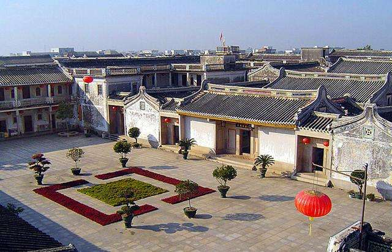
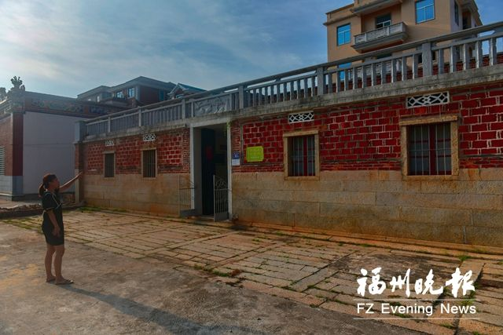
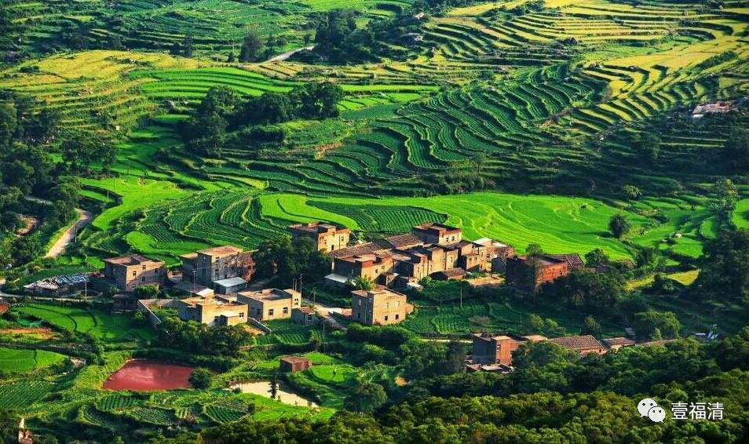
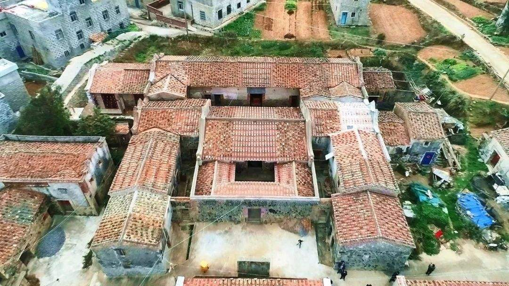

今の部屋
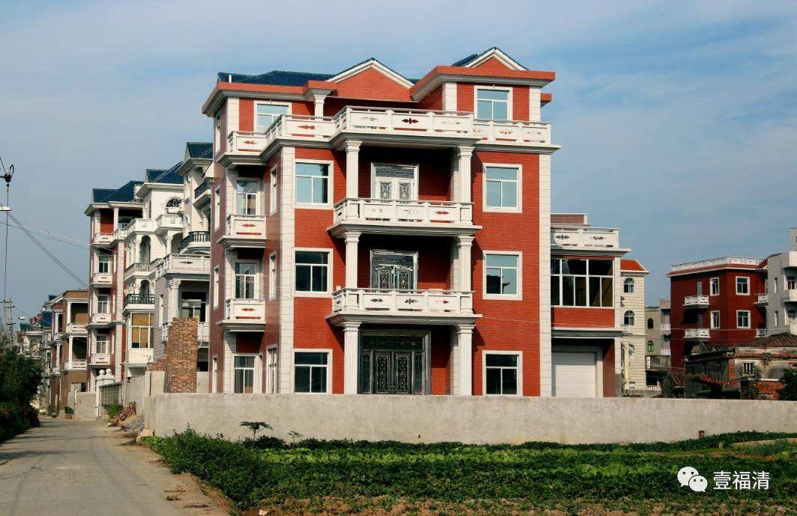
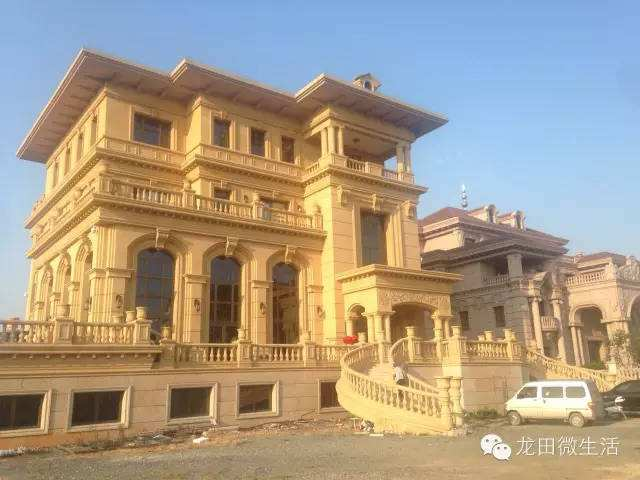
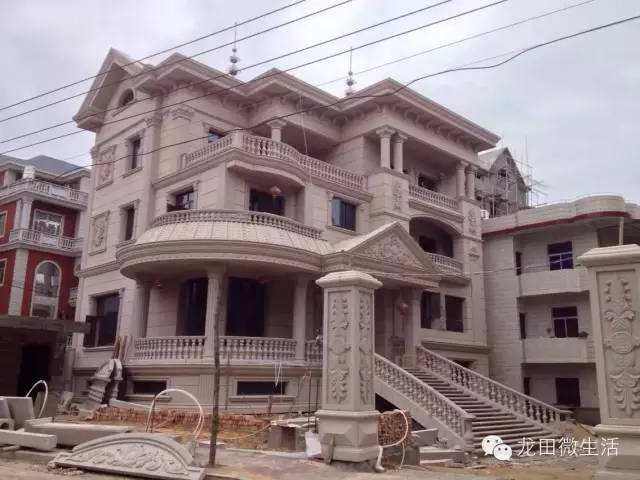
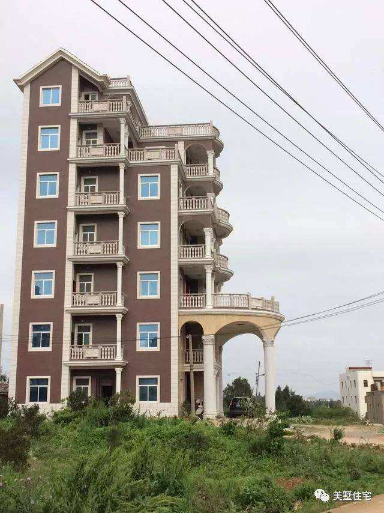
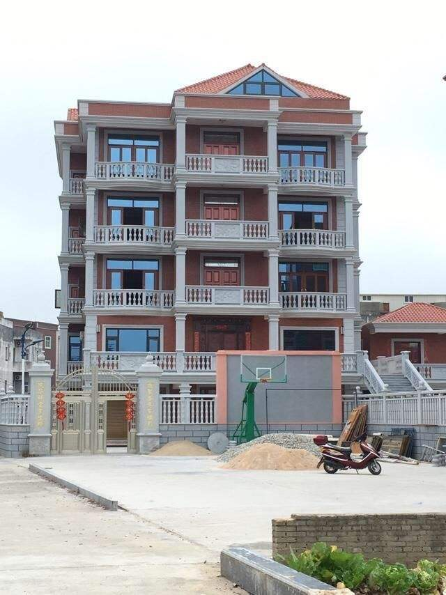
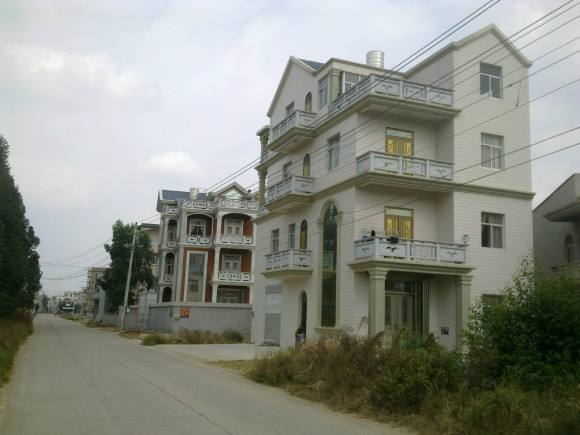

# 実家の海

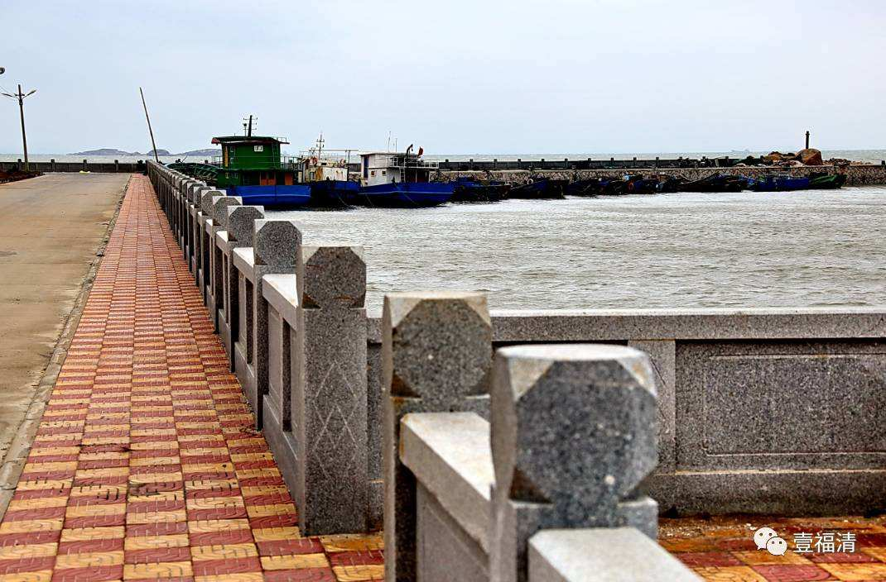
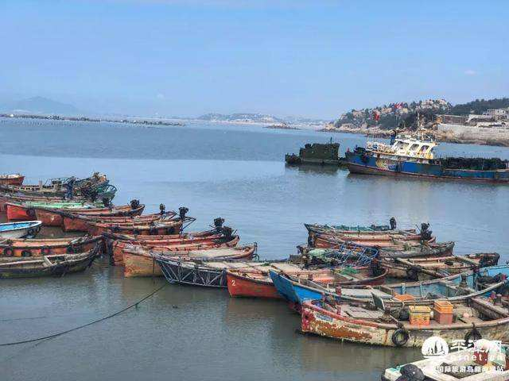
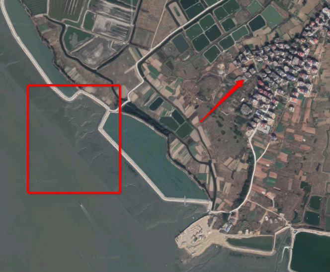

# 実家の宗廟

祖先﹝そせん﹞を祭る﹝まつる﹞所﹝ところ﹞.宗廟﹝そうびょう﹞.
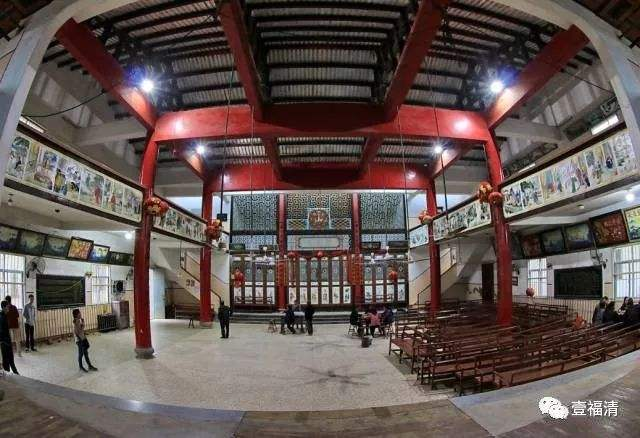

# 三明学院

<ruby>繁華<rt>はんか</rt></ruby>

# [福清の石竹山](https://www.tripadvisor.jp/Attraction_Review-g657954-d1851038-Reviews-Shizhu_Mountain-Fuqing_Fujian.html)

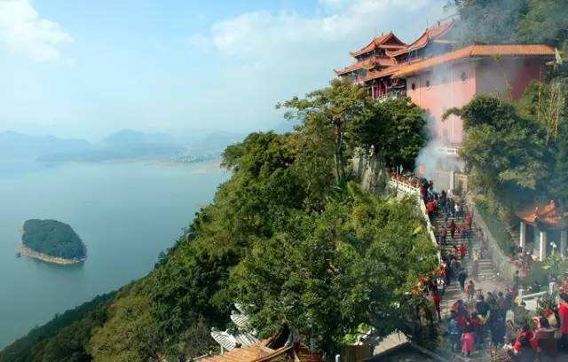

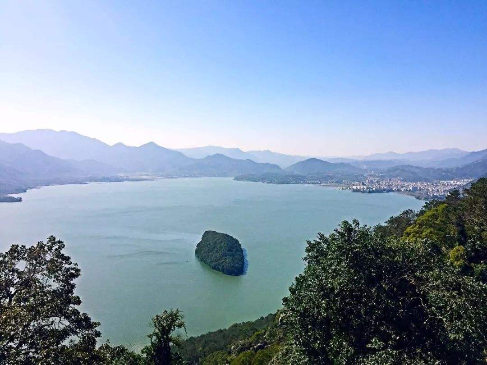

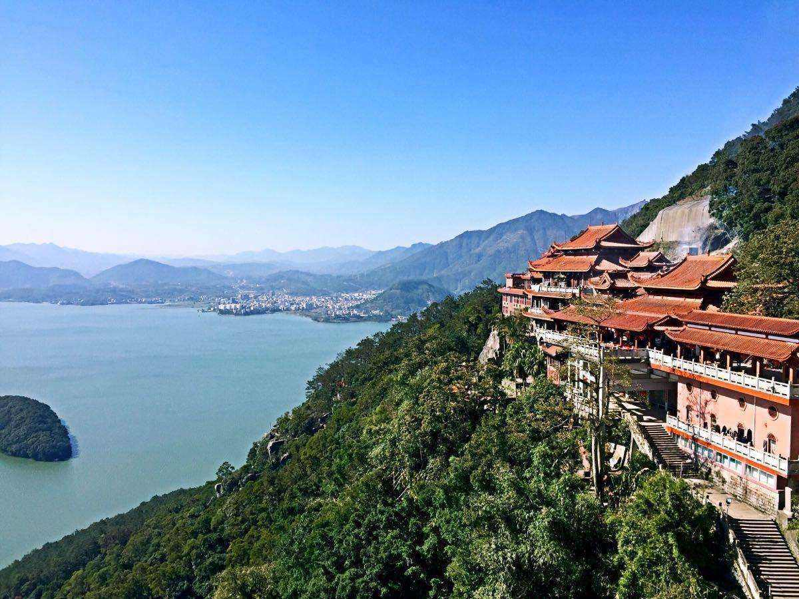
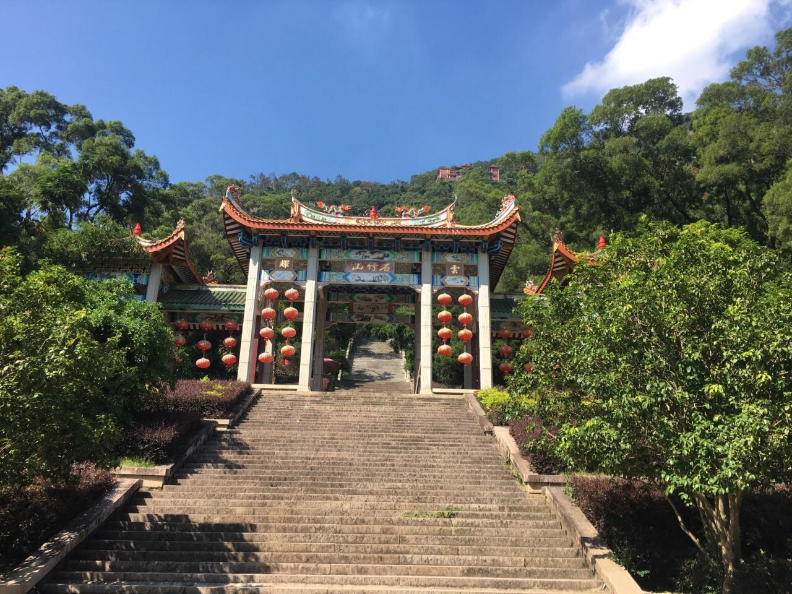
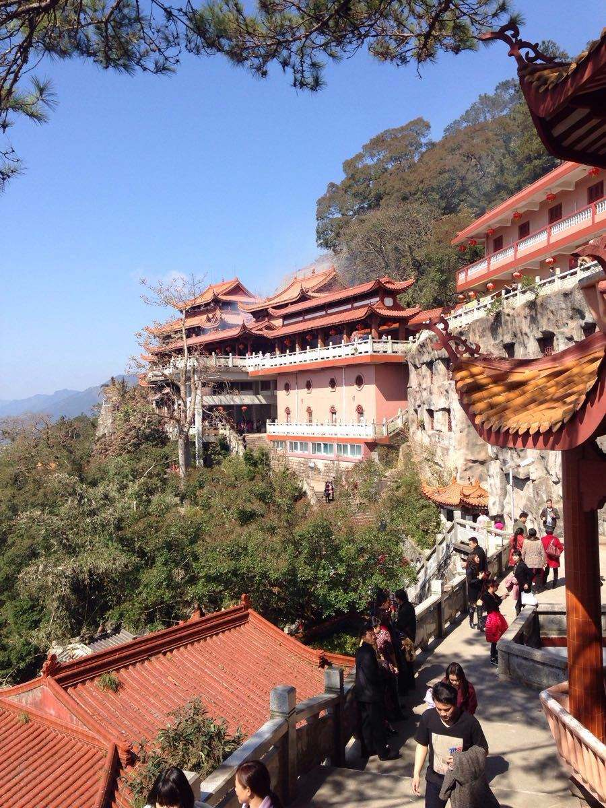
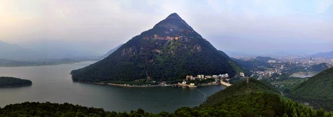
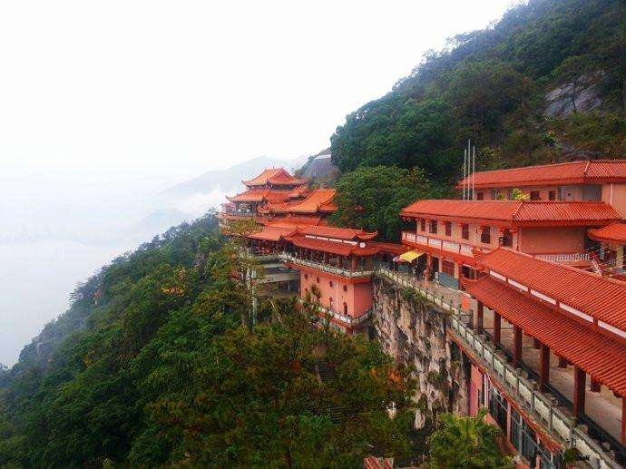
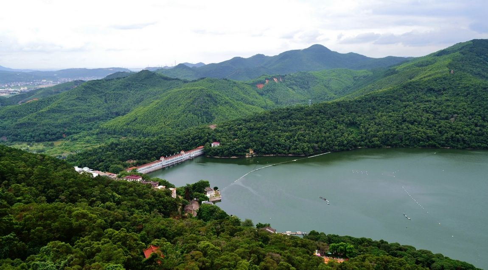

# [福州の鼓山](https://www.tripadvisor.jp/Attraction_Review-g297405-d561401-Reviews-Drum_Mountain_Gu_Shan-Fuzhou_Fujian.html)

# [福州の三坊七巷](https://www.tripadvisor.jp/Attraction_Review-g297405-d1851046-Reviews-Architectural_buildings_of_Sanfang_Qixiang_and_Zhuzi_Workshop-Fuzhou_Fujian.html)

# [福州の西湖公园](https://timgsa.baidu.com/timg?image&quality=80&size=b9999_10000&sec=1599491560069&di=2983372a97c4698cb30f83884d38c68d&imgtype=0&src=http%3A%2F%2Fcdn.moji002.com%2Fimages%2Fsimgs%2F2017%2F04%2F29%2F14934202060.73261500.1840_android.jpg)

 # 廈門
<ruby><rb>廈門</rb><rt>アモイし</rt></ruby>は、<ruby><rb>環境</rb><rt>かんきょう</rt></ruby>が<ruby><rb>良</rb><rt>よ</rt></ruby>く<ruby><rb>住</rb><rt>す</rt></ruby>みやすい、<ruby><rb>学生</rb><rt>がくせい</rt></ruby>の<ruby><rb>街</rb><rt>まち</rt></ruby>です。<ruby><rb>仏教</rb><rt>ぶっきょう</rt></ruby><ruby><rb>寺院</rb><rt>じいん</rt></ruby>、アートギャラリー、<ruby><rb>美</rb><rt>うつく</rt></ruby>しい<ruby><rb>公園</rb><rt>こうえん</rt></ruby>を<ruby><rb>散策</rb><rt>さんさく</rt></ruby>してみましょう。<ruby><rb>廈門</rb><rt>。</rt></ruby>は、<ruby><rb>実</rb><rt>じつ</rt></ruby>は<ruby><rb>小</rb><rt>ちい</rt></ruby>さな<ruby><rb>島</rb><rt>しま</rt></ruby>が<ruby><rb>集</rb><rt>あつ</rt></ruby>まって<ruby><rb>形成</rb><rt>けいせい</rt></ruby>されているのです。その1つのコロンス<ruby><rb>島</rb><rt>とう</rt></ruby>では<ruby><rb>車両</rb><rt>しゃりょう</rt></ruby>の<ruby><rb>乗</rb><rt>の</rt></ruby>り<ruby><rb>入</rb><rt>い</rt></ruby>れが<ruby><rb>禁止</rb><rt>きんし</rt></ruby>されており、<ruby><rb>自由</rb><rt>じゆう</rt></ruby>な<ruby><rb>雰囲気</rb><rt>ふんいき</rt></ruby>の<ruby><rb>平和</rb><rt>へいわ</rt></ruby>な<ruby><rb>島</rb><rt>しま</rt></ruby>です。<ruby><rb>春雨</rb><rt>はるさめ</rt></ruby>やジューシーな<ruby><rb>餃子</rb><rt>ぎょうざ</rt></ruby>をぜひ<ruby><rb>食</rb><rt>た</rt></ruby>べてみてください。アンティーク、<ruby><rb>繊細</rb><rt>せんさい</rt></ruby>なビーズ、<ruby><rb>陶器</rb><rt>とうき</rt></ruby>などが<ruby><rb>売</rb><rt>う</rt></ruby>られているお<ruby><rb>店</rb><rt>みせ</rt></ruby>をのぞいてみるのも<ruby><rb>楽</rb><rt>たの</rt></ruby>しいですよ。

## 鼓浪屿环岛路
Kulangsu Huandao Road

上海的外滩

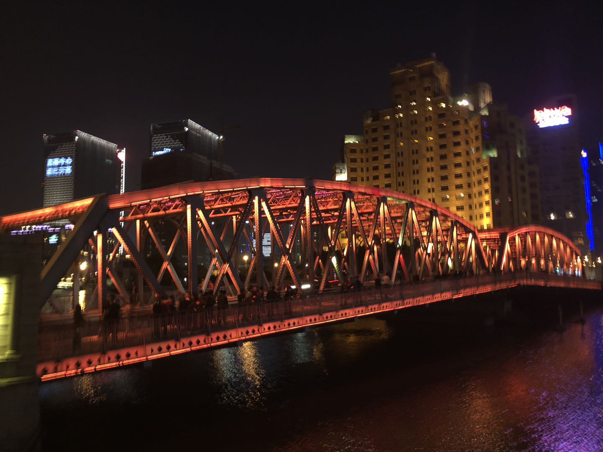

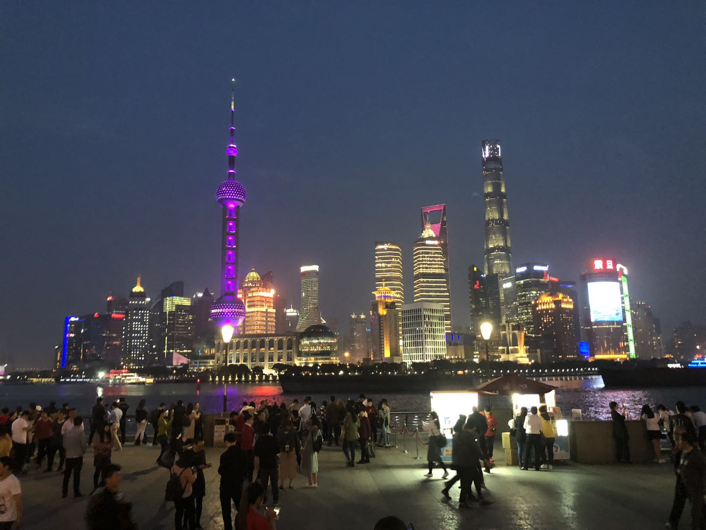

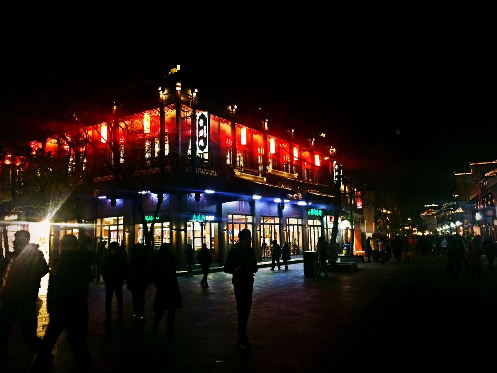

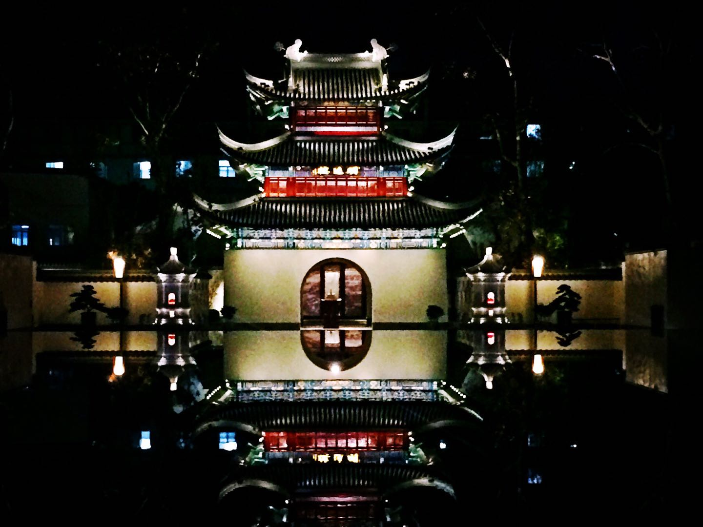

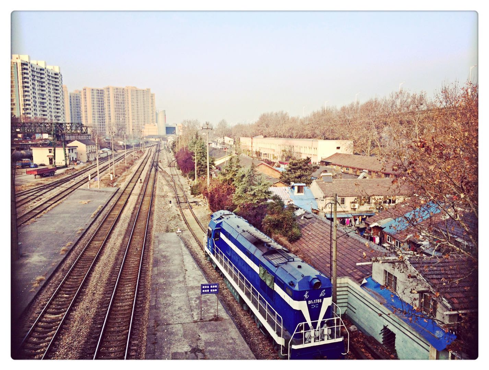

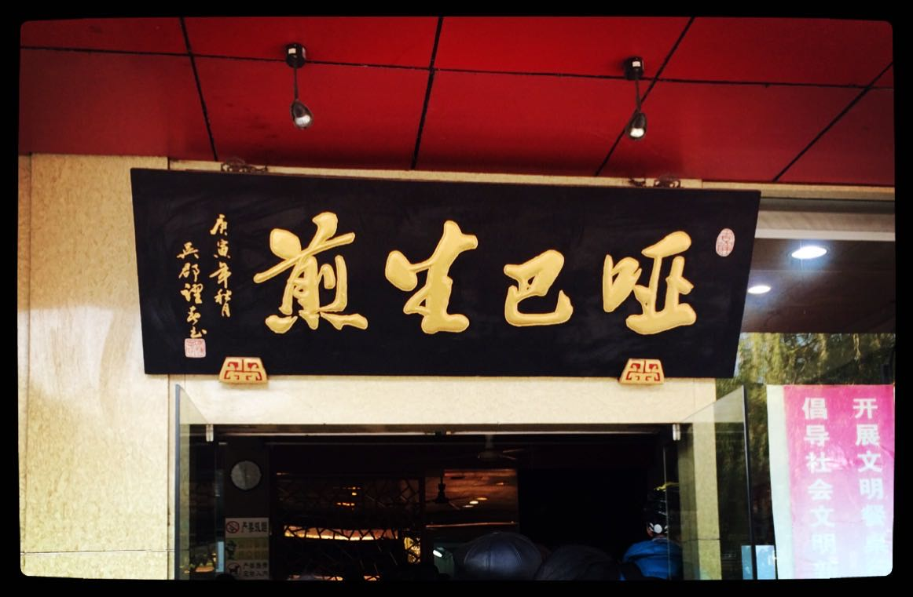