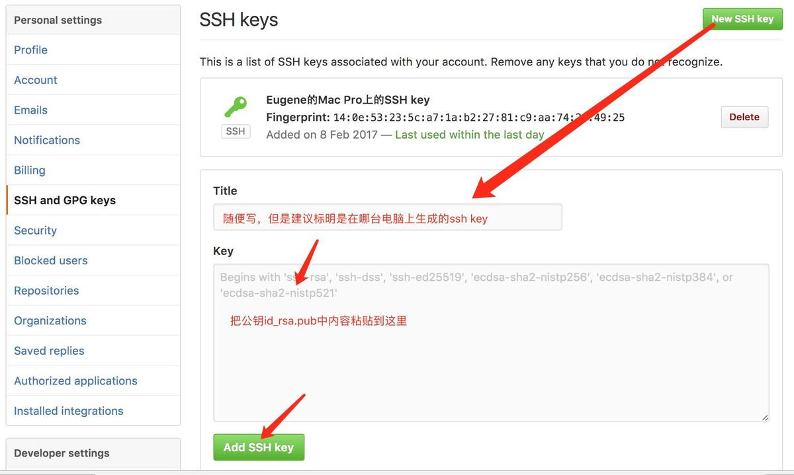

# Mac下git通过SSH进行免密码安全连接github

## Git安装

直接下载安装 Xcode，高版本Xcode已经默认集成了Git 。

## 生成SSH key

SSH key提供了一种与GitHub通信的方式，通过这种方式，能够在不输入密码的情况下，将GitHub作为自己的remote端服务器，可以实现本地 Git 仓库和 GitHub 仓库之间的数据传输，方便进行版本控制。

大多数 Git 服务器都会选择使用 SSH 公钥来进行授权。系统中的每个用户都必须提供一个公钥用于授权，没有的话就要生成一个。

步骤:

* 首先先确认一下是否已经有一个公钥了。SSH 公钥默认储存在账户的主目录下的 ~/.ssh 目录。进去看看：
```shell
$ cd ~/.ssh
$ ls
 id_dsa       known_hosts
 id_dsa.pub     config   
```
* 关键是看有没有用 something 和 something.pub 来命名的一对文件，这个 something 通常就是 id_dsa 或 id_rsa。有 .pub 后缀的文件就是公钥，另一个文件则是密钥。如果已经有了，可直接跳到打开id_rsa.pub，然后copy到GitHub。如果没有，打开终端（Shell） ，创建 SSH Key：
```shell
$ ssh-keygen -t rsa -C "youremail@example.com"
```
或
```shell
$ ssh-keygen
Generating public/private rsa key pair.
Enter file in which to save the key (/Users/schacon/.ssh/id_rsa):
Enter passphrase (empty for no passphrase):
Enter same passphrase again:
Your identification has been saved in /Users/schacon/.ssh/id_rsa.
Your public key has been saved in /Users/schacon/.ssh/id_rsa.pub.
The key fingerprint is:
43:c5:5b:5f:b1:f1:50:43:ad:20:a6:92:6a:1f:9a:3a schacon@agadorlaptop.local
```
⚠️注意它先要求你确认保存公钥的位置（.ssh/id_rsa），然后它会让你重复一个密码两次，如果不想在使用公钥的时候输入密码，可以留空或直接一路回车确定下就安装好了。查看是否成功：
```shell
$ cd ~/.ssh
$ ls
id_rsa
id_rsa.pub
```
打开 id_rsa.pub文件，里面就有需要的ssh key。
在终端输入命令打开id_rsa.pub，然后copy。

```shell
vim ~/.ssh/id_rsa.pub
```
或
```shell
$ cat ~/.ssh/id_rsa.pub
```


拷贝公钥

另注：所有做过这一步的用户都得把它们的公钥给你或者 Git 服务器的管理员（假设 SSH 服务被设定为使用公钥机制）。他们只需要复制 .pub 文件的内容然后发邮件给管理员。


## 将SSH Key添加到GitHub中

登陆 GitHub，打开“SSH and GPG Keys”页面：



将SSH Key添加到GitHub中

### 最后测试github是否连接成功

```shell
$ssh -T git@github.com
```
如果显示：
```shell
Are you sure you want to continue connecting (yes/no)?  ##输入yes##
```
接下来如果正常的话，会出现如下提示：
```shell
Hi ZyjEugene! You've successfully authenticated, but GitHub does not
provide shell access. 
```
如果出现如下提示，则说明有权限问题：
```
Permission denied (publickey)....
```

如果有权限问题的情况下，你对项目执行push操作的时候，会得到如下提示：
```shell
Warning: Permanently added the RSA host key for IP address '192.30.252.129' to the list of known hosts.
Permission denied (publickey).
fatal: Could not read from remote repository.

>Please make sure you have the correct access rights
and the repository exists.
```

### 多套git ssh密钥权限问题

原因：生成了多套git ssh密钥，并且都Github和客户端连接。通常一台电脑生成一个ssh不会有这个问题，当一台电脑生成多个ssh的时候，就可能遇到这个问题。
解决步骤如下：
1、查看系统ssh-key代理, 执行如下命令
```shell
$ ssh-add -l
```
以上命令如果输出  The agent has no identities. 则表示没有代理。如果系统有代理，可以执行下面的命令清除代理:
```shell
$ ssh-add -D
```

2、然后将你新创建的ssh添加代理，执行命令如下：
```shell
$ ssh-add ~/.ssh/id_rsa 
```

注：id_rsa你的公私钥名称

3、你会得到如下提示：
```shell
2048 8e:71:ad:88:78:80:b2:d9:e1:2d:1d:e4:be:6b:db:8e /Users/Eugene/.ssh/id_rsa (RSA)
```
4、测试 ssh
```shell
ssh -T git@github.com
```
你若得到如下提示，表示这个ssh公钥已经获得了权限

```shell
Hi ZyjEugene! You've successfully authenticated, but github does not provide shell access.
问题到此解决。
```