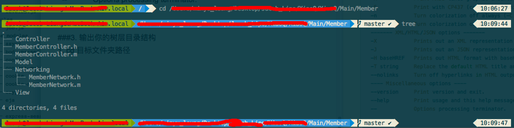

# Mac开发技巧

## 查看端口占用

```
lsof -i tcp:8080 
```

## 杀死进程

```
kill -9 pid
```

## 打印目录的树形结构

```S

├── build
├── config
├── docs
│   └── static
│       ├── css
│       └── js
├── src
│   ├── assets
│   ├── components
│   ├── store
│   │   └── modules
│   └── views
│       ├── book
│       └── movie
└── static
```
1. mac 下使用 brew包管理工具安装 tree

```
brew install tree
```

2. 安装成功后，直接在终端使用，使用 --help 查看帮助信息

```
tree --help
```
看到如下功能

```shell
tree --help                               10:06:14
usage: tree [-acdfghilnpqrstuvxACDFJQNSUX] [-H baseHREF] [-T title ]
    [-L level [-R]] [-P pattern] [-I pattern] [-o filename] [--version]
    [--help] [--inodes] [--device] [--noreport] [--nolinks] [--dirsfirst]
    [--charset charset] [--filelimit[=]#] [--si] [--timefmt[=]<f>]
    [--sort[=]<name>] [--matchdirs] [--ignore-case] [--] [<directory list>]
  ------- Listing options -------
  -a            All files are listed.
  -d            List directories only.
  -l            Follow symbolic links like directories.
  -f            Print the full path prefix for each file.
  -x            Stay on current filesystem only.
  -L level      Descend only level directories deep.
  -R            Rerun tree when max dir level reached.
  -P pattern    List only those files that match the pattern given.
  -I pattern    Do not list files that match the given pattern.
  --ignore-case Ignore case when pattern matching.
  --matchdirs   Include directory names in -P pattern matching.
  --noreport    Turn off file/directory count at end of tree listing.
  --charset X   Use charset X for terminal/HTML and indentation line output.
  --filelimit # Do not descend dirs with more than # files in them.
  --timefmt <f> Print and format time according to the format <f>.
  -o filename   Output to file instead of stdout.
  -------- File options ---------
  -q            Print non-printable characters as '?'.
  -N            Print non-printable characters as is.
  -Q            Quote filenames with double quotes.
  -p            Print the protections for each file.
  -u            Displays file owner or UID number.
  -g            Displays file group owner or GID number.
  -s            Print the size in bytes of each file.
  -h            Print the size in a more human readable way.
  --si          Like -h, but use in SI units (powers of 1000).
  -D            Print the date of last modification or (-c) status change.
  -F            Appends '/', '=', '*', '@', '|' or '>' as per ls -F.
  --inodes      Print inode number of each file.
  --device      Print device ID number to which each file belongs.
  ------- Sorting options -------
  -v            Sort files alphanumerically by version.
  -t            Sort files by last modification time.
  -c            Sort files by last status change time.
  -U            Leave files unsorted.
  -r            Reverse the order of the sort.
  --dirsfirst   List directories before files (-U disables).
  --sort X      Select sort: name,version,size,mtime,ctime.
  ------- Graphics options ------
  -i            Don't print indentation lines.
  -A            Print ANSI lines graphic indentation lines.
  -S            Print with CP437 (console) graphics indentation lines.
  -n            Turn colorization off always (-C overrides).
  -C            Turn colorization on always.
  ------- XML/HTML/JSON options -------
  -X            Prints out an XML representation of the tree.
  -J            Prints out an JSON representation of the tree.
  -H baseHREF   Prints out HTML format with baseHREF as top directory.
  -T string     Replace the default HTML title and H1 header with string.
  --nolinks     Turn off hyperlinks in HTML output.
  ---- Miscellaneous options ----
  --version     Print version and exit.
  --help        Print usage and this help message and exit.
  --            Options processing terminat
```

3. 输出你的树层目录结构

cd 目标文件夹路径
然后 tree 一下，会将该层级下所有文件都遍历了输出，不管层级多深



4. 常用技巧

我们可以在目录遍历时使用 -L 参数指定遍历层级
```
tree -L 2
```
如果你想把一个目录的结构树导出到文件 Readme.md ,可以这样操作
```
tree -L 2 >README.md //然后我们看下当前目录下的 README.md 文件
```
只显示文件夹；
```
tree -d 
```
显示项目的层级，n表示层级数。例：显示项目三层结构，tree -l 3；
```
tree -L n 
```
tree -I pattern 用于过滤不想要显示的文件或者文件夹。比如要过滤项目中的node_modules文件夹；
```
tree -I “node_modules”
```


