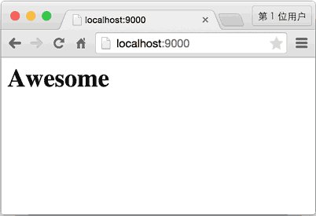

- [Day 1 - 搭建开发环境](#day-1---搭建开发环境)
  - [搭建开发环境](#搭建开发环境)
- [Day 2 - 编写Web App骨架](#day-2---编写web-app骨架)
- [Day 3 - 编写ORM](#day-3---编写orm)
  - [创建连接池](#创建连接池)
  - [Select](#select)
  - [Insert, Update, Delete](#insert-update-delete)
  - [ORM](#orm)
    - [定义Model](#定义model)
    - [Field和各种Field子类：](#field和各种field子类)
    - [映射varchar的StringField：](#映射varchar的stringfield)
- [Day 4 - 编写Model](#day-4---编写model)
  - [创建model](#创建model)
  - [初始化数据库表](#初始化数据库表)


# Day 1 - 搭建开发环境


## 搭建开发环境

首先，确认系统安装的Python版本是3.7.x：

```
$ python3 --version
Python 3.7.0
```
然后，用pip安装开发Web App需要的第三方库：

异步框架aiohttp：

```
$pip3 install aiohttp
```
前端模板引擎jinja2：
```

$ pip3 install jinja2
```
MySQL 5.x数据库，从官方网站下载并安装，安装完毕后，请务必牢记root口令。为避免遗忘口令，建议直接把root口令设置为password；

MySQL的Python异步驱动程序aiomysql：
```

$ pip3 install aiomysql
```
项目结构

选择一个工作目录，然后，我们建立如下的目录结构：
```

awesome-python3-webapp/  <-- 根目录
|
+- backup/               <-- 备份目录
|
+- conf/                 <-- 配置文件
|
+- dist/                 <-- 打包目录
|
+- www/                  <-- Web目录，存放.py文件
|  |
|  +- static/            <-- 存放静态文件
|  |
|  +- templates/         <-- 存放模板文件
|
+- ios/                  <-- 存放iOS App工程
|
+- LICENSE               <-- 代码LICENSE
```

# Day 2 - 编写Web App骨架

由于我们的Web App建立在asyncio的基础上，因此用aiohttp写一个基本的app.py：

```python
import logging; logging.basicConfig(level=logging.INFO)

import asyncio, os, json, time
from datetime import datetime

from aiohttp import web

def index(request):
    return web.Response(body=b'<h1>Awesome</h1>')

@asyncio.coroutine
def init(loop):
    app = web.Application(loop=loop)
    app.router.add_route('GET', '/', index)
    srv = yield from loop.create_server(app.make_handler(), '127.0.0.1', 9000)
    logging.info('server started at http://127.0.0.1:9000...')
    return srv

loop = asyncio.get_event_loop()
loop.run_until_complete(init(loop))
loop.run_forever()
```
运行python app.py，Web App将在9000端口监听HTTP请求，并且对首页/进行响应：
```python

$ python3 app.py
INFO:root:server started at http://127.0.0.1:9000...
```
这里我们简单地返回一个Awesome字符串，在浏览器中可以看到效果：

awesome-home



# Day 3 - 编写ORM

在一个Web App中，所有数据，包括用户信息、发布的日志、评论等，都存储在数据库中。在awesome-python3-webapp中，我们选择MySQL作为数据库。

Web App里面有很多地方都要访问数据库。访问数据库需要创建数据库连接、游标对象，然后执行SQL语句，最后处理异常，清理资源。这些访问数据库的代码如果分散到各个函数中，势必无法维护，也不利于代码复用。

所以，我们要首先把常用的SELECT、INSERT、UPDATE和DELETE操作用函数封装起来。

由于Web框架使用了基于asyncio的aiohttp，这是基于协程的异步模型。在协程中，不能调用普通的同步IO操作，因为所有用户都是由一个线程服务的，协程的执行速度必须非常快，才能处理大量用户的请求。而耗时的IO操作不能在协程中以同步的方式调用，否则，等待一个IO操作时，系统无法响应任何其他用户。

这就是异步编程的一个原则：一旦决定使用异步，则系统每一层都必须是异步，“开弓没有回头箭”。

幸运的是aiomysql为MySQL数据库提供了异步IO的驱动。

## 创建连接池

我们需要创建一个全局的连接池，每个HTTP请求都可以从连接池中直接获取数据库连接。使用连接池的好处是不必频繁地打开和关闭数据库连接，而是能复用就尽量复用。

连接池由全局变量__pool存储，缺省情况下将编码设置为utf8，自动提交事务：

```python
@asyncio.coroutine
def create_pool(loop, **kw):
    logging.info('create database connection pool...')
    global __pool
    __pool = yield from aiomysql.create_pool(
        host=kw.get('host', 'localhost'),
        port=kw.get('port', 3306),
        user=kw['user'],
        password=kw['password'],
        db=kw['db'],
        charset=kw.get('charset', 'utf8'),
        autocommit=kw.get('autocommit', True),
        maxsize=kw.get('maxsize', 10),
        minsize=kw.get('minsize', 1),
        loop=loop
    )
```
## Select

要执行SELECT语句，我们用select函数执行，需要传入SQL语句和SQL参数：

```python
@asyncio.coroutine
def select(sql, args, size=None):
    log(sql, args)
    global __pool
    with (yield from __pool) as conn:
        cur = yield from conn.cursor(aiomysql.DictCursor)
        yield from cur.execute(sql.replace('?', '%s'), args or ())
        if size:
            rs = yield from cur.fetchmany(size)
        else:
            rs = yield from cur.fetchall()
        yield from cur.close()
        logging.info('rows returned: %s' % len(rs))
        return rs
```
SQL语句的占位符是?，而MySQL的占位符是%s，select()函数在内部自动替换。注意要始终坚持使用带参数的SQL，而不是自己拼接SQL字符串，这样可以防止SQL注入攻击。

注意到yield from将调用一个子协程（也就是在一个协程中调用另一个协程）并直接获得子协程的返回结果。

如果传入size参数，就通过`fetchmany()`获取最多指定数量的记录，否则，通过`fetchall()`获取所有记录。

## Insert, Update, Delete

要执行INSERT、UPDATE、DELETE语句，可以定义一个通用的`execute()`函数，因为这3种SQL的执行都需要相同的参数，以及返回一个整数表示影响的行数：

```python
@asyncio.coroutine
def execute(sql, args):
    log(sql)
    with (yield from __pool) as conn:
        try:
            cur = yield from conn.cursor()
            yield from cur.execute(sql.replace('?', '%s'), args)
            affected = cur.rowcount
            yield from cur.close()
        except BaseException as e:
            raise
        return affected
```
execute()函数和select()函数所不同的是，cursor对象不返回结果集，而是通过rowcount返回结果数。

## ORM

有了基本的`select()`和`execute()`函数，我们就可以开始编写一个简单的ORM了。

设计ORM需要从上层调用者角度来设计。

我们先考虑如何定义一个User对象，然后把数据库表users和它关联起来。

```python
from orm import Model, StringField, IntegerField

class User(Model):
    __table__ = 'users'

    id = IntegerField(primary_key=True)
    name = StringField()
```
注意到定义在User类中的__table__、id和name是类的属性，不是实例的属性。所以，在类级别上定义的属性用来描述User对象和表的映射关系，而实例属性必须通过__init__()方法去初始化，所以两者互不干扰：
```python
# 创建实例:
user = User(id=123, name='Michael')
# 存入数据库:
user.insert()
# 查询所有User对象:
users = User.findAll()
```
### 定义Model

首先要定义的是所有ORM映射的基类Model：

```python
class Model(dict, metaclass=ModelMetaclass):

    def __init__(self, **kw):
        super(Model, self).__init__(**kw)

    def __getattr__(self, key):
        try:
            return self[key]
        except KeyError:
            raise AttributeError(r"'Model' object has no attribute '%s'" % key)

    def __setattr__(self, key, value):
        self[key] = value

    def getValue(self, key):
        return getattr(self, key, None)

    def getValueOrDefault(self, key):
        value = getattr(self, key, None)
        if value is None:
            field = self.__mappings__[key]
            if field.default is not None:
                value = field.default() if callable(field.default) else field.default
                logging.debug('using default value for %s: %s' % (key, str(value)))
                setattr(self, key, value)
        return value
```
Model从dict继承，所以具备所有dict的功能，同时又实现了特殊方法__getattr__()和__setattr__()，因此又可以像引用普通字段那样写：

```python
>>> user['id']
123
>>> user.id
123
```
### Field和各种Field子类：

```python
class Field(object):

    def __init__(self, name, column_type, primary_key, default):
        self.name = name
        self.column_type = column_type
        self.primary_key = primary_key
        self.default = default

    def __str__(self):
        return '<%s, %s:%s>' % (self.__class__.__name__, self.column_type, self.name)
```
### 映射varchar的StringField：

```python
class StringField(Field):

    def __init__(self, name=None, primary_key=False, default=None, ddl='varchar(100)'):
        super().__init__(name, ddl, primary_key, default)
```
注意到Model只是一个基类，如何将具体的子类如User的映射信息读取出来呢？答案就是通过metaclass：ModelMetaclass：

```python
class ModelMetaclass(type):

    def __new__(cls, name, bases, attrs):
        # 排除Model类本身:
        if name=='Model':
            return type.__new__(cls, name, bases, attrs)
        # 获取table名称:
        tableName = attrs.get('__table__', None) or name
        logging.info('found model: %s (table: %s)' % (name, tableName))
        # 获取所有的Field和主键名:
        mappings = dict()
        fields = []
        primaryKey = None
        for k, v in attrs.items():
            if isinstance(v, Field):
                logging.info('  found mapping: %s ==> %s' % (k, v))
                mappings[k] = v
                if v.primary_key:
                    # 找到主键:
                    if primaryKey:
                        raise RuntimeError('Duplicate primary key for field: %s' % k)
                    primaryKey = k
                else:
                    fields.append(k)
        if not primaryKey:
            raise RuntimeError('Primary key not found.')
        for k in mappings.keys():
            attrs.pop(k)
        escaped_fields = list(map(lambda f: '`%s`' % f, fields))
        attrs['__mappings__'] = mappings # 保存属性和列的映射关系
        attrs['__table__'] = tableName
        attrs['__primary_key__'] = primaryKey # 主键属性名
        attrs['__fields__'] = fields # 除主键外的属性名
        # 构造默认的SELECT, INSERT, UPDATE和DELETE语句:
        attrs['__select__'] = 'select `%s`, %s from `%s`' % (primaryKey, ', '.join(escaped_fields), tableName)
        attrs['__insert__'] = 'insert into `%s` (%s, `%s`) values (%s)' % (tableName, ', '.join(escaped_fields), primaryKey, create_args_string(len(escaped_fields) + 1))
        attrs['__update__'] = 'update `%s` set %s where `%s`=?' % (tableName, ', '.join(map(lambda f: '`%s`=?' % (mappings.get(f).name or f), fields)), primaryKey)
        attrs['__delete__'] = 'delete from `%s` where `%s`=?' % (tableName, primaryKey)
        return type.__new__(cls, name, bases, attrs)
```
这样，任何继承自Model的类（比如User），会自动通过ModelMetaclass扫描映射关系，并存储到自身的类属性如__table__、__mappings__中。

然后，我们往Model类添加class方法，就可以让所有子类调用class方法：

```python
class Model(dict):

    ...

    @classmethod
    @asyncio.coroutine
    def find(cls, pk):
        ' find object by primary key. '
        rs = yield from select('%s where `%s`=?' % (cls.__select__, cls.__primary_key__), [pk], 1)
        if len(rs) == 0:
            return None
        return cls(**rs[0])
```
User类现在就可以通过类方法实现主键查找：

```python
user = yield from User.find('123')
```
往Model类添加实例方法，就可以让所有子类调用实例方法：

```python
class Model(dict):

    ...

    @asyncio.coroutine
    def save(self):
        args = list(map(self.getValueOrDefault, self.__fields__))
        args.append(self.getValueOrDefault(self.__primary_key__))
        rows = yield from execute(self.__insert__, args)
        if rows != 1:
            logging.warn('failed to insert record: affected rows: %s' % rows)
```
这样，就可以把一个User实例存入数据库：
```python

user = User(id=123, name='Michael')
yield from user.save()
```
最后一步是完善ORM，对于查找，我们可以实现以下方法：

findAll() - 根据WHERE条件查找；

findNumber() - 根据WHERE条件查找，但返回的是整数，适用于select count(*)类型的SQL。

以及update()和remove()方法。

所有这些方法都必须用@asyncio.coroutine装饰，变成一个协程。

调用时需要特别注意：

```python
user.save()
```
没有任何效果，因为调用save()仅仅是创建了一个协程，并没有执行它。一定要用：

```python
yield from user.save()
```
才真正执行了INSERT操作。

最后看看我们实现的ORM模块一共多少行代码？累计不到300多行。用Python写一个ORM是不是很容易呢？


# Day 4 - 编写Model

## 创建model

有了ORM，我们就可以把Web App需要的3个表用Model表示出来：

models.py

```python
import time, uuid

from orm import Model, StringField, BooleanField, FloatField, TextField

def next_id():
    return '%015d%s000' % (int(time.time() * 1000), uuid.uuid4().hex)

class User(Model):
    __table__ = 'users'

    id = StringField(primary_key=True, default=next_id, ddl='varchar(50)')
    email = StringField(ddl='varchar(50)')
    passwd = StringField(ddl='varchar(50)')
    admin = BooleanField()
    name = StringField(ddl='varchar(50)')
    image = StringField(ddl='varchar(500)')
    created_at = FloatField(default=time.time)

class Blog(Model):
    __table__ = 'blogs'

    id = StringField(primary_key=True, default=next_id, ddl='varchar(50)')
    user_id = StringField(ddl='varchar(50)')
    user_name = StringField(ddl='varchar(50)')
    user_image = StringField(ddl='varchar(500)')
    name = StringField(ddl='varchar(50)')
    summary = StringField(ddl='varchar(200)')
    content = TextField()
    created_at = FloatField(default=time.time)

class Comment(Model):
    __table__ = 'comments'

    id = StringField(primary_key=True, default=next_id, ddl='varchar(50)')
    blog_id = StringField(ddl='varchar(50)')
    user_id = StringField(ddl='varchar(50)')
    user_name = StringField(ddl='varchar(50)')
    user_image = StringField(ddl='varchar(500)')
    content = TextField()
    created_at = FloatField(default=time.time)
```
在编写ORM时，给一个Field增加一个default参数可以让ORM自己填入缺省值，非常方便。并且，缺省值可以作为函数对象传入，在调用save()时自动计算。

例如，主键id的缺省值是函数next_id，创建时间created_at的缺省值是函数time.time，可以自动设置当前日期和时间。

日期和时间用float类型存储在数据库中，而不是datetime类型，这么做的好处是不必关心数据库的时区以及时区转换问题，排序非常简单，显示的时候，只需要做一个float到str的转换，也非常容易。

## 初始化数据库表

如果表的数量很少，可以手写创建表的SQL脚本：

```sql
-- schema.sql

drop database if exists awesome;

create database awesome;

use awesome;

grant select, insert, update, delete on awesome.* to 'www-data'@'localhost' identified by 'www-data';

create table users (
    `id` varchar(50) not null,
    `email` varchar(50) not null,
    `passwd` varchar(50) not null,
    `admin` bool not null,
    `name` varchar(50) not null,
    `image` varchar(500) not null,
    `created_at` real not null,
    unique key `idx_email` (`email`),
    key `idx_created_at` (`created_at`),
    primary key (`id`)
) engine=innodb default charset=utf8;

create table blogs (
    `id` varchar(50) not null,
    `user_id` varchar(50) not null,
    `user_name` varchar(50) not null,
    `user_image` varchar(500) not null,
    `name` varchar(50) not null,
    `summary` varchar(200) not null,
    `content` mediumtext not null,
    `created_at` real not null,
    key `idx_created_at` (`created_at`),
    primary key (`id`)
) engine=innodb default charset=utf8;

create table comments (
    `id` varchar(50) not null,
    `blog_id` varchar(50) not null,
    `user_id` varchar(50) not null,
    `user_name` varchar(50) not null,
    `user_image` varchar(500) not null,
    `content` mediumtext not null,
    `created_at` real not null,
    key `idx_created_at` (`created_at`),
    primary key (`id`)
) engine=innodb default charset=utf8;
```
如果表的数量很多，可以从Model对象直接通过脚本自动生成SQL脚本，使用更简单。

把SQL脚本放到MySQL命令行里执行：

```
$ mysql -u root -p < schema.sql
```
我们就完成了数据库表的初始化。

编写数据访问代码

最终产生文件如下

orm.py(注意这里没有使用协程来实现,这个写法是同步异步写法和上面的day3不一样，day3写法后续测试)
```python
#!/usr/bin/env python3

# -*- coding: utf-8 -*-

__author__ = 'Michael Liao'

import asyncio, logging

import aiomysql

def log(sql, args=()):
    logging.info('SQL: %s' % sql)

async def create_pool(loop, **kw):
    logging.info('create database connection pool...')
    global __pool
    __pool = await aiomysql.create_pool(
        host=kw.get('host', 'localhost'),
        port=kw.get('port', 3306),
        user=kw['user'],
        password=kw['password'],
        db=kw['db'],
        charset=kw.get('charset', 'utf8'),
        autocommit=kw.get('autocommit', True),
        maxsize=kw.get('maxsize', 10),
        minsize=kw.get('minsize', 1),
        loop=loop
    )

async def select(sql, args, size=None):
    log(sql, args)
    global __pool
    async with __pool.get() as conn:
        async with conn.cursor(aiomysql.DictCursor) as cur:
            await cur.execute(sql.replace('?', '%s'), args or ())
            if size:
                rs = await cur.fetchmany(size)
            else:
                rs = await cur.fetchall()
        logging.info('rows returned: %s' % len(rs))
        return rs

async def execute(sql, args, autocommit=True):
    log(sql)
    async with __pool.get() as conn:
        if not autocommit:
            await conn.begin()
        try:
            async with conn.cursor(aiomysql.DictCursor) as cur:
                await cur.execute(sql.replace('?', '%s'), args)
                affected = cur.rowcount
            if not autocommit:
                await conn.commit()
        except BaseException as e:
            if not autocommit:
                await conn.rollback()
            raise
        return affected

def create_args_string(num):
    L = []
    for n in range(num):
        L.append('?')
    return ', '.join(L)

class Field(object):

    def __init__(self, name, column_type, primary_key, default):
        self.name = name
        self.column_type = column_type
        self.primary_key = primary_key
        self.default = default

    def __str__(self):
        return '<%s, %s:%s>' % (self.__class__.__name__, self.column_type, self.name)

class StringField(Field):

    def __init__(self, name=None, primary_key=False, default=None, ddl='varchar(100)'):
        super().__init__(name, ddl, primary_key, default)

class BooleanField(Field):

    def __init__(self, name=None, default=False):
        super().__init__(name, 'boolean', False, default)

class IntegerField(Field):

    def __init__(self, name=None, primary_key=False, default=0):
        super().__init__(name, 'bigint', primary_key, default)

class FloatField(Field):

    def __init__(self, name=None, primary_key=False, default=0.0):
        super().__init__(name, 'real', primary_key, default)

class TextField(Field):

    def __init__(self, name=None, default=None):
        super().__init__(name, 'text', False, default)

class ModelMetaclass(type):

    def __new__(cls, name, bases, attrs):
        if name=='Model':
            return type.__new__(cls, name, bases, attrs)
        tableName = attrs.get('__table__', None) or name
        logging.info('found model: %s (table: %s)' % (name, tableName))
        mappings = dict()
        fields = []
        primaryKey = None
        for k, v in attrs.items():
            if isinstance(v, Field):
                logging.info('  found mapping: %s ==> %s' % (k, v))
                mappings[k] = v
                if v.primary_key:
                    # 找到主键:
                    if primaryKey:
                        raise StandardError('Duplicate primary key for field: %s' % k)
                    primaryKey = k
                else:
                    fields.append(k)
        if not primaryKey:
            raise StandardError('Primary key not found.')
        for k in mappings.keys():
            attrs.pop(k)
        escaped_fields = list(map(lambda f: '`%s`' % f, fields))
        attrs['__mappings__'] = mappings # 保存属性和列的映射关系
        attrs['__table__'] = tableName
        attrs['__primary_key__'] = primaryKey # 主键属性名
        attrs['__fields__'] = fields # 除主键外的属性名
        attrs['__select__'] = 'select `%s`, %s from `%s`' % (primaryKey, ', '.join(escaped_fields), tableName)
        attrs['__insert__'] = 'insert into `%s` (%s, `%s`) values (%s)' % (tableName, ', '.join(escaped_fields), primaryKey, create_args_string(len(escaped_fields) + 1))
        attrs['__update__'] = 'update `%s` set %s where `%s`=?' % (tableName, ', '.join(map(lambda f: '`%s`=?' % (mappings.get(f).name or f), fields)), primaryKey)
        attrs['__delete__'] = 'delete from `%s` where `%s`=?' % (tableName, primaryKey)
        return type.__new__(cls, name, bases, attrs)

class Model(dict, metaclass=ModelMetaclass):

    def __init__(self, **kw):
        super(Model, self).__init__(**kw)

    def __getattr__(self, key):
        try:
            return self[key]
        except KeyError:
            raise AttributeError(r"'Model' object has no attribute '%s'" % key)

    def __setattr__(self, key, value):
        self[key] = value

    def getValue(self, key):
        return getattr(self, key, None)

    def getValueOrDefault(self, key):
        value = getattr(self, key, None)
        if value is None:
            field = self.__mappings__[key]
            if field.default is not None:
                value = field.default() if callable(field.default) else field.default
                logging.debug('using default value for %s: %s' % (key, str(value)))
                setattr(self, key, value)
        return value

    @classmethod
    async def findAll(cls, where=None, args=None, **kw):
        ' find objects by where clause. '
        sql = [cls.__select__]
        if where:
            sql.append('where')
            sql.append(where)
        if args is None:
            args = []
        orderBy = kw.get('orderBy', None)
        if orderBy:
            sql.append('order by')
            sql.append(orderBy)
        limit = kw.get('limit', None)
        if limit is not None:
            sql.append('limit')
            if isinstance(limit, int):
                sql.append('?')
                args.append(limit)
            elif isinstance(limit, tuple) and len(limit) == 2:
                sql.append('?, ?')
                args.extend(limit)
            else:
                raise ValueError('Invalid limit value: %s' % str(limit))
        rs = await select(' '.join(sql), args)
        return [cls(**r) for r in rs]

    @classmethod
    async def findNumber(cls, selectField, where=None, args=None):
        ' find number by select and where. '
        sql = ['select %s _num_ from `%s`' % (selectField, cls.__table__)]
        if where:
            sql.append('where')
            sql.append(where)
        rs = await select(' '.join(sql), args, 1)
        if len(rs) == 0:
            return None
        return rs[0]['_num_']

    @classmethod
    async def find(cls, pk):
        ' find object by primary key. '
        rs = await select('%s where `%s`=?' % (cls.__select__, cls.__primary_key__), [pk], 1)
        if len(rs) == 0:
            return None
        return cls(**rs[0])

    async def save(self):
        args = list(map(self.getValueOrDefault, self.__fields__))
        args.append(self.getValueOrDefault(self.__primary_key__))
        rows = await execute(self.__insert__, args)
        if rows != 1:
            logging.warn('failed to insert record: affected rows: %s' % rows)

    async def update(self):
        args = list(map(self.getValue, self.__fields__))
        args.append(self.getValue(self.__primary_key__))
        rows = await execute(self.__update__, args)
        if rows != 1:
            logging.warn('failed to update by primary key: affected rows: %s' % rows)

    async def remove(self):
        args = [self.getValue(self.__primary_key__)]
        rows = await execute(self.__delete__, args)
        if rows != 1:
            logging.warn('failed to remove by primary key: affected rows: %s' % rows)

```
app.py
```python
import logging; logging.basicConfig(level=logging.INFO)

import asyncio,os,json,time
import  datetime
from  aiohttp import web
import orm
from models import User, Blog, Comment

def index(request):
    return web.Response(body=b'<h1>Hello World</h1>')

async def init(loop):
    app = web.Application(loop=loop)
    app.router.add_route('GET','/',index)
    srv = await loop.create_server(app.make_handler(), '127.0.0.1', 9000)
    logging.info('server started at http://127.0.0.1:9000...')
    return srv


async def test(loop):
    await orm.create_pool(loop,user='root', password='aa19881203', db='awesome')
    u = User(name='Test', email='test@example.com', passwd='1234567890', image='about:blank')
    await u.save()

loop = asyncio.get_event_loop()
loop.run_until_complete(init(loop))
loop.run_until_complete(test(loop))
loop.run_forever()

```
可以在MySQL客户端命令行查询，看看数据是不是正常存储到MySQL里面了。