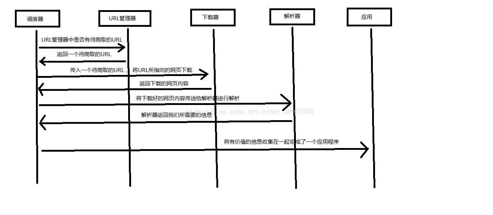

- [Python 爬虫介绍](#python-爬虫介绍)
  - [一、什么是爬虫](#一什么是爬虫)
  - [二、Python爬虫架构](#二python爬虫架构)
  - [三、urllib2 实现下载网页的三种方式](#三urllib2-实现下载网页的三种方式)
  - [四、第三方库 Beautiful Soup 的安装](#四第三方库-beautiful-soup-的安装)
    - [1、安装 Beautiful Soup](#1安装-beautiful-soup)
    - [2、测试是否安装成功](#2测试是否安装成功)
  - [五、使用 Beautiful Soup 解析 html 文件](#五使用-beautiful-soup-解析-html-文件)

# Python 爬虫介绍

## 一、什么是爬虫
爬虫：一段自动抓取互联网信息的程序，从互联网上抓取对于我们有价值的信息。

## 二、Python爬虫架构
Python 爬虫架构主要由五个部分组成，分别是调度器、URL管理器、网页下载器、网页解析器、应用程序（爬取的有价值数据）。

* 调度器：相当于一台电脑的CPU，主要负责调度URL管理器、下载器、解析器之间的协调工作。
* URL管理器：包括待爬取的URL地址和已爬取的URL地址，防止重复抓取URL和循环抓取URL，实现URL管理器主要用三种方式，通过内存、数据库、缓存数据库来实现。
* 网页下载器：通过传入一个URL地址来下载网页，将网页转换成一个字符串，网页下载器有urllib2（Python官方基础模块）包括需要登录、代理、和cookie，requests(第三方包)
* 网页解析器：将一个网页字符串进行解析，可以按照我们的要求来提取出我们有用的信息，也可以根据DOM树的解析方式来解析。网页解析器有正则表达式（直观，将网页转成字符串通过模糊匹配的方式来提取有价*值的信息，当文档比较复杂的时候，该方法提取数据的时候就会非常的困难）、html.parser（Python自带的）、beautifulsoup（第三方插件，可以使用Python自带的html.parser进行解析，也可以使用lxml进行解析，相对于其他几种来说要强大一些）、lxml（第三方插件，可以解析 xml 和 HTML），html.parser 和 beautifulsoup 以及 lxml 都是以 DOM 树的方式进行解析的。
* 应用程序：就是从网页中提取的有用数据组成的一个应用。
下面用一个图来解释一下调度器是如何协调工作的:



## 三、urllib2 实现下载网页的三种方式

```python
#!/usr/bin/python
# -*- coding: UTF-8 -*-
 
import cookielib
import urllib2
 
url = "http://www.baidu.com"
response1 = urllib2.urlopen(url)
print "第一种方法"
#获取状态码，200表示成功
print response1.getcode()
#获取网页内容的长度
print len(response1.read())
 
print "第二种方法"
request = urllib2.Request(url)
#模拟Mozilla浏览器进行爬虫
request.add_header("user-agent","Mozilla/5.0")
response2 = urllib2.urlopen(request)
print response2.getcode()
print len(response2.read())
 
print "第三种方法"
cookie = cookielib.CookieJar()
#加入urllib2处理cookie的能力
opener = urllib2.build_opener(urllib2.HTTPCookieProcessor(cookie))
urllib2.install_opener(opener)
response3 = urllib2.urlopen(url)
print response3.getcode()
print len(response3.read())
print cookie
```
## 四、第三方库 Beautiful Soup 的安装
Beautiful Soup: Python 的第三方插件用来提取 xml 和 HTML 中的数据，官网地址 https://www.crummy.com/software/BeautifulSoup/

### 1、安装 Beautiful Soup

打开 cmd（命令提示符），进入到 Python（Python2.7版本）安装目录中的 scripts 下，输入 dir 查看是否有 pip.exe, 如果用就可以使用 Python 自带的 pip 命令进行安装，输入以下命令进行安装即可：
```
pip install beautifulsoup4
```
### 2、测试是否安装成功

编写一个 Python 文件，输入:
```
import bs4
print bs4
```
运行该文件，如果能够正常输出则安装成功。

## 五、使用 Beautiful Soup 解析 html 文件

```python
#!/usr/bin/python
# -*- coding: UTF-8 -*-
 
import re
 
from bs4 import BeautifulSoup
html_doc = """
<html><head><title>The Dormouse's story</title></head>
<body>
<p class="title"><b>The Dormouse's story</b></p>
<p class="story">Once upon a time there were three little sisters; and their names were
<a href="http://example.com/elsie" class="sister" id="link1">Elsie</a>,
<a href="http://example.com/lacie" class="sister" id="link2">Lacie</a> and
<a href="http://example.com/tillie" class="sister" id="link3">Tillie</a>;
and they lived at the bottom of a well.</p>
<p class="story">...</p>
"""
#创建一个BeautifulSoup解析对象
soup = BeautifulSoup(html_doc,"html.parser",from_encoding="utf-8")
#获取所有的链接
links = soup.find_all('a')
print "所有的链接"
for link in links:
    print link.name,link['href'],link.get_text()
 
print "获取特定的URL地址"
link_node = soup.find('a',href="http://example.com/elsie")
print link_node.name,link_node['href'],link_node['class'],link_node.get_text()
 
print "正则表达式匹配"
link_node = soup.find('a',href=re.compile(r"ti"))
print link_node.name,link_node['href'],link_node['class'],link_node.get_text()
 
print "获取P段落的文字"
p_node = soup.find('p',class_='story')
print p_node.name,p_node['class'],p_node.get_text()
```