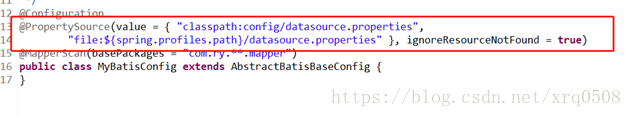
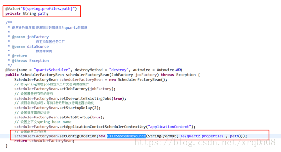
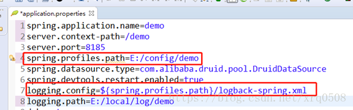

- [引用](#引用)
- [背景](#背景)
- [具体的实现方案](#具体的实现方案)
  - [1. 配置文件统一管理](#1-配置文件统一管理)
    - [1.1 springboot核心配置文件](#11-springboot核心配置文件)
    - [1.2 其他资源配置文件](#12-其他资源配置文件)
  - [2.第三方依赖包统一管理](#2第三方依赖包统一管理)
  - [3. 项目管理 shell 脚本编写](#3-项目管理-shell-脚本编写)
    - [项目管理](#项目管理)


# 引用
https://blog.csdn.net/xrq0508/article/details/80050119


# 背景

为实现快速搭建和开发，项目以Springboot框架搭建，springboot搭建的项目可以将项目直接打成jar包并运行，无需自己安装配置Tomcat或者其他服务器，是一种方便快捷的部署方式。

假设项目以最常规的方式打包成一个整体的jar包部署，即配置文件和第三方依赖包都包含在jar包里，就会有如下两个问题

问题一：项目运行过程中，要改动配置文件的话需要重新打包并部署。

问题二：多个第三方依赖包都相近的项目要部署在同一台服务器时，各自的jar包都包含了相同的第三方依赖包（假设项目jar包有100M，第三方依赖包可能就占用了99M），这样第三方依赖包冗余造成了服务器资源的浪费以及降低了项目部署的效率。

如果将各项目的配置文件、第三方依赖包都提取到jar包外统一管理，这样即提升了项目打包效率又节约了服务器的磁盘消耗，同时项目的运维也是非常方便的，改动了配置文件重启下服务就可以了，无需重新构建部署。

# 具体的实现方案

## 1. 配置文件统一管理

### 1.1 springboot核心配置文件

Springboot读取核心配置文件（application.properties）的优先级为

* 脚本或命令的执行时同级目录的config目录

* 脚本或命令的执行时同级目录

* classPath(即resources目录)的config目录

* classpath目录

上面是springboot默认去拿自己的核心配置文件的优先级，还有一种最高优先级的方式是项目启动时通过命令的方式指定项目加载核心配置文件，命令如下

```
java –jar -Dspring.config.location=xxx/xxx/xxxx.properties xxxx.jar
```

如果Spring Boot在优先级更高的位置找到了配置，那么它会无视优先级更低的配置


### 1.2 其他资源配置文件

上面描述的Springboot核心文件已经能够提取出jar包外进行管理了，但是还有其他一些业务上的配置文件，如数据源配置文件，公共资源定义配置文件（常量，FTP信息等），quartz定时器，日志等配置文件我们如何去提取出来并确保能在代码中引用到呢

我们知道Springboot项目可以通过注解方式来获取相关配置文件，所以我们也是通过注解方式让项目能够引用到jar包外部的配置文件的，如下图：




@PropertySource里面的value有两个值，第一个是classpath下config目录下的数据源配置文件，第二个则是根据spring.profiles.path动态获取的目录，spring.profiles.path是我们在核心文件自定义的一个配置项，它的值是我们配置文件统一管理的文件夹路径，后面的ignoreResourceNotFound=true则是设定假如根据前面一个路径没有找到相关配置文件，则根据第二个路径去找。

我们还可以直接根据路径，用FileSystemResource类去加载一个配置文件实例出来，如下图



原理类似，根据在核心文件自定义的统一配置目录的路径来加载配置文件

另外logback日志配置文件加载方式如下：



 

综上所述，我们梳理一下实现方案的思路

1、        在springboot核心文件里定义一个spring.profiles.path配置项，它的值指向我们所有配置文件统一放置的目录，包含核心文件自身也是放置在里面的

2、        代码或者配置文件里加载配置文件的地方也应该获取spring.profiles.path配置项来动态加载该路径下的配置文件

3、        Pom.xml文件修改打包相关模块，将配置文件排除，这样我们打出的jar包是不含配置文件的，打包配置请参考文档节点3

4、        启动jar包时，通过命令指定加载的核心文件为spring.profiles.path下的核心文件

## 2.第三方依赖包统一管理

待续


## 3. 项目管理 shell 脚本编写
自定义shell脚本，实现项目的启动，停止，状态，重启操作：

```python
#!/bin/bash 
#这里可替换为你自己的执行程序,其他代码无需更改 
APP_NAME=demo1-0.0.1-SNAPSHOT.jar 
JVM="-server -Xms512m -Xmx512m -XX:PermSize=64M -XX:MaxNewSize=128m -XX:MaxPermSize=128m -Djava.awt.headless=true -XX:+CMSClassUnloadingEnabled -XX:+CMSPermGenSweepingEnabled"
APPFILE_PATH="-Dspring.config.location=/usr/local/demo/config/application-demo1.properties"
#使用说明,用来提示输入参数 
usage() { 
echo "Usage: sh 执行脚本.sh [start|stop|restart|status]" 
exit 1 
} 
#检查程序是否在运行 
is_exist(){ 
pid=`ps -ef|grep $APP_NAME|grep -v grep|awk '{print $2}' ` 
#如果不存在返回1,存在返回0 
if [ -z "${pid}" ]; then 
return 1 
else 
return 0 
fi 
} 
#启动方法 
start(){ 
is_exist 
if [ $? -eq "0" ]; then 
echo "${APP_NAME} is already running. pid=${pid} ." 
else 
nohup java $JVM -jar $APPFILE_PATH $APP_NAME > /dev/null 2>&1 
fi
} 
#停止方法 
stop(){ 
is_exist 
if [ $? -eq "0" ]; then 
kill -9 $pid 
else 
echo "${APP_NAME} is not running" 
fi 
} 
#输出运行状态 
status(){ 
is_exist 
if [ $? -eq "0" ]; then 
echo "${APP_NAME} is running. Pid is ${pid}" 
else 
echo "${APP_NAME} is NOT running." 
fi 
} 
#重启 
restart(){ 
stop 
start 
} 
#根据输入参数,选择执行对应方法,不输入则执行使用说明 
case "$1" in 
"start") 
start 
;; 
"stop") 
stop 
;; 
"status") 
status 
;; 
"restart") 
restart 
;; 
*) 
usage 
;; 
esac
```
 

### 项目管理

进入jar包所在目录执行下面命令

```python
sh demo1.sh start 启动项目

sh demo1.sh stop 停止项目

sh demo1.sh restart重启项目

sh demo1.sh status项目状态
```