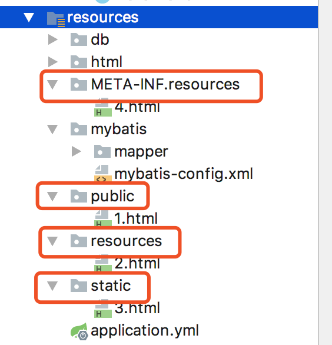

- [通过代码手动写接口实现(忽视框架本身来实现)](#通过代码手动写接口实现忽视框架本身来实现)
- [默认配置](#默认配置)
- [自定义静态资源目录](#自定义静态资源目录)
  - [配置类代码配置](#配置类代码配置)
    - [配置到服务器磁盘目录](#配置到服务器磁盘目录)
  - [通过配置文件properties文件](#通过配置文件properties文件)
  - [直接在application.yml中配置](#直接在applicationyml中配置)
    - [配置到服务器磁盘](#配置到服务器磁盘)
# 通过代码手动写接口实现(忽视框架本身来实现)

我们首先来分享一种最笨的办法，就是将静态资源通过流直接返回给前端，我们在maven工程的resources的根目录下建立一个html的目录，然后我们把html文件放在该目录下，并且规定任何访问路径以/static/开头的即访问该目录下的静态资源，其实现如下：

```java
@Controller
public class StaticResourceController {
 
    @RequestMapping("/static/**")
    public void getHtml(HttpServletRequest request, HttpServletResponse response) {
        String uri = request.getRequestURI();
        String[] arr = uri.split("static/");
        String resourceName = "index.html";
        if (arr.length > 1) {
            resourceName = arr[1];
        }
        String url = StaticResourceController.class.getResource("/").getPath() + "html/" + resourceName;
        try {
            FileReader reader = new FileReader(new File(url));
            BufferedReader br = new BufferedReader(reader);
            StringBuilder sb = new StringBuilder();
            String line = br.readLine();
            while (line != null) {
                sb.append(line);
                line = br.readLine();
            }
            response.getOutputStream().write(sb.toString().getBytes());
            response.flushBuffer();
        } catch (IOException e) {
            e.printStackTrace();
        }
    }
}
```

其实现过程很简单，就是先从路径中分离出来资源uri，然后从static目录下读取文件，并输出到前端。因为只做简单演示，所以这里只处理了文本类型的文件，图片文件可以做类似的处理。

当然，我们在实际中肯定不会这么做，Spring boot也肯定有更好的解决办法。不过这个办法虽然有点笨，但确是最本质的东西，无论框架如何方便的帮我们处理了这类问题，但是抛开框架，我们依然要能够熟练的写出一个web项目，只有知道其实现原理，你才会在遇到问题时能得心应手。

现在我们再来看看Spring boot对静态资源的支持。

# 默认配置

Spring boot默认对/**的访问可以直接访问四个目录下的文件：
* classpath:/public/

* classpath:/resources/

* classpath:/static/

* classpath:/META-INFO/resouces/



注意：注意蓝色条下的资源文件夹resources与类路径下的文件夹classpath:/resources是不同的，蓝色条下的resources代表的是该目录下的文件为资源文件，在打包的时候会将该目录下的文件全部打包的类路径下，这个名称是可以改的，在pom.xml指定资源目录即可：

```xml
<resources>
     <resource>
         <directory>src/main/resources</directory>
     </resource>
</resources>
```

而类路径下的resources是spring boot默认的静态资源文件夹之一，和public、static以及MEAT-INFO/resources的功能相同。现在我们重启Spring boot就可以通过

　　　　http://localhost:8080/1.html

　　　　http://localhost:8080/2.html

　　　　http://localhost:8080/3.html

　　　　http://localhost:8080/4.html

　　四个URL访问到四个目录下的静态资源了。

# 自定义静态资源目录

## 配置类代码配置

```java

import org.springframework.context.annotation.Configuration;
import org.springframework.web.servlet.config.annotation.ResourceHandlerRegistry;
import org.springframework.web.servlet.config.annotation.WebMvcConfigurationSupport;
 
/**
 * 主动设置URL匹配路径
 *
 * @author JustryDeng
 * @date 2018年8月4日 上午1:36:38
 */
@Configuration
public class MyURLPatternConfiguration extends WebMvcConfigurationSupport {
	@Override
	public void addResourceHandlers(ResourceHandlerRegistry registry) {
        
        registry.addResourceHandler("/fileData/**").addResourceLocations("classpath:/myFile/");

		super.addResourceHandlers(registry);
	}
}

```

注：此时默认的四个文件夹都失效了，如果想让默认的四个文件夹依然有效，那么可以在配置类中通过
       .addResourceHandler多次添加四个文件夹。

### 配置到服务器磁盘目录

```java
// 指定到D盘下的myFile文件夹
		registry.addResourceHandler("/fileData/**").addResourceLocations("file:D:/images/");
        // 注:如果是Linux的话，直接指定文件夹路径即可，如指定当前jar包的同级目录下的images文件夹
        registry.addResourceHandler("/fileData/**").addResourceLocations("file:./images/");

```
此时：我们访问IP地址:端口号/fileData/时，就相当于到了服务器(D盘)的images文件夹中了。

## 通过配置文件properties文件

```properties
# 设置当URI为/fileData/**时,才进过静态资源
# 注:如果设置为/**，那么表示任何访问都会经过静态资源路径
spring.mvc.static-path-pattern=/fileData/**
 
# 自定义路径
# 注:自定义路径时,默认的四个文件夹下中的“META-INF下的resoures文件夹”仍然有效,其他三个文件夹失效
# (此时:访问ip:端口号/fileData/时，相当于访问到了 “自定义的文件夹”和 “META-INF下的resoures文件夹”);
# 注:搜索文件时，自定义的文件夹的优先级要高于默认的四个文件夹
spring.resources.static-locations=classpath:/myFile/
 
# 提示:如果我们显式地把自定义文件夹  和 默认的四个文件夹都写出来，那么都会有效(此时，优先级 从左至右 依次降低)
#spring.resources.static-locations = classpath:/META-INF/resources/,classpath:/resources/,classpath:/static/,classpath:/public/,classpath:/myFile/

```

## 直接在application.yml中配置
```
spring:
  mvc:
    static-path-pattern: /image/**
  resources:
    static-locations: classpath:/images/

```

### 配置到服务器磁盘
```
spring:
  mvc:
    static-path-pattern: /image/**
  resources:
    static-locations: file:./images/

```

static-path-pattern：访问模式，默认为/**，多个可以逗号分隔

　　static-locations：资源目录，多个目录逗号分隔，默认资源目录为classpath:/META-INF/resources/,classpath:/resources/,classpath:/static/,classpath:/public/

　　注意，这个配置会覆盖Spring boot默认的静态资源目录，例如如果按示例中配置，则无法再访问static、public、resources等目录下的资源了。