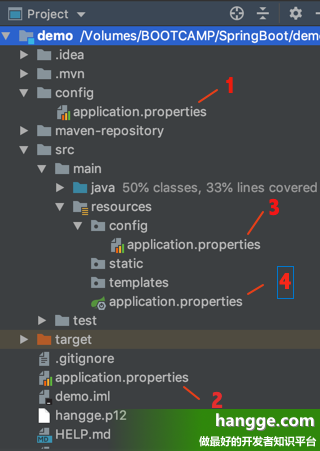
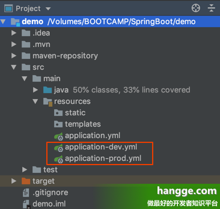

- [1，基本介绍](#1基本介绍)
- [2，YAML 配置与 Properties 配置的比较](#2yaml-配置与-properties-配置的比较)
- [3，常规配置](#3常规配置)
- [4，将数据注入到属性上](#4将数据注入到属性上)
- [5，将数据注入到 Bean 中](#5将数据注入到-bean-中)
- [6，将数据注入到一个集合中](#6将数据注入到一个集合中)
- [7，更复杂的配置：集合里面放置对象](#7更复杂的配置集合里面放置对象)
- [附：使用 Profile 实现多环境配置](#附使用-profile-实现多环境配置)
  - [1.创建配置文件](#1创建配置文件)

# 1，基本介绍

（1）YAML 是 JSON 的超集，简洁而强大，是一种专门用来书写配置文件的语言，可以替代 application.properties。

（2）在创建一个 SpringBoot 项目时，引入的 spring-boot-starter-web 依赖间接地引入了 snakeyaml 依赖， snakeyaml 会实现对 YAML 配置的解析。

（3）YAML 的使用非常简单，利用缩进来表示层级关系，并且大小写敏感。


# 2，YAML 配置与 Properties 配置的比较

可以使用 @PropertySource 注解加载自定义的 Properties 配置文件，但无法加载自定义的 YAML 文件。
YAML 支持列表的配置，而 Properties 不支持。
 

# 3，常规配置

（1）在 Spring Boot 项目中使用 YAML 只需要在 resources 目录下创建一个 application .yml 文件即可，这里我们添加如下配置：

有了 application .yml 后我们可以将 resources 目录下的 application.properties 文件删除（当然保留也没问题），完全使用 YAML 完成文件的配置。

```
server:
  port: 8081
  servlet:
    context-path: /hangge
  tomcat:
    uri-encoding: utf-8
```
 

其等效于 application.properties 中的如下配置：
```S
server.port=8081
server.servlet.context-path=/hangge
server.tomcat.uri-encoding=utf-8
```

（2）配置属性之间也可以相互引用使用： 

```S
my:
  name: 航歌
  age: 100
  info: name:${my.name} age:${my.age}
```

（3）配置文件中可以使用 ${random} 来生成各种不同类型的随机值：

```
my:
  secret: ${random.value}
  number: ${random.int}
  bignumber: ${random.long}
  uuid: ${random.uuid}
  lessthanten: ${random.int(10)}
  numberinrange: ${random.int[1024,65536]}
```
 

# 4，将数据注入到属性上

（1）假设我们有如下配置数据：

```
my:
  name: 航歌
  age: 100
```

（2）在需要的地方我们使用 @Value 注解就可以将数据注入到属性上：

```java
package com.example.demo;
 
import org.springframework.beans.factory.annotation.Value;
import org.springframework.web.bind.annotation.RestController;
import org.springframework.web.bind.annotation.GetMapping;
 
@RestController
public class HelloController {
    @Value("${my.name}")
    String name;
 
    @GetMapping("/hello")
    public String hello() {
        return "welcome to " + name;
    }
}
```

（3）运行结果如下：


 

# 5，将数据注入到 Bean 中

有时候属性太多了，一个个绑定到属性字段上太累，官方提倡绑定一个对象的 bean。

 

（1）首先我们创建一个名为 My 的 Bean，并将前面的配置数据注入到这个 Bean 中。

（1）@ConfigurationProperties 中的 prefix 属性描述了要加载的配置文件的前缀。
（2）Spring Boot 采用了一种宽松的规则来进行属性绑定：

假设 Bean 中的属性名为 authorName，那么配置文件中的属性可以是 my.author_name、my.author-name、my.authorName 或者 my.AUTHORNAME

```java
package com.example.demo;
 
import org.springframework.boot.context.properties.ConfigurationProperties;
import org.springframework.stereotype.Component;
 
@Component
@ConfigurationProperties(prefix = "my")
public class My {
    private String name;
    private String age;
 
    public String getName() {
        return name;
    }
 
    public void setName(String name) {
        this.name = name;
    }
 
    public String getAge() {
        return age;
    }
 
    public void setAge(String age) {
        this.age = age;
    }
}
```

（2）然后我们在 Controller 中引入这个 Bean 使用即可：

```java
package com.example.demo;
 
import org.springframework.beans.factory.annotation.Autowired;
import org.springframework.web.bind.annotation.RestController;
import org.springframework.web.bind.annotation.GetMapping;
 
@RestController
public class HelloController {
    @Autowired
    My my;
 
    @GetMapping("/hello")
    public String hello() {
        return my.getName() + " : " + my.getAge();
    }
}
```
（3）运行结果如下：


 

# 6，将数据注入到一个集合中

（1）YAML 还支持列表的配置：

```S
my:
  name: 航歌
  favorites:
    - 足球
    - 篮球
    - 排球
```

（2）下面同样将这组配置注入到 Bean 中，注意到其中 favorites 这个集合数据也自动注入到 List 属性中：
```java

package com.example.demo;
 
import org.springframework.boot.context.properties.ConfigurationProperties;
import org.springframework.stereotype.Component;
import java.util.List;
 
@Component
@ConfigurationProperties(prefix = "my")
public class My {
    private String name;
 
    private List<String> favorites;
 
    public String getName() {
        return name;
    }
 
    public void setName(String name) {
        this.name = name;
    }
 
    public List<String> getFavorites() {
        return favorites;
    }
 
    public void setFavorites(List<String> favorites) {
        this.favorites = favorites;
    }
}

```
（3）然后我们在 Controller 中引入这个 Bean 使用即可：
```S

package com.example.demo;
 
import org.springframework.beans.factory.annotation.Autowired;
import org.springframework.web.bind.annotation.RestController;
import org.springframework.web.bind.annotation.GetMapping;
 
@RestController
public class HelloController {
    @Autowired
    My my;
 
    @GetMapping("/hello")
    public String hello() {
        return my.getName() + " : " + my.getFavorites();
    }
}
```

（4）运行结果如下：


 

# 7，更复杂的配置：集合里面放置对象

（1）YAML 还支持更复杂的配置，即集合中也可以是一个对象：
```
my:
  users:
    - name: 大李
      age: 100
    - name: 小刘
      age: 200
```
 

（2）下面同样将这组配置注入到 Bean 中：
```java

package com.example.demo;
 
import org.springframework.boot.context.properties.ConfigurationProperties;
import org.springframework.stereotype.Component;
import java.util.List;
 
@Component
@ConfigurationProperties(prefix = "my")
public class Users {
    private List<User> users;
 
    public List<User> getUsers() {
        return users;
    }
 
    public void setUsers(List<User> users) {
        this.users = users;
    }
}
```

```java
package com.example.demo;
 
public class User {
    private String name;
    private String age;
 
    public String getName() {
        return name;
    }
 
    public void setName(String name) {
        this.name = name;
    }
 
    public String getAge() {
        return age;
    }
 
    public void setAge(String age) {
        this.age = age;
    }
}
```
 

（3）然后我们在 Controller 中引入这个 Bean 使用即可：

```java

package com.example.demo;
 
import org.springframework.beans.factory.annotation.Autowired;
import org.springframework.web.bind.annotation.RestController;
import org.springframework.web.bind.annotation.GetMapping;
 
@RestController
public class HelloController {
    @Autowired
    Users users;
 
    @GetMapping("/hello")
    public String hello() {
        String result = "";
        for (User user : users.getUsers()) {
            result += user.getName() + "：" + user.getAge() + "<br>";
        }
        return result;
    }
}
```

（4）运行结果如下：


 

8，使用命令行参数进行配置

 * 在命令行中通过 java -jar 命令启动项目时，可以使用连续的两个减号 -- 对 application.yml 中的属性值进行赋值。

 * 比如下面命令修改 tomcat 端口号为 8081。其等价于在 application.yml 中添加属性 server.port=8081：

注意：如果 application.yml 中已经有同名属性，那么命令行属性会覆盖 application.yml 的属性。

```
java -jar xx.jar --server.port=8081
```
 

9，配置文件的优先级

1. 同 application.properties 文件一样，Spring Boot 项目中的 application.yml 配置文件一共可以出现在如下 4 个位置（优先级逐渐降低）：

 * 项目根目录下的 config 文件夹
 * 项目根目录下
 * classpath 下的 config 文件夹
 * classpath 下
 

 2. 如果这 4 个地方都有 application.yml 文件，加载的优先级就是从 1 到 4 依次降低，Spring Boot 将按照这个优先级查找配置信息。




# 附：使用 Profile 实现多环境配置

 我们在项目发布之前，一般需要频繁地在开发环境、测试环境以及生产环境之间进行切换，这个时候大量的配置需要频繁更改（比如数据库配置、redis 配置、mongodb 配置等等）。
 Spring Boot 的 Profile 就给我们提供了解决方案，它约定不同环境下的配置文件名称规则为：

* application-{profile}.yml，其中 {profile} 表示当前环境的名称。
  
## 1.创建配置文件 

（1）首先在 resources 目录下创建两个配置文件：application-dev.yml 和 application-prod.yml 此时，分别表示开发环境中的配置和生产环境中的配置。




（2）它们两个分别设置不同的端口号。
```properties

#application-dev.yml
server:
  port: 8080
 
#application-prod.yml
server:
  port: 80
 
```

2，在 application.yml 中配置环境

（1）假设我们在 application.yml 中进行如下配置，则表示使用 application-dev.yml 配置文件启动项目。

```properties
spring:
  profiles:
    active: dev
```
 

（2）如果将 dev 改为 prod，则表示使用 application-prod.properties 启动项目。

```properties
spring:
  profiles:
    active: prod
```
 

（3）项目启动成功后，就可以通过相应的端口进行访问了。

 

3，在代码中配置环境

* 除了像前面那样在 application.yml 中添加配置，我们也可以在代码中添加配置来完成。

* 比如我们在启动类的 main 方法上添加如下代码，表示使用 application-dev.yml 配置文件启动项目。
```java

package com.example.demo;
 
import org.springframework.boot.autoconfigure.SpringBootApplication;
import org.springframework.boot.builder.SpringApplicationBuilder;
 
@SpringBootApplication
public class DemoApplication {
 
    public static void main(String[] args) {
        SpringApplicationBuilder builder = new
                SpringApplicationBuilder(DemoApplication.class);
        builder.application().setAdditionalProfiles("dev");
        builder.run(args);
    }
}
 
```

4，在项目启动时配置环境

我们也可以在项目打包成 jar 包后启动时，在命令行中动态指定当前环境：

```shell
java -jar xxx.jar --spring.profiles.active=dev
```
