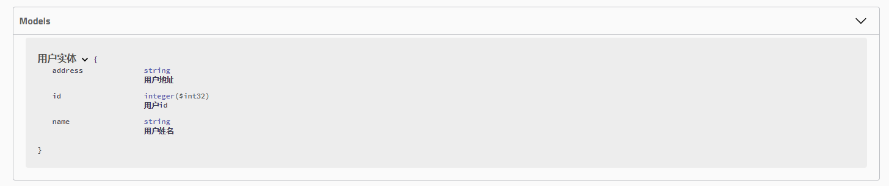
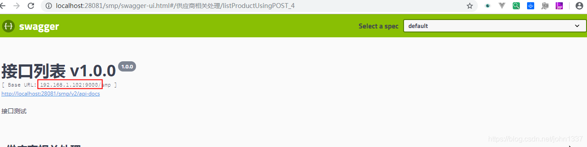

- [添加依赖包](#添加依赖包)
- [编写配置类](#编写配置类)
- [Application类需要添加扫描配置类](#application类需要添加扫描配置类)
- [自定义响应消息](#自定义响应消息)
- [接口过滤](#接口过滤)
  - [@ApiIgnore 注解。](#apiignore-注解)
  - [apis() 和 paths()过滤](#apis-和-paths过滤)
- [Model](#model)
  - [Controller 相关注解](#controller-相关注解)
    - [@Api 主要属性](#api-主要属性)
  - [接口相关注解](#接口相关注解)
    - [@ApiOperation: 可设置对接口的描述。](#apioperation-可设置对接口的描述)
    - [@ApiImplicitParam](#apiimplicitparam)
  - [Model 相关注解](#model-相关注解)
    - [@ApiModel: 可设置接口相关实体的描述。](#apimodel-可设置接口相关实体的描述)
    - [@ApiModelProperty: 可设置实体属性的相关描述。](#apimodelproperty-可设置实体属性的相关描述)
- [nginx配置反向代理](#nginx配置反向代理)
  - [配置baseurl(restapi的基础动作)](#配置baseurlrestapi的基础动作)


# 添加依赖包

```gradle
dependencies {
    .........
	//配置openapi
	compile("io.springfox:springfox-swagger2:2.9.2")
	compile("io.springfox:springfox-swagger-ui:2.9.2")


}
```
一个是swagger库一个是swagger的ui库

# 编写配置类
```java
package com.app.conf;

import com.google.common.base.Predicates;
import org.springframework.context.annotation.Bean;
import org.springframework.context.annotation.Configuration;
import org.springframework.web.bind.annotation.RequestMethod;
import springfox.documentation.builders.PathSelectors;
import springfox.documentation.builders.RequestHandlerSelectors;
import springfox.documentation.builders.ResponseMessageBuilder;
import springfox.documentation.schema.ModelRef;
import springfox.documentation.service.ApiInfo;
import springfox.documentation.service.Contact;
import springfox.documentation.spi.DocumentationType;
import springfox.documentation.spring.web.plugins.Docket;
import springfox.documentation.swagger2.annotations.EnableSwagger2;
import java.util.Collections;
import io.swagger.annotations.ApiOperation;

import static com.google.common.collect.Lists.newArrayList;

/**
 * @author ganchaoyang
 * @date 2019/3/1014:16
 */

@Configuration
@EnableSwagger2
public class SwaggerConfig {
    @Bean
    public Docket api() {
        return new Docket(DocumentationType.SWAGGER_2)
                .select()
                .apis(RequestHandlerSelectors.basePackage("com.app.davenkin"))
                .paths(PathSelectors.any())
                .build()
                .apiInfo(apiInfo())
                .useDefaultResponseMessages(false)
                .globalResponseMessage(RequestMethod.GET, newArrayList(
                        new ResponseMessageBuilder()
                                .code(500)
                                .message("服务器发生异常")
                                .responseModel(new ModelRef("Error"))
                                .build(),
                        new ResponseMessageBuilder()
                                .code(403)
                                .message("资源不可用")
                                .build()
                ));
    }

    private ApiInfo apiInfo() {
        return new ApiInfo(
                "Spring Boot项目集成Swagger实例文档",
                "我的博客网站：https://itweknow.cn，欢迎大家访问。",
                "API V1.0",
                "Terms of service",
                new Contact("名字想好没", "https://itweknow.cn", "gancy.programmer@gmail.com"),
                "Apache", "http://www.apache.org/", Collections.emptyList());
    }
}

```

# Application类需要添加扫描配置类

```java
package com.app.davenkin;
import org.springframework.boot.SpringApplication;
import org.springframework.boot.autoconfigure.SpringBootApplication;
import org.springframework.context.annotation.ComponentScan;
import org.apache.ibatis.annotations.*;
import org.mybatis.spring.annotation.MapperScan;
import springfox.documentation.swagger2.annotations.EnableSwagger2;
//@SpringBootApplication(scanBasePackages = "com.app.co")
@SpringBootApplication
@MapperScan("com.app.mapper")
@ComponentScan({"com.app.conf","com.app.davenkin"})
public class Application {

    public static void main(String[] args) {
        SpringApplication.run(Application.class, args);
    }

}

```
@ComponentScan配置扫描com.app.conf

# 自定义响应消息

Swagger 允许我们通过 Docket 的 globalResponseMessage() 方法全局覆盖 HTTP 方法的响应消息，但是首先我们得通过 Docket 的 useDefaultResponseMessages 方法告诉 Swagger 不使用默认的 HTTP 响应消息，假设我们现在需要覆盖所有 GET 方法的 500 和 403 错误的响应消息，我们只需要在 SwaggerConfig.java 类中的 Docket Bean 下添加如下内容：

```java
.useDefaultResponseMessages(false)
.globalResponseMessage(RequestMethod.GET, newArrayList(
new ResponseMessageBuilder()
              .code(500)
              .message("服务器发生异常")
              .responseModel(new ModelRef("Error"))
              .build(),
       new ResponseMessageBuilder()
              .code(403)
              .message("资源不可用")
              .build()
));

```
# 接口过滤

有些时候我们并不是希望所有的 Rest API 都呈现在文档上，这种情况下 Swagger2 提供给我们了两种方式配置，一种是基于 @ApiIgnore 注解，另一种是在 Docket 上增加筛选。

## @ApiIgnore 注解。

如果想在文档中屏蔽掉删除用户的接口（user/delete），那么只需要在删除用户的方法上加上 @ApiIgnore 即可。

```java
@ApiIgnore
public boolean delete(@PathVariable("id") int id)

```

## apis() 和 paths()过滤

在 Docket 上增加筛选。Docket 类提供了 apis() 和 paths() 两个方法来帮助我们在不同级别上过滤接口：

* apis() ：这种方式我们可以通过指定包名的方式，让 Swagger 只去某些包下面扫描。
* paths() ：这种方式可以通过筛选 API 的 url 来进行过滤。

在集成 Swagger2 的章节中我们这两个方法指定的都是扫描所有，没有指定任何过滤条件。如果我们在我们修改之前定义的 Docket 对象的 apis() 方法和 paths() 方法为下面的内容，那么接口文档将只会展示 /user/add 和 /user/find/{id} 两个接口。

具体可以看[编写配置类](#编写配置类)的代码

# Model

如下图所示，SwaggerUI 会通过我们在实体上使用的 @ApiModel 注解以及 @ApiModelProperty 注解来自动补充实体以及其属性的描述和备注。

图 8. 实体界面


## Controller 相关注解

@Api: 可设置对控制器的描述。

### @Api 主要属性

注解属性 | 类型 | 描述
-----|----|---
tags | String[] | 控制器标签。
description | String | 控制器描述（该字段被申明为过期）。

## 接口相关注解

### @ApiOperation: 可设置对接口的描述。

表 2. @ApiOperation 主要属性

注解属性 | 类型 | 描述
-----|----|---
value | String | 接口说明。
notes | String | 接口发布说明。
tags | Stirng[] | 标签。
response | Class<?> | 接口返回类型。
httpMethod | String | 接口请求方式。


@ApiIgnore: Swagger 文档不会显示拥有该注解的接口。 @ApiImplicitParams: 用于描述接口的非对象参数集。 @ApiImplicitParam: 用于描述接口的非对象参数，一般与 @ApiImplicitParams 组合使用。

### @ApiImplicitParam 

注解属性 | 描述
-----|---
paramType | 查询参数类型，实际上就是参数放在那里。取值：path：以地址的形式提交数据，根据 id 查询用户的接口就是这种形式传参；query：Query string 的方式传参；header：以流的形式提交；form：以 Form 表单的形式提交。
dataType | 参数的数据类型。取值：Long 和 String
name | 参数名字。
value | 参数意义的描述。
required | 是否必填。取值：true：必填参数；false：非必填参数。

## Model 相关注解

### @ApiModel: 可设置接口相关实体的描述。 

### @ApiModelProperty: 可设置实体属性的相关描述。

@ApiModelProperty 主要属性

注解属性 | 类型 | 描述
-----|----|---
value | String | 字段说明。
name | String | 重写字段名称。
dataType | Stirng | 重写字段类型。
required | boolean | 是否必填。
example | Stirng | 举例说明。
hidden | boolean | 是否在文档中隐藏该字段。
allowEmptyValue | boolean | 是否允许为空。
allowableValues | String | 该字段允许的值，当我们 API 的某个参数为枚举类型时，使用这个属性就可以清楚地告诉 API 使用者该参数所能允许传入的值。

# nginx配置反向代理

如果在服务器上，用户访问的域名是https://example.com，但内部是通过类似Nginx这样的反向代理访问实际的Spring Boot应用，比如http://localhost:8080，这个时候，在页面https://example.com/swagger-ui.html上，显示的URL仍然是http://localhost:8080，这样一来，就无法直接在页面执行API，非常不方便。

这是因为Spring Boot内置的Tomcat默认获取的服务器名称是localhost，端口是实际监听端口，而不是对外暴露的域名和80或443端口。要让Tomcat获取到对外暴露的域名等信息，必须在Nginx配置中传入必要的HTTP Header，常用的配置如下：

```nginx
# Nginx配置
server {
    ...
    location / {
        proxy_pass http://localhost:8080;
        proxy_set_header Host $host;
        proxy_set_header X-Real-IP $remote_addr;
        proxy_set_header X-Forwarded-Proto $scheme;
        proxy_set_header X-Forwarded-For $proxy_add_x_forwarded_for;
    }
    ...
}

```

重新加载nginx
```sh
nginx -s reload
```

然后，在Spring Boot的application.yml中，加入如下配置：
```yml
server:
  # 实际监听端口:
  port: 8080
  # 从反向代理读取相关的HTTP Header:
  forward-headers-strategy: native
```
重启Spring Boot应用，即可在Swagger中显示正确的URL。

## 配置baseurl(restapi的基础动作)
```java

@Configuration
public class SwaggerConfig {
 
    //:表示如果yml文件没有有配置swagger2.host则使用127.0.0.1:8080
    @Value("${swagger2.host:127.0.0.1:8080}")
    private String swaggerHost;
 
    @Bean
    public Docket createRestApi() {
 
        return new Docket(DocumentationType.SWAGGER_2)
                .host(swaggerHost)
                .apiInfo(apiInfo())
                .select()
                .apis(RequestHandlerSelectors.basePackage("jtl3d"))
                .paths(PathSelectors.any())
                .build();
    }
}

```

然后在配置文件中配置swagger2.host即可，如下图

yml文件中配置：

```yml
# swagger配置
swagger2:
  host: 192.168.1.102:9000
```
展示效果如下图所示，注意标红部分：
