- [SpringMVC](#springmvc)
	- [Springmvc处理流程](#springmvc处理流程)
	- [入门程序](#入门程序)
		- [创建web工程](#创建web工程)
		- [导入jar包](#导入jar包)
		- [创建springmvc.xml](#创建springmvcxml)
		- [配置前段控制器](#配置前段控制器)
		- [加入jsp页面](#加入jsp页面)
		- [创建商品pojo](#创建商品pojo)
		- [创建ItemController(handler层)](#创建itemcontrollerhandler层)
		- [运行测试](#运行测试)
	- [SpringMVC架构](#springmvc架构)
		- [架构结构](#架构结构)
		- [组件说明](#组件说明)
			- [DispatcherServlet：前端控制器](#dispatcherservlet前端控制器)
			- [HandlerMapping：处理器映射器](#handlermapping处理器映射器)
			- [Handler：处理器](#handler处理器)
			- [HandlAdapter：处理器适配器](#handladapter处理器适配器)
			- [ViewResolver：视图解析器](#viewresolver视图解析器)
			- [View：视图](#view视图)
		- [spring默认加载的组件](#spring默认加载的组件)
		- [组件扫描](#组件扫描)
		- [注解映射器和适配器](#注解映射器和适配器)
			- [配置处理器映射器](#配置处理器映射器)
			- [配置处理器适配器](#配置处理器适配器)
			- [注解驱动](#注解驱动)
			- [视图解析器](#视图解析器)
			- [修改ItemController](#修改itemcontroller)
			- [效果](#效果)
	- [SpringMVC整合Mybatis](#springmvc整合mybatis)
		- [创建数据库数据](#创建数据库数据)
		- [导入整合相关jar包](#导入整合相关jar包)
		- [整合思路](#整合思路)
		- [配置文件](#配置文件)
			- [sqlMapConfig.xml](#sqlmapconfigxml)
			- [applicationContext-dao.xml](#applicationcontext-daoxml)
			- [db.properties](#dbproperties)
			- [applicationContext-service.xml](#applicationcontext-servicexml)
			- [applicationContext-trans.xml](#applicationcontext-transxml)
			- [springmvc.xml](#springmvcxml)
			- [web.xml](#webxml)
			- [itemList.jsp和itemEdit.jsp到工程中](#itemlistjsp和itemeditjsp到工程中)
			- [配置完效果如下图：](#配置完效果如下图)
		- [实现商品列表显示](#实现商品列表显示)
			- [使用逆向工程，生成代码](#使用逆向工程生成代码)
			- [配置service和controller相关代码](#配置service和controller相关代码)
				- [ItemService接口](#itemservice接口)
				- [ItemServiceImpl实现类](#itemserviceimpl实现类)
				- [ItemController](#itemcontroller)
		- [测试](#测试)
	- [参数绑定](#参数绑定)
		- [需求](#需求)
		- [需求分析](#需求分析)
		- [编写service代码](#编写service代码)
			- [ItemService接口](#itemservice接口-1)
			- [ItemServiceImpl实现类](#itemserviceimpl实现类-1)
			- [ItemController](#itemcontroller-1)
				- [springmvc 默认支持的类型](#springmvc-默认支持的类型)
					- [HttpServletRequest](#httpservletrequest)
					- [HttpServletResponse](#httpservletresponse)
					- [HttpSession](#httpsession)
			- [Controller的返回类值](#controller的返回类值)
				- [ModelAndView返回数据](#modelandview返回数据)
				- [Model/ModelMap返回数据](#modelmodelmap返回数据)
		- [请求参数类型获取](#请求参数类型获取)
			- [获取简单数据类型](#获取简单数据类型)
			- [支持的数据类型](#支持的数据类型)
			- [@RequestParam](#requestparam)
		- [pojo类型](#pojo类型)
			- [将页面修改后的商品信息保存到数据库中。](#将页面修改后的商品信息保存到数据库中)
				- [使用pojo接收表单数据](#使用pojo接收表单数据)
				- [ItemService接口](#itemservice接口-2)
				- [ItemServiceImpl实现类](#itemserviceimpl实现类-2)
				- [ItemController](#itemcontroller-2)
				- [编写success页面](#编写success页面)
				- [6.3.8. 解决post乱码问题](#638-解决post乱码问题)
		- [pojo包装参数类型](#pojo包装参数类型)
			- [使用包装的pojo接收商品信息的查询条件。](#使用包装的pojo接收商品信息的查询条件)
				- [接收查询条件](#接收查询条件)
		- [自定义参数类型](#自定义参数类型)
			- [需求在商品修改页面可以修改商品的生产日期，并且根据业务需求自定义日期格式。](#需求在商品修改页面可以修改商品的生产日期并且根据业务需求自定义日期格式)
			- [修改itemEdit.jsp](#修改itemeditjsp)
			- [自定义Converter](#自定义converter)
			- [配置Converter](#配置converter)
			- [配置方式2（了解）](#配置方式2了解)
	- [SpringMVC和Struts2的区别](#springmvc和struts2的区别)
	- [高级参数绑定](#高级参数绑定)
		- [绑定数组(选中多个商品，然后删除。)](#绑定数组选中多个商品然后删除)
			- [Jsp修改](#jsp修改)
			- [Controller](#controller)
			- [测试效果](#测试效果)
		- [将表单的数据绑定到List](#将表单的数据绑定到list)
			- [定义包装pojo](#定义包装pojo)
			- [Jsp改造](#jsp改造)
			- [测试](#测试-1)
	- [@RequestMapping注解使用](#requestmapping注解使用)
		- [4.1. URL路径映射](#41-url路径映射)
		- [添加在类上面(约束一个类接收的url格式)](#添加在类上面约束一个类接收的url格式)
		- [请求方法限定](#请求方法限定)
	- [controller返回值](#controller返回值)
		- [返回ModelAndView](#返回modelandview)
		- [返回void](#返回void)
			- [使用request转发页面](#使用request转发页面)
			- [可以通过response页面重定向](#可以通过response页面重定向)
			- [可以通过response指定响应结果，例如响应json数据如下：](#可以通过response指定响应结果例如响应json数据如下)
			- [代码演示](#代码演示)
		- [返回字符串](#返回字符串)
			- [逻辑视图名](#逻辑视图名)
			- [Redirect重定向](#redirect重定向)
			- [forward转发](#forward转发)
	- [异常处理器](#异常处理器)
		- [异常处理思路](#异常处理思路)
			- [自定义异常类](#自定义异常类)
			- [自定义异常处理器](#自定义异常处理器)
			- [异常处理器配置](#异常处理器配置)
			- [错误页面](#错误页面)
			- [异常测试](#异常测试)
	- [图片上传处理](#图片上传处理)
		- [配置虚拟目录](#配置虚拟目录)
		- [加入文件上传jar包](#加入文件上传jar包)
		- [配置上传解析器](#配置上传解析器)
		- [jsp页面修改](#jsp页面修改)
		- [图片上传](#图片上传)
	- [json数据交互](#json数据交互)
		- [@RequestBody](#requestbody)
		- [@ResponseBody](#responsebody)
		- [请求json，响应json实现：](#请求json响应json实现)
			- [加入支持json的jar包](#加入支持json的jar包)
			- [ItemController编写](#itemcontroller编写)
			- [安装谷歌浏览器测试工具](#安装谷歌浏览器测试工具)
			- [测试结果](#测试结果)
			- [配置json转换器](#配置json转换器)
	- [Springmvc 实现restfull(restfull是一个习惯)](#springmvc-实现restfullrestfull是一个习惯)
		- [什么是restful？](#什么是restful)
		- [需求](#需求-1)
		- [从URL上获取参数](#从url上获取参数)
	- [拦截器](#拦截器)
		- [什么是拦截器](#什么是拦截器)
		- [如何定义拦截器](#如何定义拦截器)
		- [拦截器配置](#拦截器配置)
		- [正常流程测试](#正常流程测试)
		- [运行流程](#运行流程)
		- [中断流程测试](#中断流程测试)
		- [运行流程](#运行流程-1)
		- [拦截器应用](#拦截器应用)
			- [处理流程](#处理流程)
			- [编写登录jsp](#编写登录jsp)
			- [用户登陆Controller](#用户登陆controller)
			- [编写拦截器](#编写拦截器)
			- [配置拦截器](#配置拦截器)

# SpringMVC

Spring web mvc和Struts2都属于表现层的框架,它是Spring框架的一部分,我们可以从Spring的整体结构中看得出来,如下图：

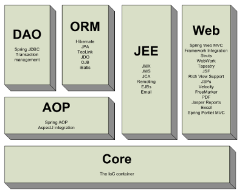

## Springmvc处理流程

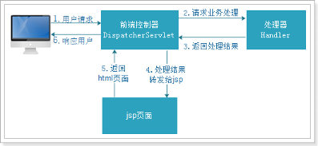


## 入门程序

需求：使用浏览器显示商品列表

### 创建web工程

springMVC是表现层框架，需要搭建web工程开发。

环境 
```xml
Tomcat 7
Dynamic web moudle 的版本是2.5，可以自动生成web.xml配置文件，
```
### 导入jar包

复制jar到lib目录，工程直接加载jar包，如下图：

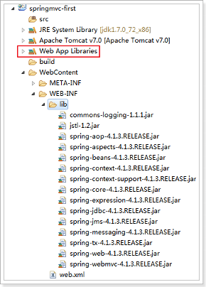

### 创建springmvc.xml

创建SpringMVC的核心配置文件
SpringMVC本身就是Spring的子项目，对Spring兼容性很好，不需要做很多配置。
这里只配置一个Controller扫描就可以了，让Spring对页面控制层Controller进行管理。

```xml
<?xml version="1.0" encoding="UTF-8"?>
<beans xmlns="http://www.springframework.org/schema/beans"
	xmlns:xsi="http://www.w3.org/2001/XMLSchema-instance" xmlns:p="http://www.springframework.org/schema/p"
	xmlns:context="http://www.springframework.org/schema/context"
	xmlns:mvc="http://www.springframework.org/schema/mvc"
	xsi:schemaLocation="http://www.springframework.org/schema/beans http://www.springframework.org/schema/beans/spring-beans-4.0.xsd
        http://www.springframework.org/schema/mvc http://www.springframework.org/schema/mvc/spring-mvc-4.0.xsd
        http://www.springframework.org/schema/context http://www.springframework.org/schema/context/spring-context-4.0.xsd">

	<!-- 配置controller扫描包 -->
	<context:component-scan base-package="cn.itcast.springmvc.controller" />

</beans>

```

配置文件约束如下：

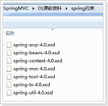

### 配置前段控制器
配置SpringMVC的前端控制器DispatcherServlet
在web.xml中

```xml
<?xml version="1.0" encoding="UTF-8"?>
<web-app xmlns:xsi="http://www.w3.org/2001/XMLSchema-instance"
	xmlns="http://java.sun.com/xml/ns/javaee"
	xsi:schemaLocation="http://java.sun.com/xml/ns/javaee http://java.sun.com/xml/ns/javaee/web-app_2_5.xsd"
	id="WebApp_ID" version="2.5">
	<display-name>springmvc-first</display-name>
	<welcome-file-list>
		<welcome-file>index.html</welcome-file>
		<welcome-file>index.htm</welcome-file>
		<welcome-file>index.jsp</welcome-file>
		<welcome-file>default.html</welcome-file>
		<welcome-file>default.htm</welcome-file>
		<welcome-file>default.jsp</welcome-file>
	</welcome-file-list>

	<!-- 配置SpringMVC前端控制器 -->
	<servlet>
		<servlet-name>springmvc-first</servlet-name>
		<servlet-class>org.springframework.web.servlet.DispatcherServlet</servlet-class>
		<!-- 指定SpringMVC配置文件 -->
		<!-- SpringMVC的配置文件的默认路径是/WEB-INF/${servlet-name}-servlet.xml -->
		<init-param>
			<param-name>contextConfigLocation</param-name>
			<param-value>classpath:springmvc.xml</param-value>
		</init-param>
	</servlet>

	<servlet-mapping>
		<servlet-name>springmvc-first</servlet-name>
		<!-- 设置所有以action结尾的请求进入SpringMVC -->
		<!-- 
  		1. /*  拦截所有   jsp  js png .css  真的全拦截   建议不使用
  		2. *.action *.do 拦截以do action 结尾的请求     肯定能使用   ERP  
  		3. /  拦截所有 （不包括jsp) (包含.js .png.css)  强烈建议使用     前台 面向消费者  www.jd.com/search   /对静态资源放行
  	 	-->
		<url-pattern>*.action</url-pattern>
	</servlet-mapping>
</web-app>

```

### 加入jsp页面

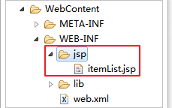

添加 itemList.jsp到WEB-INF.

```jsp
<%@ page language="java" contentType="text/html; charset=UTF-8"
    pageEncoding="UTF-8"%>
<%@ taglib uri="http://java.sun.com/jsp/jstl/core" prefix="c" %>
<%@ taglib uri="http://java.sun.com/jsp/jstl/fmt"  prefix="fmt"%>
<!DOCTYPE html PUBLIC "-//W3C//DTD HTML 4.01 Transitional//EN" "http://www.w3.org/TR/html4/loose.dtd">
<html>
<head>
<meta http-equiv="Content-Type" content="text/html; charset=UTF-8">
<title>查询商品列表</title>
</head>
<body> 
<form action="${pageContext.request.contextPath }/item/queryitem.action" method="post">
查询条件：
<table width="100%" border=1>
<tr>
<td><input type="submit" value="查询"/></td>
</tr>
</table>
商品列表：
<table width="100%" border=1>
<tr>
	<td>商品名称</td>
	<td>商品价格</td>
	<td>生产日期</td>
	<td>商品描述</td>
	<td>操作</td>
</tr>
<c:forEach items="${itemList }" var="item">
<tr>
	<td>${item.name }</td>
	<td>${item.price }</td>
	<td><fmt:formatDate value="${item.createtime}" pattern="yyyy-MM-dd HH:mm:ss"/></td>
	<td>${item.detail }</td>
	
	<td><a href="${pageContext.request.contextPath }/itemEdit.action?id=${item.id}">修改</a></td>

</tr>
</c:forEach>

</table>
</form>
</body>

</html>
```

### 创建商品pojo

```java
public class Item {
	// 商品id
	private int id;
	// 商品名称
	private String name;
	// 商品价格
	private double price;
	// 商品创建时间
	private Date createtime;
	// 商品描述
	private String detail;

创建带参数的构造器
set/get。。。
}

```

### 创建ItemController(handler层)

ItemController是一个普通的java类，不需要实现任何接口。
需要在类上添加@Controller注解，把Controller交由Spring管理
在方法上面添加@RequestMapping注解，里面指定请求的url。其中“.action”可以加也可以不加。

```java
@Controller
public class ItemController {

	// @RequestMapping：里面放的是请求的url，和用户请求的url进行匹配
	// action可以写也可以不写
	@RequestMapping("/itemList.action")
	public ModelAndView queryItemList() {
		// 创建页面需要显示的商品数据
		List<Item> list = new ArrayList<>();
		list.add(new Item(1, "1华为 荣耀8", 2399, new Date(), "质量好！1"));
		list.add(new Item(2, "2华为 荣耀8", 2399, new Date(), "质量好！2"));
		list.add(new Item(3, "3华为 荣耀8", 2399, new Date(), "质量好！3"));
		list.add(new Item(4, "4华为 荣耀8", 2399, new Date(), "质量好！4"));
		list.add(new Item(5, "5华为 荣耀8", 2399, new Date(), "质量好！5"));
		list.add(new Item(6, "6华为 荣耀8", 2399, new Date(), "质量好！6"));

		// 创建ModelAndView，用来存放数据和视图
		ModelAndView modelAndView = new ModelAndView();
		// 设置数据到模型中
		modelAndView.addObject("list", list);
		// 设置视图jsp，需要设置视图的物理地址
		modelAndView.setViewName("/WEB-INF/jsp/itemList.jsp");

		return modelAndView;
	}
}

```

### 运行测试

启动项目，浏览器访问地址
http://127.0.0.1:8080/springmvc-first/itemList.action

效果如下图：

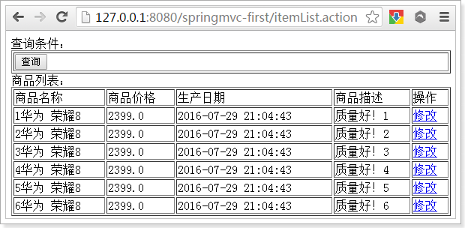


## SpringMVC架构

### 架构结构

框架结构如下图：

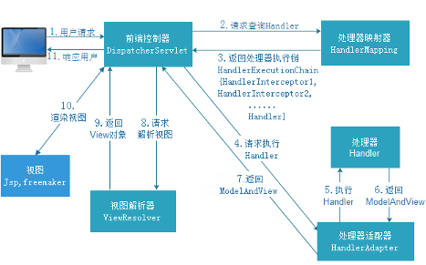


1.	用户发送请求至前端控制器DispatcherServlet
2.	DispatcherServlet收到请求调用HandlerMapping处理器映射器。
3.	处理器映射器根据请求url找到具体的处理器，生成处理器对象及处理器拦截器(如果有则生成)一并返回给DispatcherServlet。
4.	DispatcherServlet通过HandlerAdapter处理器适配器调用处理器
5.	执行处理器(Controller，也叫后端控制器)。
6.	Controller执行完成返回ModelAndView
7.	HandlerAdapter将controller执行结果ModelAndView返回给DispatcherServlet
8.	DispatcherServlet将ModelAndView传给ViewReslover视图解析器
9.	ViewReslover解析后返回具体View
10.	DispatcherServlet对View进行渲染视图（即将模型数据填充至视图中）。
11.	DispatcherServlet响应用户


### 组件说明

以下组件通常使用框架提供实现：
#### DispatcherServlet：前端控制器
用户请求到达前端控制器，它就相当于mvc模式中的c，dispatcherServlet是整个流程控制的中心，由它调用其它组件处理用户的请求，dispatcherServlet的存在降低了组件之间的耦合性。

#### HandlerMapping：处理器映射器
HandlerMapping负责根据用户请求url找到Handler即处理器，springmvc提供了不同的映射器实现不同的映射方式，例如：配置文件方式，实现接口方式，注解方式等。

#### Handler：处理器
Handler 是继DispatcherServlet前端控制器的后端控制器，在DispatcherServlet的控制下Handler对具体的用户请求进行处理。
由于Handler涉及到具体的用户业务请求，所以一般情况需要程序员根据业务需求开发Handler。

#### HandlAdapter：处理器适配器
通过HandlerAdapter对处理器进行执行，这是适配器模式的应用，通过扩展适配器可以对更多类型的处理器进行执行。
下图是许多不同的适配器，最终都可以使用usb接口连接


#### ViewResolver：视图解析器
View Resolver负责将处理结果生成View视图，View Resolver首先根据逻辑视图名解析成物理视图名即具体的页面地址，再生成View视图对象，最后对View进行渲染将处理结果通过页面展示给用户。 
#### View：视图
springmvc框架提供了很多的View视图类型的支持，包括：jstlView、freemarkerView、pdfView等。我们最常用的视图就是jsp。
一般情况下需要通过页面标签或页面模版技术将模型数据通过页面展示给用户，需要由程序员根据业务需求开发具体的页面。

>说明：在springmvc的各个组件中，处理器映射器、处理器适配器、视图解析器称为springmvc的三大组件。
需要用户开发的组件有handler、view

### spring默认加载的组件

我们没有做任何配置，就可以使用这些组件
因为框架已经默认加载这些组件了，配置文件位置如下图：

 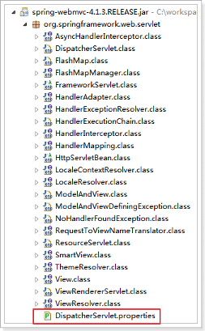

 ```xml
 # Default implementation classes for DispatcherServlet's strategy interfaces.
# Used as fallback when no matching beans are found in the DispatcherServlet context.
# Not meant to be customized by application developers.

org.springframework.web.servlet.LocaleResolver=org.springframework.web.servlet.i18n.AcceptHeaderLocaleResolver

org.springframework.web.servlet.ThemeResolver=org.springframework.web.servlet.theme.FixedThemeResolver

org.springframework.web.servlet.HandlerMapping=org.springframework.web.servlet.handler.BeanNameUrlHandlerMapping,\
	org.springframework.web.servlet.mvc.annotation.DefaultAnnotationHandlerMapping

org.springframework.web.servlet.HandlerAdapter=org.springframework.web.servlet.mvc.HttpRequestHandlerAdapter,\
	org.springframework.web.servlet.mvc.SimpleControllerHandlerAdapter,\
	org.springframework.web.servlet.mvc.annotation.AnnotationMethodHandlerAdapter

org.springframework.web.servlet.HandlerExceptionResolver=org.springframework.web.servlet.mvc.annotation.AnnotationMethodHandlerExceptionResolver,\
	org.springframework.web.servlet.mvc.annotation.ResponseStatusExceptionResolver,\
	org.springframework.web.servlet.mvc.support.DefaultHandlerExceptionResolver

org.springframework.web.servlet.RequestToViewNameTranslator=org.springframework.web.servlet.view.DefaultRequestToViewNameTranslator

org.springframework.web.servlet.ViewResolver=org.springframework.web.servlet.view.InternalResourceViewResolver

org.springframework.web.servlet.FlashMapManager=org.springframework.web.servlet.support.SessionFlashMapManager

 ```

 ### 组件扫描

 使用组件扫描器省去在spring容器配置每个Controller类的繁琐。
使用`<context:component-scan>`自动扫描标记@Controller的控制器类，
在springmvc.xml配置文件中配置如下：
```xml
<!-- 配置controller扫描包，多个包之间用,分隔 -->
<context:component-scan base-package="cn.itcast.springmvc.controller />
```

### 注解映射器和适配器

#### 配置处理器映射器

注解式处理器映射器，对类中标记了@ResquestMapping的方法进行映射。根据@ResquestMapping定义的url匹配@ResquestMapping标记的方法，匹配成功返回HandlerMethod对象给前端控制器。
HandlerMethod对象中封装url对应的方法Method。 

从spring3.1版本开始，废除了DefaultAnnotationHandlerMapping的使用，推荐使用RequestMappingHandlerMapping完成注解式处理器映射。

在springmvc.xml配置文件中配置如下：
```xml
<!-- 配置处理器映射器 -->
<bean
	class="org.springframework.web.servlet.mvc.method.annotation.RequestMappingHandlerMapping" />
```
注解描述：
@RequestMapping：定义请求url到处理器功能方法的映射

#### 配置处理器适配器

注解式处理器适配器，对标记@ResquestMapping的方法进行适配。

从spring3.1版本开始，废除了AnnotationMethodHandlerAdapter的使用，推荐使用RequestMappingHandlerAdapter完成注解式处理器适配。

在springmvc.xml配置文件中配置如下：
```xml
<!-- 配置处理器适配器 -->
<bean
	class="org.springframework.web.servlet.mvc.method.annotation.RequestMappingHandlerAdapter" />
```

#### 注解驱动

直接配置处理器映射器和处理器适配器比较麻烦，可以使用注解驱动来加载。
SpringMVC使用'<mvc:annotation-driven>'自动加载RequestMappingHandlerMapping和RequestMappingHandlerAdapter
可以在springmvc.xml配置文件中使用'<mvc:annotation-driven>'替代注解处理器和适配器的配置。
```xml
<!-- 注解驱动 -->
<mvc:annotation-driven />
```

#### 视图解析器

视图解析器使用SpringMVC框架默认的InternalResourceViewResolver，这个视图解析器支持JSP视图解析
在springmvc.xml配置文件中配置如下：
```xml
	<!-- Example: prefix="/WEB-INF/jsp/", suffix=".jsp", viewname="test" -> 
		"/WEB-INF/jsp/test.jsp" -->
	<!-- 配置视图解析器 -->
	<bean
		class="org.springframework.web.servlet.view.InternalResourceViewResolver">
		<!-- 配置逻辑视图的前缀 -->
		<property name="prefix" value="/WEB-INF/jsp/" />
		<!-- 配置逻辑视图的后缀 -->
		<property name="suffix" value=".jsp" />
	</bean>
```
逻辑视图名需要在controller中返回ModelAndView指定，比如逻辑视图名为ItemList，则最终返回的jsp视图地址:
“WEB-INF/jsp/itemList.jsp”

最终jsp物理地址：前缀+逻辑视图名+后缀

#### 修改ItemController

修改ItemController中设置视图的代码
```java
// @RequestMapping：里面放的是请求的url，和用户请求的url进行匹配
// action可以写也可以不写
@RequestMapping("/itemList.action")
public ModelAndView queryItemList() {
	// 创建页面需要显示的商品数据
	List<Item> list = new ArrayList<>();
	list.add(new Item(1, "1华为 荣耀8", 2399, new Date(), "质量好！1"));
	list.add(new Item(2, "2华为 荣耀8", 2399, new Date(), "质量好！2"));
	list.add(new Item(3, "3华为 荣耀8", 2399, new Date(), "质量好！3"));
	list.add(new Item(4, "4华为 荣耀8", 2399, new Date(), "质量好！4"));
	list.add(new Item(5, "5华为 荣耀8", 2399, new Date(), "质量好！5"));
	list.add(new Item(6, "6华为 荣耀8", 2399, new Date(), "质量好！6"));

	// 创建ModelAndView，用来存放数据和视图
	ModelAndView modelAndView = new ModelAndView();
	// 设置数据到模型中
	modelAndView.addObject("itemList", list);
	// 设置视图jsp，需要设置视图的物理地址
	// modelAndView.setViewName("/WEB-INF/jsp/itemList.jsp");
	// 配置好视图解析器前缀和后缀，这里只需要设置逻辑视图就可以了。
	// 视图解析器根据前缀+逻辑视图名+后缀拼接出来物理路径
	modelAndView.setViewName("itemList");

	return modelAndView;
}
```
#### 效果
效果和之前一样，如下图：


## SpringMVC整合Mybatis

springmvc和spring是无缝整合(没有整合包)，spring和mybatis整合。这样就算三个整合完了。

为了更好的学习 springmvc和mybatis整合开发的方法，需要将springmvc和mybatis进行整合。

整合目标：控制层采用springmvc、持久层使用mybatis实现。

### 创建数据库数据

[sql脚本](heima/spring-mvc/01/note/code/prepare/sql/springmvc.sql)

### 导入整合相关jar包

1.	spring（包括springmvc）
2.	mybatis
3.	mybatis-spring整合包
4.	数据库驱动
5.	第三方连接池。

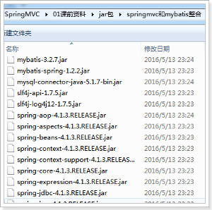

### 整合思路

Dao层：
1、SqlMapConfig.xml，空文件即可，但是需要文件头。
2、applicationContext-dao.xml
a)	数据库连接池
b)	SqlSessionFactory对象，需要spring和mybatis整合包下的。
c)	配置mapper文件扫描器。

Service层：
1、applicationContext-service.xml包扫描器，扫描@service注解的类。
2、applicationContext-trans.xml配置事务。

Controller层：
1、Springmvc.xml
a)	包扫描器，扫描@Controller注解的类。
b)	配置注解驱动
c)	配置视图解析器

Web.xml文件：
1、配置spring
2、配置前端控制器。

### 配置文件

创建资源文件夹config
在其下创建mybatis和spring文件夹，用来存放配置文件，如下图：

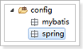

#### sqlMapConfig.xml
使用逆向工程来生成Mapper相关代码，不需要配置别名。
在config/mybatis下创建SqlMapConfig.xml
```xml
<?xml version="1.0" encoding="UTF-8"?>
<!DOCTYPE configuration
PUBLIC "-//mybatis.org//DTD Config 3.0//EN"
"http://mybatis.org/dtd/mybatis-3-config.dtd">
<configuration>

</configuration>
```

#### applicationContext-dao.xml
配置数据源、配置SqlSessionFactory、mapper扫描器。
```xml
<?xml version="1.0" encoding="UTF-8"?>
<beans xmlns="http://www.springframework.org/schema/beans"
	xmlns:context="http://www.springframework.org/schema/context" xmlns:p="http://www.springframework.org/schema/p"
	xmlns:aop="http://www.springframework.org/schema/aop" xmlns:tx="http://www.springframework.org/schema/tx"
	xmlns:xsi="http://www.w3.org/2001/XMLSchema-instance"
	xsi:schemaLocation="http://www.springframework.org/schema/beans http://www.springframework.org/schema/beans/spring-beans-4.0.xsd
	http://www.springframework.org/schema/context http://www.springframework.org/schema/context/spring-context-4.0.xsd
	http://www.springframework.org/schema/aop http://www.springframework.org/schema/aop/spring-aop-4.0.xsd http://www.springframework.org/schema/tx http://www.springframework.org/schema/tx/spring-tx-4.0.xsd
	http://www.springframework.org/schema/util http://www.springframework.org/schema/util/spring-util-4.0.xsd">

	<!-- 加载配置文件 -->
	<context:property-placeholder location="classpath:db.properties" />

	<!-- 数据库连接池 -->
	<bean id="dataSource" class="org.apache.commons.dbcp.BasicDataSource"
		destroy-method="close">
		<property name="driverClassName" value="${jdbc.driver}" />
		<property name="url" value="${jdbc.url}" />
		<property name="username" value="${jdbc.username}" />
		<property name="password" value="${jdbc.password}" />
		<property name="maxActive" value="10" />
		<property name="maxIdle" value="5" />
	</bean>

	<!-- 配置SqlSessionFactory -->
	<bean id="sqlSessionFactory" class="org.mybatis.spring.SqlSessionFactoryBean">
		<!-- 数据库连接池 -->
		<property name="dataSource" ref="dataSource" />
		<!-- 加载mybatis的全局配置文件 -->
		<property name="configLocation" value="classpath:mybatis/SqlMapConfig.xml" />
	</bean>

	<!-- 配置Mapper扫描 -->
	<bean class="org.mybatis.spring.mapper.MapperScannerConfigurer">
		<!-- 配置Mapper扫描包 -->
		<property name="basePackage" value="cn.itcast.ssm.mapper" />
	</bean>

</beans>
```
#### db.properties

配置数据库相关信息
```properties
jdbc.driver=com.mysql.jdbc.Driver
jdbc.url=jdbc:mysql://localhost:3306/springmvc?characterEncoding=utf-8
jdbc.username=root
jdbc.password=root
```
#### applicationContext-service.xml
```xml
<?xml version="1.0" encoding="UTF-8"?>
<beans xmlns="http://www.springframework.org/schema/beans"
	xmlns:context="http://www.springframework.org/schema/context" xmlns:p="http://www.springframework.org/schema/p"
	xmlns:aop="http://www.springframework.org/schema/aop" xmlns:tx="http://www.springframework.org/schema/tx"
	xmlns:xsi="http://www.w3.org/2001/XMLSchema-instance"
	xsi:schemaLocation="http://www.springframework.org/schema/beans http://www.springframework.org/schema/beans/spring-beans-4.0.xsd
	http://www.springframework.org/schema/context http://www.springframework.org/schema/context/spring-context-4.0.xsd
	http://www.springframework.org/schema/aop http://www.springframework.org/schema/aop/spring-aop-4.0.xsd http://www.springframework.org/schema/tx http://www.springframework.org/schema/tx/spring-tx-4.0.xsd
	http://www.springframework.org/schema/util http://www.springframework.org/schema/util/spring-util-4.0.xsd">

	<!-- 配置service扫描 -->
	<context:component-scan base-package="cn.itcast.ssm.service" />

</beans>
```

#### applicationContext-trans.xml
```xml
<?xml version="1.0" encoding="UTF-8"?>
<beans xmlns="http://www.springframework.org/schema/beans"
	xmlns:context="http://www.springframework.org/schema/context" xmlns:p="http://www.springframework.org/schema/p"
	xmlns:aop="http://www.springframework.org/schema/aop" xmlns:tx="http://www.springframework.org/schema/tx"
	xmlns:xsi="http://www.w3.org/2001/XMLSchema-instance"
	xsi:schemaLocation="http://www.springframework.org/schema/beans http://www.springframework.org/schema/beans/spring-beans-4.0.xsd
	http://www.springframework.org/schema/context http://www.springframework.org/schema/context/spring-context-4.0.xsd
	http://www.springframework.org/schema/aop http://www.springframework.org/schema/aop/spring-aop-4.0.xsd http://www.springframework.org/schema/tx http://www.springframework.org/schema/tx/spring-tx-4.0.xsd
	http://www.springframework.org/schema/util http://www.springframework.org/schema/util/spring-util-4.0.xsd">

	<!-- 事务管理器 -->
	<bean id="transactionManager"
		class="org.springframework.jdbc.datasource.DataSourceTransactionManager">
		<!-- 数据源 -->
		<property name="dataSource" ref="dataSource" />
	</bean>

	<!-- 通知 -->
	<tx:advice id="txAdvice" transaction-manager="transactionManager">
		<tx:attributes>
			<!-- 传播行为 -->
			<tx:method name="save*" propagation="REQUIRED" />
			<tx:method name="insert*" propagation="REQUIRED" />
			<tx:method name="delete*" propagation="REQUIRED" />
			<tx:method name="update*" propagation="REQUIRED" />
			<tx:method name="find*" propagation="SUPPORTS" read-only="true" />
			<tx:method name="get*" propagation="SUPPORTS" read-only="true" />
			<tx:method name="query*" propagation="SUPPORTS" read-only="true" />
		</tx:attributes>
	</tx:advice>

	<!-- 切面 -->
	<aop:config>
		<aop:advisor advice-ref="txAdvice"
			pointcut="execution(* cn.itcast.ssm.service.*.*(..))" />
	</aop:config>

</beans>
```

#### springmvc.xml

```xml
<?xml version="1.0" encoding="UTF-8"?>
<beans xmlns="http://www.springframework.org/schema/beans"
	xmlns:xsi="http://www.w3.org/2001/XMLSchema-instance" xmlns:p="http://www.springframework.org/schema/p"
	xmlns:context="http://www.springframework.org/schema/context"
	xmlns:mvc="http://www.springframework.org/schema/mvc"
	xsi:schemaLocation="http://www.springframework.org/schema/beans http://www.springframework.org/schema/beans/spring-beans-4.0.xsd
        http://www.springframework.org/schema/mvc http://www.springframework.org/schema/mvc/spring-mvc-4.0.xsd
        http://www.springframework.org/schema/context http://www.springframework.org/schema/context/spring-context-4.0.xsd">

	<!-- 配置controller扫描包 -->
	<context:component-scan base-package="cn.itcast.ssm.controller" />

	<!-- 注解驱动 -->
	<mvc:annotation-driven />

	<!-- Example: prefix="/WEB-INF/jsp/", suffix=".jsp", viewname="test" -> 
		"/WEB-INF/jsp/test.jsp" -->
	<!-- 配置视图解析器 -->
	<bean
	class="org.springframework.web.servlet.view.InternalResourceViewResolver">
		<!-- 配置逻辑视图的前缀 -->
		<property name="prefix" value="/WEB-INF/jsp/" />
		<!-- 配置逻辑视图的后缀 -->
		<property name="suffix" value=".jsp" />
	</bean>

</beans>
```
#### web.xml
```xml
<?xml version="1.0" encoding="UTF-8"?>
<web-app xmlns:xsi="http://www.w3.org/2001/XMLSchema-instance"
	xmlns="http://java.sun.com/xml/ns/javaee"
	xsi:schemaLocation="http://java.sun.com/xml/ns/javaee http://java.sun.com/xml/ns/javaee/web-app_2_5.xsd"
	id="WebApp_ID" version="2.5">
	<display-name>springmvc-web</display-name>
	<welcome-file-list>
		<welcome-file>index.html</welcome-file>
		<welcome-file>index.htm</welcome-file>
		<welcome-file>index.jsp</welcome-file>
		<welcome-file>default.html</welcome-file>
		<welcome-file>default.htm</welcome-file>
		<welcome-file>default.jsp</welcome-file>
	</welcome-file-list>

	<!-- 配置spring -->
	<context-param>
		<param-name>contextConfigLocation</param-name>
		<param-value>classpath:spring/applicationContext*.xml</param-value>
	</context-param>

	<!-- 使用监听器加载Spring配置文件 -->
	<listener>
		<listener-class>org.springframework.web.context.ContextLoaderListener</listener-class>
	</listener>

	<!-- 配置SrpingMVC的前端控制器 -->
	<servlet>
		<servlet-name>springmvc-web</servlet-name>
		<servlet-class>org.springframework.web.servlet.DispatcherServlet</servlet-class>
		<init-param>
			<param-name>contextConfigLocation</param-name>
			<param-value>classpath:spring/springmvc.xml</param-value>
		</init-param>
	</servlet>

	<servlet-mapping>
		<servlet-name>springmvc-web</servlet-name>
		<!-- 配置所有以action结尾的请求进入SpringMVC -->
		<url-pattern>*.action</url-pattern>
	</servlet-mapping>

</web-app>
```

#### itemList.jsp和itemEdit.jsp到工程中

[itemList.jsp](heima/spring-mvc/01/note/code/prepare/jsp/itemList.jsp)

[itemEdit.jsp](heima/spring-mvc/01/note/code/prepare/jsp/editItem.jsp)

#### 配置完效果如下图：

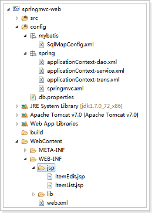

### 实现商品列表显示

实现商品查询列表，从mysql数据库查询商品信息。

#### 使用逆向工程，生成代码

注意修改逆向工程的配置文件，参考MyBatis第二天
逆向工程生成代码如下图：

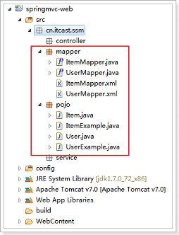

#### 配置service和controller相关代码

##### ItemService接口
```java
public interface ItemService {

	/**
	 * 查询商品列表
	 * 
	 * @return
	 */
	List<Item> queryItemList();

}
```

##### ItemServiceImpl实现类
```java
@Service
public class ItemServiceImpl implements ItemService {

	@Autowired
	private ItemMapper itemMapper;

	@Override
	public List<Item> queryItemList() {
		// 从数据库查询商品数据
		List<Item> list = this.itemMapper.selectByExample(null);

		return list;
	}

}
```

##### ItemController
```java
@Controller
public class ItemController {

	@Autowired
	private ItemService itemService;

	/**
	 * 显示商品列表
	 * 
	 * @return
	 */
	@RequestMapping("/itemList")
	public ModelAndView queryItemList() {
		// 获取商品数据
		List<Item> list = this.itemService.queryItemList();

		ModelAndView modelAndView = new ModelAndView();
		// 把商品数据放到模型中
		modelAndView.addObject("itemList", list);
		// 设置逻辑视图
		modelAndView.setViewName("itemList");

		return modelAndView;
	}

}
```

### 测试
访问url：
http://127.0.0.1:8080/springmvc-web/itemList.action

效果如下图：

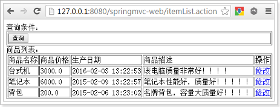
 
## 参数绑定


### 需求
打开商品编辑页面，展示商品信息。

### 需求分析

编辑商品信息，首先要显示商品详情
需要根据商品id查询商品信息，然后展示到页面。
请求的url：/itemEdit.action
参数：id（商品id）
响应结果：商品编辑页面，展示商品详细信息。


### 编写service代码

#### ItemService接口

```java
/*
* 根据商品id查询商品
* @param id
* @return 
*/

Item queryItemByID(int id);

```
#### ItemServiceImpl实现类

```java
@Override
public Item queryItemById(int id) {
	Item item = this.itemMapper.selectByPrimaryKey(id);
	
	return item;
}

```

#### ItemController

页面点击修改按钮，发起请求
http://127.0.0.1:8080/springmvc-web/itemEdit.action?id=1

需要从请求的参数中把请求的id取出来。
Id包含在Request对象中。可以从Request对象中取id。

想获得Request对象只需要在Controller方法的形参中添加一个参数即可。Springmvc框架会自动把Request对象传递给方法。

##### springmvc 默认支持的类型

处理器形参中添加如下类型的参数处理适配器会默认识别并进行赋值。
###### HttpServletRequest
通过request对象获取请求信息
###### HttpServletResponse
通过response处理响应信息
###### HttpSession
通过session对象得到session中存放的对象

#### Controller的返回类值

##### ModelAndView返回数据

```java
/**
 * 根据id查询商品
 * 
 * @param request
 * @return
 */
@RequestMapping("/itemEdit")
public ModelAndView queryItemById(HttpServletRequest request) {
	// 从request中获取请求参数
	String strId = request.getParameter("id");
	Integer id = Integer.valueOf(strId);

	// 根据id查询商品数据
	Item item = this.itemService.queryItemById(id);

	// 把结果传递给页面
	ModelAndView modelAndView = new ModelAndView();
	// 把商品数据放在模型中
	modelAndView.addObject("item", item);
	// 设置逻辑视图
	modelAndView.setViewName("itemEdit");

	return modelAndView;
}


```


##### Model/ModelMap返回数据

除了ModelAndView以外，还可以使用Model来向页面传递数据，
Model是一个接口，在参数里直接声明model即可。

如果使用Model则可以不使用ModelAndView对象，Model对象可以向页面传递数据，View对象则可以使用String返回值替代。
不管是Model还是ModelAndView，其本质都是使用Request对象向jsp传递数据。
代码实现：

 Model返回数据
 
```java
/**
 * 根据id查询商品,使用Model
 * 
 * @param request
 * @param model
 * @return
 */
@RequestMapping("/itemEdit")
public String queryItemById(HttpServletRequest request, Model model) {
	// 从request中获取请求参数
	String strId = request.getParameter("id");
	Integer id = Integer.valueOf(strId);

	// 根据id查询商品数据
	Item item = this.itemService.queryItemById(id);

	// 把结果传递给页面
	// ModelAndView modelAndView = new ModelAndView();
	// 把商品数据放在模型中
	// modelAndView.addObject("item", item);
	// 设置逻辑视图
	// modelAndView.setViewName("itemEdit");

	// 把商品数据放在模型中
	model.addAttribute("item", item);

	return "itemEdit";
}

```
ModelMap返回数据

ModelMap是Model接口的实现类，也可以通过ModelMap向页面传递数据

使用Model和ModelMap的效果一样，如果直接使用Model，springmvc会实例化ModelMap。

代码实现：
```java
/**
 * 根据id查询商品,使用ModelMap
 * 
 * @param request
 * @param model
 * @return
 */
@RequestMapping("/itemEdit")
public String queryItemById(HttpServletRequest request, ModelMap model) {
	// 从request中获取请求参数
	String strId = request.getParameter("id");
	Integer id = Integer.valueOf(strId);

	// 根据id查询商品数据
	Item item = this.itemService.queryItemById(id);

	// 把结果传递给页面
	// ModelAndView modelAndView = new ModelAndView();
	// 把商品数据放在模型中
	// modelAndView.addObject("item", item);
	// 设置逻辑视图
	// modelAndView.setViewName("itemEdit");

	// 把商品数据放在模型中
	model.addAttribute("item", item);

	return "itemEdit";
```

### 请求参数类型获取

#### 获取简单数据类型

当请求的参数名称和处理器形参名称一致时会将请求参数与形参进行绑定。
这样，从Request取参数的方法就可以进一步简化。
```java
/**
 * 根据id查询商品,绑定简单数据类型
 * 
 * @param id
 * @param model
 * @return
 */
@RequestMapping("/itemEdit")
public String queryItemById(int id, ModelMap model) {
	// 根据id查询商品数据
	Item item = this.itemService.queryItemById(id);

	// 把商品数据放在模型中
	model.addAttribute("item", item);

	return "itemEdit";
}
```

#### 支持的数据类型
参数类型推荐使用包装数据类型，因为基础数据类型不可以为null
整形：Integer、int
字符串：String
单精度：Float、float
双精度：Double、double
布尔型：Boolean、boolean
说明：对于布尔类型的参数，请求的参数值为true或false。或者1或0
请求url：
http://localhost:8080/xxx.action?id=2&status=false

处理器方法：
public String editItem(Model model,Integer id,Boolean status) 


#### @RequestParam
使用@RequestParam常用于处理简单类型的绑定。

value：参数名字，即入参的请求参数名字，如value=“itemId”表示请求的参数	   区中的名字为itemId的参数的值将传入

required：是否必须，默认是true，表示请求中一定要有相应的参数，否则将报错
TTP Status 400 - Required Integer parameter 'XXXX' is not present

defaultValue：默认值，表示如果请求中没有同名参数时的默认值

定义如下：
```java
@RequestMapping("/itemEdit")
public String queryItemById(@RequestParam(value = "itemId", required = true, defaultValue = "1") Integer id,
		ModelMap modelMap) {
	// 根据id查询商品数据
	Item item = this.itemService.queryItemById(id);

	// 把商品数据放在模型中
	modelMap.addAttribute("item", item);

	return "itemEdit";
}
```

### pojo类型

#### 将页面修改后的商品信息保存到数据库中。

请求的url：/updateItem.action
参数：表单中的数据。
响应内容：更新成功页面

##### 使用pojo接收表单数据

如果提交的参数很多，或者提交的表单中的内容很多的时候,可以使用简单类型接受数据,也可以使用pojo接收数据。
要求：pojo对象中的属性名和表单中input的name属性一致。

页面定义如下图：
 
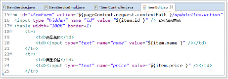

Pojo(逆向工程生成)如下图：

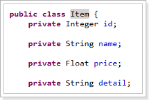

##### ItemService接口

```java
/**
 * 根据id更新商品
 * 
 * @param item
 */
void updateItemById(Item item);

```

##### ItemServiceImpl实现类

ItemServiceImpl里实现接口方法
使用updateByPrimaryKeySelective(item)方法，忽略空参数

```java
@Override
public void updateItemById(Item item) {
	this.itemMapper.updateByPrimaryKeySelective(item);
}
```

##### ItemController

```java
/**
 * 更新商品,绑定pojo类型
 * 
 * @param item
 * @param model
 * @return
 */
@RequestMapping("/updateItem")
public String updateItem(Item item) {
	// 调用服务更新商品
	this.itemService.updateItemById(item);

	// 返回逻辑视图
	return "success";
}

```

>注意：
提交的表单中不要有日期类型的数据，否则会报400错误。如果想提交日期类型的数据需要用到后面的自定义参数绑定的内容。

##### 编写success页面
如下图创建success.jsp页面

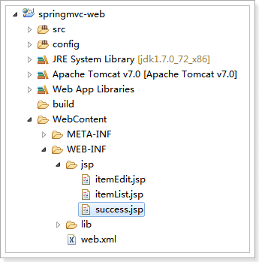 

页面代码：
```html
<%@ page language="java" contentType="text/html; charset=UTF-8"
    pageEncoding="UTF-8"%>
<!DOCTYPE html PUBLIC "-//W3C//DTD HTML 4.01 Transitional//EN" "http://www.w3.org/TR/html4/loose.dtd">
<html>
<head>
<meta http-equiv="Content-Type" content="text/html; charset=UTF-8">
<title>Insert title here</title>
</head>
<body>

<h1>商品修改成功！</h1>

</body>
</html>

```

##### 6.3.8. 解决post乱码问题

提交发现，保存成功，但是保存的是乱码
在web.xml中加入：
```xml
	<!-- 解决post乱码问题 -->
	<filter>
		<filter-name>encoding</filter-name>
		<filter-class>org.springframework.web.filter.CharacterEncodingFilter</filter-class>
		<!-- 设置编码参是UTF8 -->
		<init-param>
			<param-name>encoding</param-name>
			<param-value>UTF-8</param-value>
		</init-param>
	</filter>
	<filter-mapping>
		<filter-name>encoding</filter-name>
		<url-pattern>/*</url-pattern>
	</filter-mapping>
```
以上可以解决post请求乱码问题。

对于get请求中文参数出现乱码解决方法有两个：
修改tomcat配置文件添加编码与工程编码一致，如下：
```xml
<Connector URIEncoding="utf-8" connectionTimeout="20000" port="8080" protocol="HTTP/1.1" redirectPort="8443"/>
```
另外一种方法对参数进行重新编码：
```javaScript
String userName new 
String(request.getParamter("userName").getBytes("ISO8859-1"),"utf-8")
```
ISO8859-1是tomcat默认编码，需要将tomcat编码后的内容按utf-8编码


### pojo包装参数类型

#### 使用包装的pojo接收商品信息的查询条件。
包装对象定义如下：
```java
public class QueryVo {
	private Item item;
set/get。。。
}
```

页面定义如下图：

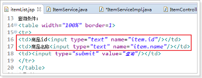

##### 接收查询条件

```java
	// 绑定包装数据类型
	@RequestMapping("/queryItem")
	public String queryItem(QueryVo queryVo) {
		System.out.println(queryVo.getItem().getId());
		System.out.println(queryVo.getItem().getName());

		return "success";
	}

```

### 自定义参数类型

#### 需求在商品修改页面可以修改商品的生产日期，并且根据业务需求自定义日期格式。

由于日期数据有很多种格式，springmvc没办法把字符串转换成日期类型。所以需要自定义参数绑定。

前端控制器接收到请求后，找到注解形式的处理器适配器，对RequestMapping标记的方法进行适配，并对方法中的形参进行参数绑定。可以在springmvc处理器适配器上自定义转换器Converter进行参数绑定。

一般使用`<mvc:annotation-driven/>`注解驱动加载处理器适配器，可以在此标签上进行配置。

#### 修改itemEdit.jsp
如下图修改itemEdit.jsp页面，显示时间

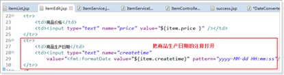

#### 自定义Converter

```java
//Converter<S, T>
//S:source,需要转换的源的类型
//T:target,需要转换的目标类型
public class DateConverter implements Converter<String, Date> {

	@Override
	public Date convert(String source) {
		try {
			// 把字符串转换为日期类型
			SimpleDateFormat simpleDateFormat = new SimpleDateFormat("yyyy-MM-dd HH:mm:ss");
			Date date = simpleDateFormat.parse(source);

			return date;
		} catch (ParseException e) {
			// TODO Auto-generated catch block
			e.printStackTrace();
		}
		// 如果转换异常则返回空
		return null;
	}
}

```

#### 配置Converter

我们同时可以配置多个的转换器。
类似下图的usb设备，可以接入多个usb设备
 


```xml
<!-- 配置注解驱动 -->
<!-- 如果配置此标签,可以不用配置... -->
<mvc:annotation-driven conversion-service="conversionService" />

<!-- 转换器配置 -->
<bean id="conversionService" class="org.springframework.format.support.FormattingConversionServiceFactoryBean">
	<property name="converters">
		<set>
			<bean class="cn.itcast.springmvc.converter.DateConverter" />
		</set>
	</property>
</bean>
```

#### 配置方式2（了解）

```xml
<!--注解适配器 -->
<bean class="org.springframework.web.servlet.mvc.method.annotation.RequestMappingHandlerAdapter">
	<property name="webBindingInitializer" ref="customBinder"></property>
</bean>

<!-- 自定义webBinder -->
<bean id="customBinder" class="org.springframework.web.bind.support.ConfigurableWebBindingInitializer">
	<property name="conversionService" ref="conversionService" />
</bean>

<!-- 转换器配置 -->
<bean id="conversionService" class="org.springframework.format.support.FormattingConversionServiceFactoryBean">
	<property name="converters">
		<set>
			<bean class="cn.itcast.springmvc.convert.DateConverter" />
		</set>
	</property>
</bean>
```

>注意：此方法需要独立配置处理器映射器、适配器，
不再使用`<mvc:annotation-driven/>`


## SpringMVC和Struts2的区别

1.	springmvc的入口是一个servlet即前端控制器，而struts2入口是一个filter过滤器。
2.	springmvc是基于方法开发(一个url对应一个方法)，请求参数传递到方法的形参，可以设计为单例或多例(建议单例)，struts2是基于类开发，传递参数是通过类的属性，只能设计为多例。
3.	Struts采用值栈存储请求和响应的数据，通过OGNL存取数据， springmvc通过参数解析器是将request请求内容解析，并给方法形参赋值，将数据和视图封装成ModelAndView对象，最后又将ModelAndView中的模型数据通过request域传输到页面。Jsp视图解析器默认使用jstl。


## 高级参数绑定

### 绑定数组(选中多个商品，然后删除。)

需求：在商品列表页面选中多个商品，然后删除。

功能要求商品列表页面中的每个商品前有一个checkbok，选中多个商品后点击删除按钮把商品id传递给Controller，根据商品id删除商品信息。

我们演示可以获取id的数组即可

#### Jsp修改

修改itemList.jsp页面,增加多选框，提交url是queryItem.action

页面选中多个checkbox向controller方法传递
本身属于一个form表单，提交url是queryItem.action


```jsp

<form action="${pageContext.request.contextPath }/queryItem.action" method="post">
查询条件：
<table width="100%" border=1>
<tr>
<td>商品id<input type="text" name="item.id" /></td>
<td>商品名称<input type="text" name="item.name" /></td>
<td><input type="submit" value="查询"/></td>
</tr>
</table>
商品列表：
<table width="100%" border=1>
<tr>
	<td>选择</td>
	<td>商品名称</td>
	<td>商品价格</td>
	<td>生产日期</td>
	<td>商品描述</td>
	<td>操作</td>
</tr>
<c:forEach items="${itemList }" var="item">
<tr>
	<td><input type="checkbox" name="ids" value="${item.id}"/></td>
	<td>${item.name }</td>
	<td>${item.price }</td>
	<td><fmt:formatDate value="${item.createtime}" pattern="yyyy-MM-dd HH:mm:ss"/></td>
	<td>${item.detail }</td>
	
	<td><a href="${pageContext.request.contextPath }/itemEdit.action?id=${item.id}">修改</a></td>

</tr>
</c:forEach>

</table>
</form>

```

#### Controller

Controller方法中可以用String[]接收，或者pojo的String[]属性接收。两种方式任选其一即可。

定义QueryVo，如下图：

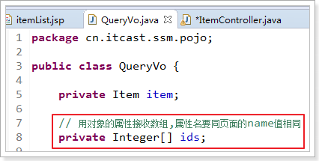

ItemController修改queryItem方法：

```java
/**
 * 包装类型 绑定数组类型，可以使用两种方式，pojo的属性接收，和直接接收
 * 
 * @param queryVo
 * @return
 */
@RequestMapping("queryItem")
public String queryItem(QueryVo queryVo, Integer[] ids) {

	System.out.println(queryVo.getItem().getId());
	System.out.println(queryVo.getItem().getName());

	System.out.println(queryVo.getIds().length);
	System.out.println(ids.length);

	return "success";
}

```

#### 测试效果

效果，如下图：

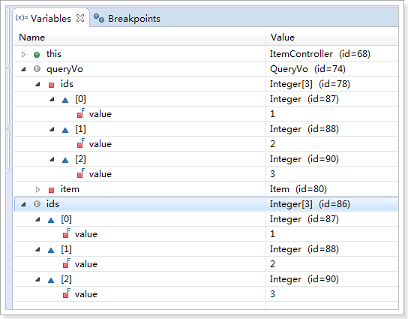

### 将表单的数据绑定到List

需求：实现商品数据的批量修改。

开发分析
1. 在商品列表页面中可以对商品信息进行修改。
2. 可以批量提交修改后的商品数据。

#### 定义包装pojo

List中存放对象，并将定义的List放在包装类QueryVo中

使用包装pojo对象接收，如下图：

#### Jsp改造

前端页面应该显示的html代码，如下图：


分析发现：name属性必须是list属性名+下标+元素属性。
Jsp做如下改造：

```html
<c:forEach items="${itemList }" var="item" varStatus="s">
<tr>
	<td><input type="checkbox" name="ids" value="${item.id}"/></td>
	<td>
		<input type="hidden" name="itemList[${s.index}].id" value="${item.id }"/>
		<input type="text" name="itemList[${s.index}].name" value="${item.name }"/>
	</td>
	<td><input type="text" name="itemList[${s.index}].price" value="${item.price }"/></td>
	<td><input type="text" name="itemList[${s.index}].createtime" value="<fmt:formatDate value="${item.createtime}" pattern="yyyy-MM-dd HH:mm:ss"/>"/></td>
	<td><input type="text" name="itemList[${s.index}].detail" value="${item.detail }"/></td>
	
	<td><a href="${pageContext.request.contextPath }/itemEdit.action?id=${item.id}">修改</a></td>

</tr>
</c:forEach>

```

* `${current}`	当前这次迭代的（集合中的）项
* `${status.first}`	判断当前项是否为集合中的第一项，返回值为true或false
* `${status.last}`	判断当前项是否为集合中的最
varStatus属性常用参数总结下：
* `${status.index}`	输出行号，从0开始。
* `${status.count}`	输出行号，从1开始。
* `${status.后一项}`，返回值为true或false
begin、end、step分别表示：起始序号，结束序号，跳跃步伐。


#### 测试

这里只演示List的绑定，能够接收到list数据。
可以拿到数据即可，不做数据库的操作。

测试效果如下图：

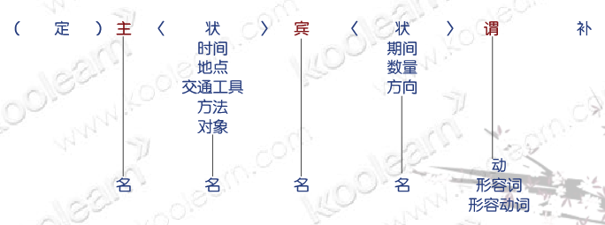

注意：接收List类型的数据必须是pojo的属性，如果方法的形参为ArrayList类型无法正确接收到数据。


## @RequestMapping注解使用

通过@RequestMapping注解可以定义不同的处理器映射规则。

### 4.1. URL路径映射

@RequestMapping(value="item")或@RequestMapping("/item"）
value的值是数组，可以将多个url映射到同一个方法

```java
/**
 * 查询商品列表
 * @return
 */
@RequestMapping(value = { "itemList", "itemListAll" })
public ModelAndView queryItemList() {
	// 查询商品数据
	List<Item> list = this.itemService.queryItemList();

	// 创建ModelAndView,设置逻辑视图名
	ModelAndView mv = new ModelAndView("itemList");

	// 把商品数据放到模型中
	mv.addObject("itemList", list);
	return mv;
}

```

### 添加在类上面(约束一个类接收的url格式)

在class上添加@RequestMapping(url)指定通用请求前缀， 限制此类下的所有方法请求url必须以请求前缀开头

可以使用此方法对url进行分类管理，如下图：


此时需要进入queryItemList()方法的请求url为：
http://127.0.0.1:8080/springmvc-web2/item/itemList.action
或者
http://127.0.0.1:8080/springmvc-web2/item/itemListAll.action

注意：学员练习此项后，把类上的@RequestMapping注释掉，如下：
//@RequestMapping("item")
public class ItemController {
以方便后面的练习

### 请求方法限定

除了可以对url进行设置，还可以限定请求进来的方法
* 限定GET方法
@RequestMapping(method = RequestMethod.GET)

如果通过POST访问则报错：
HTTP Status 405 - Request method 'POST' not supported

例如：
@RequestMapping(value = "itemList",method = RequestMethod.POST)

* 限定POST方法
@RequestMapping(method = RequestMethod.POST)

如果通过GET访问则报错：
HTTP Status 405 - Request method 'GET' not supported

* GET和POST都可以
@RequestMapping(method = {RequestMethod.GET,RequestMethod.POST})


## controller返回值

### 返回ModelAndView
controller方法中定义ModelAndView对象并返回，对象中可添加model数据、指定view。

参考第一天的内容

### 返回void

在Controller方法形参上可以定义request和response，使用request或response指定响应结果：

#### 使用request转发页面

```java
request.getRequestDispatcher("页面路径").forward(request, response);
request.getRequestDispatcher("/WEB-INF/jsp/success.jsp").forward(request, response);
```
#### 可以通过response页面重定向
```java
response.sendRedirect("url")
response.sendRedirect("/springmvc-web2/itemEdit.action");
```
#### 可以通过response指定响应结果，例如响应json数据如下：
```java
response.getWriter().print("{\"abc\":123}");
```

#### 代码演示
以下代码一次测试，演示上面的效果
```java
/**
 * 返回void测试
 * 
 * @param request
 * @param response
 * @throws Exception
 */
@RequestMapping("queryItem")
public void queryItem(HttpServletRequest request, HttpServletResponse response) throws Exception {
	// 1 使用request进行转发
	// request.getRequestDispatcher("/WEB-INF/jsp/success.jsp").forward(request,
	// response);

	// 2 使用response进行重定向到编辑页面
	// response.sendRedirect("/springmvc-web2/itemEdit.action");

	// 3 使用response直接显示
	response.getWriter().print("{\"abc\":123}");
}
```
### 返回字符串

#### 逻辑视图名
controller方法返回字符串可以指定逻辑视图名，通过视图解析器解析为物理视图地址。
```java
//指定逻辑视图名，经过视图解析器解析为jsp物理路径：/WEB-INF/jsp/itemList.jsp
return "itemList";
```
参考第一天内容

#### Redirect重定向

Contrller方法返回字符串可以重定向到一个url地址
如下商品修改提交后重定向到商品编辑页面。

```java
/**
 * 更新商品
 * 
 * @param item
 * @return
 */
@RequestMapping("updateItem")
public String updateItemById(Item item) {
	// 更新商品
	this.itemService.updateItemById(item);

	// 修改商品成功后，重定向到商品编辑页面
	// 重定向后浏览器地址栏变更为重定向的地址，
	// 重定向相当于执行了新的request和response，所以之前的请求参数都会丢失
	// 如果要指定请求参数，需要在重定向的url后面添加 ?itemId=1 这样的请求参数
	return "redirect:/itemEdit.action?itemId=" + item.getId();
}
```

#### forward转发
Controller方法执行后继续执行另一个Controller方法
如下商品修改提交后转向到商品修改页面，修改商品的id参数可以带到商品修改方法中。

```java
/**
 * 更新商品
 * 
 * @param item
 * @return
 */
@RequestMapping("updateItem")
public String updateItemById(Item item) {
	// 更新商品
	this.itemService.updateItemById(item);

	// 修改商品成功后，重定向到商品编辑页面
	// 重定向后浏览器地址栏变更为重定向的地址，
	// 重定向相当于执行了新的request和response，所以之前的请求参数都会丢失
	// 如果要指定请求参数，需要在重定向的url后面添加 ?itemId=1 这样的请求参数
	// return "redirect:/itemEdit.action?itemId=" + item.getId();

	// 修改商品成功后，继续执行另一个方法
	// 使用转发的方式实现。转发后浏览器地址栏还是原来的请求地址，
	// 转发并没有执行新的request和response，所以之前的请求参数都存在
	return "forward:/itemEdit.action";

}
//结果转发到editItem.action，request可以带过去
return "forward: /itemEdit.action";
```

需要修改之前编写的根据id查询商品方法
因为请求进行修改商品时，请求参数里面只有id属性，没有itemId属性
修改，如下图：：

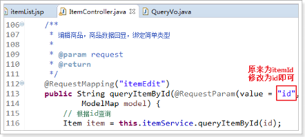

## 异常处理器

springmvc在处理请求过程中出现异常信息交由异常处理器进行处理，自定义异常处理器可以实现一个系统的异常处理逻辑。

### 异常处理思路

系统中异常包括两类：预期异常和运行时异常RuntimeException，前者通过捕获异常从而获取异常信息，后者主要通过规范代码开发、测试通过手段减少运行时异常的发生。

系统的dao、service、controller出现都通过throws Exception向上抛出，最后由springmvc前端控制器交由异常处理器进行异常处理，如下图：

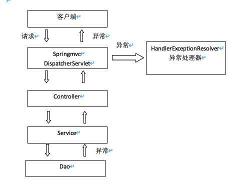

#### 自定义异常类

为了区别不同的异常,通常根据异常类型进行区分，这里我们创建一个自定义系统异常。

如果controller、service、dao抛出此类异常说明是系统预期处理的异常信息。

```java

public class MyException extends Exception {
	// 异常信息
	private String message;

	public MyException() {
		super();
	}

	public MyException(String message) {
		super();
		this.message = message;
	}

	public String getMessage() {
		return message;
	}

	public void setMessage(String message) {
		this.message = message;
	}

}

```

#### 自定义异常处理器

```java
public class CustomHandleException implements HandlerExceptionResolver {

	@Override
	public ModelAndView resolveException(HttpServletRequest request, HttpServletResponse response, Object handler,
			Exception exception) {
		// 定义异常信息
		String msg;

		// 判断异常类型
		if (exception instanceof MyException) {
			// 如果是自定义异常，读取异常信息
			msg = exception.getMessage();
		} else {
			// 如果是运行时异常，则取错误堆栈，从堆栈中获取异常信息
			Writer out = new StringWriter();
			PrintWriter s = new PrintWriter(out);
			exception.printStackTrace(s);
			msg = out.toString();

		}

		// 把错误信息发给相关人员,邮件,短信等方式
		// TODO

		// 返回错误页面，给用户友好页面显示错误信息
		ModelAndView modelAndView = new ModelAndView();
		modelAndView.addObject("msg", msg);
		modelAndView.setViewName("error");

		return modelAndView;
	}
}

```

#### 异常处理器配置

在springmvc.xml中添加：
```xml
<!-- 配置全局异常处理器 -->
<bean 
id="customHandleException" 	class="cn.itcast.ssm.exception.CustomHandleException"/>

```

#### 错误页面

```html
<%@ page language="java" contentType="text/html; charset=UTF-8"
	pageEncoding="UTF-8"%>
<!DOCTYPE html PUBLIC "-//W3C//DTD HTML 4.01 Transitional//EN" "http://www.w3.org/TR/html4/loose.dtd">
<html>
<head>
<meta http-equiv="Content-Type" content="text/html; charset=UTF-8">
<title>Insert title here</title>
</head>
<body>

	<h1>系统发生异常了！</h1>
	<br />
	<h1>异常信息</h1>
	<br />
	<h2>${msg }</h2>

</body>
</html>

```

#### 异常测试

修改ItemController方法“queryItemList”，抛出异常：

```java
/**
 * 查询商品列表
 * 
 * @return
 * @throws Exception
 */
@RequestMapping(value = { "itemList", "itemListAll" })
public ModelAndView queryItemList() throws Exception {
	// 自定义异常
	if (true) {
		throw new MyException("自定义异常出现了~");
	}

	// 运行时异常
	int a = 1 / 0;

	// 查询商品数据
	List<Item> list = this.itemService.queryItemList();
	// 创建ModelAndView,设置逻辑视图名
	ModelAndView mv = new ModelAndView("itemList");
	// 把商品数据放到模型中
	mv.addObject("itemList", list);

	return mv;
}

```

## 图片上传处理

### 配置虚拟目录 

在tomcat上配置图片虚拟目录，在tomcat下conf/server.xml中添加：
`<Context docBase="D:\develop\upload\temp" path="/pic" reloadable="false"/>`
访问http://localhost:8080/pic即可访问D:\develop\upload\temp下的图片。
也可以通过eclipse配置，如下图：

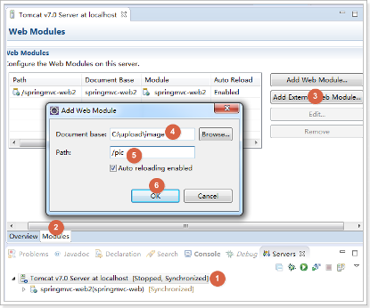


复制一张图片到存放图片的文件夹，使用浏览器访问
测试效果，如下图：

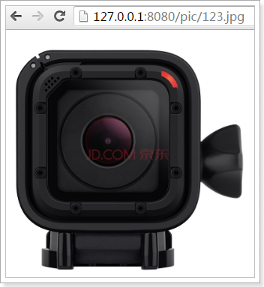

### 加入文件上传jar包
实现图片上传需要加入的jar包，如下图：

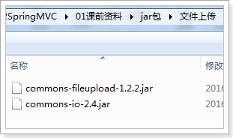

把两个jar包放到工程的lib文件夹中

### 配置上传解析器

在springmvc.xml中配置文件上传解析器

```xml

<!-- 文件上传,id必须设置为multipartResolver -->
<bean id="multipartResolver"
	class="org.springframework.web.multipart.commons.CommonsMultipartResolver">
	<!-- 设置文件上传大小 -->
	<property name="maxUploadSize" value="5000000" />
</bean>

```

### jsp页面修改

在商品修改页面，打开图片上传功能，如下图：


设置表单可以进行文件上传，如下图：

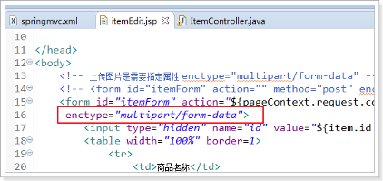

### 图片上传

在更新商品方法中添加图片上传逻辑
```java
/**
 * 更新商品
 * 
 * @param item
 * @return
 * @throws Exception
 */
@RequestMapping("updateItem")
public String updateItemById(Item item, MultipartFile pictureFile) throws Exception {
	// 图片上传
	// 设置图片名称，不能重复，可以使用uuid
	String picName = UUID.randomUUID().toString();

	// 获取文件名
	String oriName = pictureFile.getOriginalFilename();
	// 获取图片后缀
	String extName = oriName.substring(oriName.lastIndexOf("."));

	// 开始上传
	pictureFile.transferTo(new File("C:/upload/image/" + picName + extName));

	// 设置图片名到商品中
	item.setPic(picName + extName);
	// ---------------------------------------------
	// 更新商品
	this.itemService.updateItemById(item);

	return "forward:/itemEdit.action";
}
```

效果，如下图：


## json数据交互

### @RequestBody

作用：
@RequestBody注解用于读取http请求的内容(字符串)，通过springmvc提供的HttpMessageConverter接口将读到的内容（json数据）转换为java对象并绑定到Controller方法的参数上。

传统的请求参数：
itemEdit.action?id=1&name=zhangsan&age=12
现在的请求参数：
使用POST请求，在请求体里面加入json数据
```json
{
"id": 1,
"name": "测试商品",
"price": 99.9,
"detail": "测试商品描述",
"pic": "123456.jpg"
}
```

本例子应用：

@RequestBody注解实现接收http请求的json数据，将json数据转换为java对象进行绑定

### @ResponseBody

作用：
@ResponseBody注解用于将Controller的方法返回的对象，通过springmvc提供的HttpMessageConverter接口转换为指定格式的数据如：json,xml等，通过Response响应给客户端

本例子应用：
@ResponseBody注解实现将Controller方法返回java对象转换为json响应给客户端。

### 请求json，响应json实现：

#### 加入支持json的jar包
如果需要springMVC支持json，必须加入json的处理jar
我们使用Jackson这个jar，如下图：

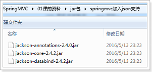

#### ItemController编写
```java
/**
 * 测试json的交互
 * @param item
 * @return
 */
@RequestMapping("testJson")
// @ResponseBody
public @ResponseBody Item testJson(@RequestBody Item item) {
	return item;
}
```

#### 安装谷歌浏览器测试工具
安装程序在课后资料
参考安装文档，如下图：

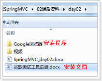

8.3.4. 测试方法
测试方法，如下图：
 
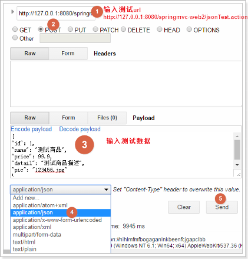

#### 测试结果
如下图：


#### 配置json转换器

如果不使用注解驱动`<mvc:annotation-driven />，`就需要给处理器适配器配置json转换器，参考之前学习的自定义参数绑定。

在springmvc.xml配置文件中，给处理器适配器加入json转换器：
```xml
<!--处理器适配器 -->
	<bean class="org.springframework.web.servlet.mvc.method.annotation.RequestMappingHandlerAdapter">
		<property name="messageConverters">
		<list>
		<bean class="org.springframework.http.converter.json.MappingJacksonHttpMessageConverter"></bean>
		</list>
		</property>
	</bean>
```


## Springmvc 实现restfull(restfull是一个习惯)

### 什么是restful？
Restful就是一个资源定位及资源操作的风格。不是标准也不是协议，只是一种风格。基于这个风格设计的软件可以更简洁，更有层次，更易于实现缓存等机制。

资源：互联网所有的事物都可以被抽象为资源
资源操作：使用POST、DELETE、PUT、GET，使用不同方法对资源进行操作。
      分别对应 添加、 删除、修改、查询。
传统方式操作资源
http://127.0.0.1/item/queryItem.action?id=1	查询,GET
http://127.0.0.1/item/saveItem.action			新增,POST
http://127.0.0.1/item/updateItem.action		更新,POST
http://127.0.0.1/item/deleteItem.action?id=1	删除,GET或POST

使用RESTful操作资源
http://127.0.0.1/item/1		查询,GET
http://127.0.0.1/item		新增,POST
http://127.0.0.1/item		更新,PUT
http://127.0.0.1/item/1		删除,DELETE

### 需求
RESTful方式实现商品信息查询，返回json数据

### 从URL上获取参数
使用RESTful风格开发的接口，根据id查询商品，接口地址是：
http://127.0.0.1/item/1

我们需要从url上获取商品id，步骤如下：
1. 使用注解@RequestMapping("item/{id}")声明请求的url
{xxx}叫做占位符，请求的URL可以是“item /1”或“item/2”

2. 使用(@PathVariable() Integer id)获取url上的数据	

```java
/**
 * 使用RESTful风格开发接口，实现根据id查询商品
 * 
 * @param id
 * @return
 */
@RequestMapping("item/{id}")
@ResponseBody
public Item queryItemById(@PathVariable() Integer id) {
	Item item = this.itemService.queryItemById(id);
	return item;
}
```

如果@RequestMapping中表示为"item/{id}"，id和形参名称一致，@PathVariable不用指定名称。如果不一致，例如"item/{ItemId}"则需要指定名称@PathVariable("itemId")。

http://127.0.0.1/item/123?id=1
注意两个区别
1. @PathVariable是获取url上数据的。@RequestParam获取请求参数的（包括post表单提交）

2. 如果加上@ResponseBody注解，就不会走视图解析器，不会返回页面，目前返回的json数据。如果不加，就走视图解析器，返回页面


## 拦截器

### 什么是拦截器

Spring Web MVC 的处理器拦截器类似于Servlet 开发中的过滤器Filter，用于对处理器进行预处理和后处理。

### 如何定义拦截器

实现HandlerInterceptor接口，如下：
```java
public class HandlerInterceptor1 implements HandlerInterceptor {
	// controller执行后且视图返回后调用此方法
	// 这里可得到执行controller时的异常信息
	// 这里可记录操作日志
	@Override
	public void afterCompletion(HttpServletRequest arg0, HttpServletResponse arg1, Object arg2, Exception arg3)
			throws Exception {
		System.out.println("HandlerInterceptor1....afterCompletion");
	}

	// controller执行后但未返回视图前调用此方法
	// 这里可在返回用户前对模型数据进行加工处理，比如这里加入公用信息以便页面显示
	@Override
	public void postHandle(HttpServletRequest arg0, HttpServletResponse arg1, Object arg2, ModelAndView arg3)
			throws Exception {
		System.out.println("HandlerInterceptor1....postHandle");
	}

	// Controller执行前调用此方法
	// 返回true表示继续执行，返回false中止执行
	// 这里可以加入登录校验、权限拦截等
	@Override
	public boolean preHandle(HttpServletRequest arg0, HttpServletResponse arg1, Object arg2) throws Exception {
		System.out.println("HandlerInterceptor1....preHandle");
		// 设置为true，测试使用
		return true;
	}
}
```

### 拦截器配置

上面定义的拦截器再复制一份HandlerInterceptor2，注意新的拦截器修改代码：
```java
System.out.println("HandlerInterceptor2....preHandle");
```
在springmvc.xml中配置拦截器

```xml
<!-- 配置拦截器 -->
<mvc:interceptors>
	<mvc:interceptor>
		<!-- 所有的请求都进入拦截器 -->
		<mvc:mapping path="/**" />
		<!-- 配置具体的拦截器 -->
		<bean class="cn.itcast.ssm.interceptor.HandlerInterceptor1" />
	</mvc:interceptor>
	<mvc:interceptor>
		<!-- 所有的请求都进入拦截器 -->
		<mvc:mapping path="/**" />
		<!-- 配置具体的拦截器 -->
		<bean class="cn.itcast.ssm.interceptor.HandlerInterceptor2" />
	</mvc:interceptor>
</mvc:interceptors>
```

### 正常流程测试
浏览器访问地址
http://127.0.0.1:8080/springmvc-web2/itemList.action

### 运行流程
控制台打印：
```
HandlerInterceptor1..preHandle..
HandlerInterceptor2..preHandle..

HandlerInterceptor2..postHandle..
HandlerInterceptor1..postHandle..

HandlerInterceptor2..afterCompletion..
HandlerInterceptor1..afterCompletion..
```
### 中断流程测试
浏览器访问地址
http://127.0.0.1:8080/springmvc-web2/itemList.action

### 运行流程

HandlerInterceptor1的preHandler方法返回false，HandlerInterceptor2返回true，运行流程如下：

```ssh
HandlerInterceptor1..preHandle..
```

从日志看出第一个拦截器的preHandler方法返回false后第一个拦截器只执行了preHandler方法，其它两个方法没有执行，第二个拦截器的所有方法不执行，且Controller也不执行了。


HandlerInterceptor1的preHandler方法返回true，HandlerInterceptor2返回false，运行流程如下：

```ssh
HandlerInterceptor1..preHandle..
HandlerInterceptor2..preHandle..
HandlerInterceptor1..afterCompletion..
```

从日志看出第二个拦截器的preHandler方法返回false后第一个拦截器的postHandler没有执行，第二个拦截器的postHandler和afterCompletion没有执行，且controller也不执行了。

总结：
preHandle按拦截器定义顺序调用
postHandler按拦截器定义逆序调用
afterCompletion按拦截器定义逆序调用

postHandler在拦截器链内所有拦截器返成功调用
afterCompletion只有preHandle返回true才调用
### 拦截器应用
#### 处理流程
1. 有一个登录页面，需要写一个Controller访问登录页面
2. 登录页面有一提交表单的动作。需要在Controller中处理。

 	*	判断用户名密码是否正确（在控制台打印）

	* 如果正确,向session中写入用户信息（写入用户名username）
	
	* 跳转到商品列表

3. 拦截器。
a)	拦截用户请求，判断用户是否登录（登录请求不能拦截）
b)	如果用户已经登录。放行
c)	如果用户未登录，跳转到登录页面。
#### 编写登录jsp

```jsp
<%@ page language="java" contentType="text/html; charset=UTF-8"
	pageEncoding="UTF-8"%>
<!DOCTYPE html PUBLIC "-//W3C//DTD HTML 4.01 Transitional//EN" "http://www.w3.org/TR/html4/loose.dtd">
<html>
<head>
<meta http-equiv="Content-Type" content="text/html; charset=UTF-8">
<title>Insert title here</title>
</head>
<body>

<form action="${pageContext.request.contextPath }/user/login.action">
<label>用户名：</label>
<br>
<input type="text" name="username">
<br>
<label>密码：</label>
<br>
<input type="password" name="password">
<br>
<input type="submit">

</form>

</body>
</html>

```

#### 用户登陆Controller
```java
@Controller
@RequestMapping("user")
public class UserController {

	/**
	 * 跳转到登录页面
	 * 
	 * @return
	 */
	@RequestMapping("toLogin")
	public String toLogin() {
		return "login";
	}

	/**
	 * 用户登录
	 * 
	 * @param username
	 * @param password
	 * @param session
	 * @return
	 */
	@RequestMapping("login")
	public String login(String username, String password, HttpSession session) {
		// 校验用户登录
		System.out.println(username);
		System.out.println(password);

		// 把用户名放到session中
		session.setAttribute("username", username);

		return "redirect:/item/itemList.action";
	}

}
```

#### 编写拦截器

```java
@Override
public boolean preHandle(HttpServletRequest request, HttpServletResponse response, Object arg2) throws Exception {
	// 从request中获取session
	HttpSession session = request.getSession();
	// 从session中获取username
	Object username = session.getAttribute("username");
	// 判断username是否为null
	if (username != null) {
		// 如果不为空则放行
		return true;
	} else {
		// 如果为空则跳转到登录页面
		response.sendRedirect(request.getContextPath() + "/user/toLogin.action");
	}

	return false;
}
```

#### 配置拦截器
只能拦截商品的url，所以需要修改ItemController，让所有的请求都必须以item开头，如下图：
 

 

在springmvc.xml配置拦截器

```xml
<mvc:interceptor>
	<!-- 配置商品被拦截器拦截 -->
	<mvc:mapping path="/item/**" />
	<!-- 配置具体的拦截器 -->
	<bean class="cn.itcast.ssm.interceptor.LoginHandlerInterceptor" />
</mvc:interceptor>
```


